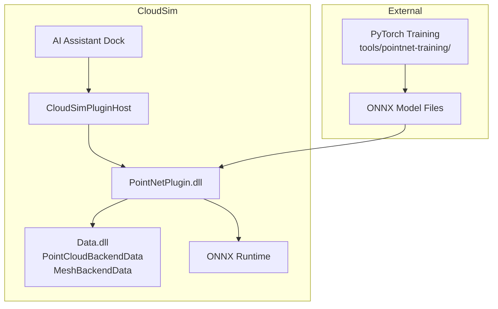
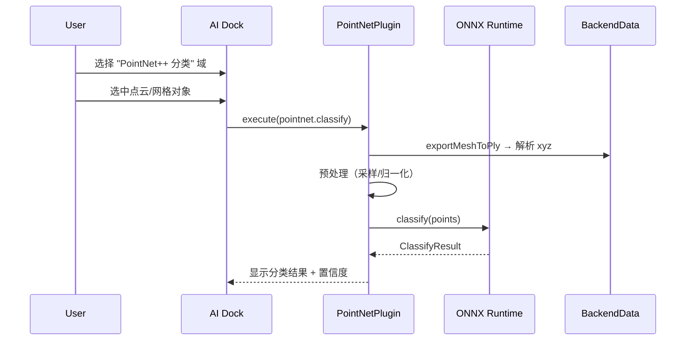
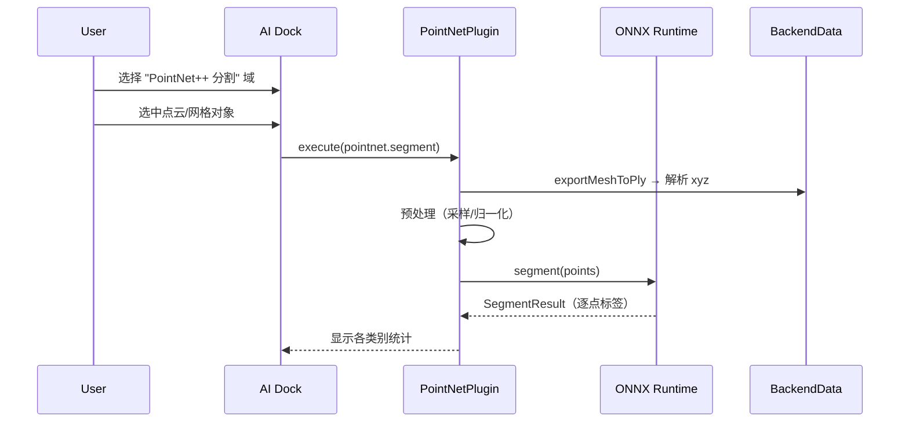

# PointNetPlugin 开发指南

## 1. 定位

PointNetPlugin 是 CloudSim 的 AI 插件，集成 PointNet++ 深度学习模型，支持点云/网格的**分类**和**语义分割**。

| 组件 | 说明 |
|------|------|
| **PointNetPlugin.dll** | 插件主 DLL，注册 `pointnet.classify` / `pointnet.segment` 两个 AI 域 |
| **PointNetInference** | ONNX Runtime 推理封装，加载 ONNX 模型并执行前向推理 |
| **PointNetClassifyDomainHandler** | 分类域处理器：从场景对象提取点云 → 推理 → 返回分类结果 |
| **PointNetSegmentDomainHandler** | 分割域处理器：从场景对象提取点云 → 推理 → 返回逐点标签 |
| **tools/pointnet-training/** | 离线训练工程（Python），训练 PyTorch 模型并导出 ONNX |

---

## 2. 架构与数据流

### 2.1 整体架构



### 2.2 分类流程



### 2.3 分割流程



---

## 3. 核心接口

### 3.1 数据类型（PointNetTypes.h）

```cpp
/// 分类推理结果
struct PointNetClassifyResult {
    int classId = -1;
    QString className;
    float confidence = 0.0f;
    std::vector<float> probabilities;
};

/// 分割推理结果
struct PointNetSegmentResult {
    std::vector<int> labels;      // 每点标签
    std::vector<float> scores;    // 每点置信度
    int numClasses = 0;
};
```

### 3.2 推理引擎（PointNetInference.h）

```cpp
class PointNetInference {
public:
    // 加载模型
    bool loadClassifyModel(const QString& onnxPath, int numPoints,
                           const QStringList& classes, QString* err = nullptr);
    bool loadSegmentModel(const QString& onnxPath, int numPoints,
                          int numClasses, QString* err = nullptr);

    // 推理
    PointNetClassifyResult classify(const std::vector<float>& points, int numPoints) const;
    PointNetSegmentResult segment(const std::vector<float>& points, int numPoints) const;

    bool isClassifyModelLoaded() const;
    bool isSegmentModelLoaded() const;

private:
    // 预处理：采样/填充 + 中心化 + 归一化到单位球
    std::vector<float> preprocessPoints(const std::vector<float>& rawPoints,
                                        int srcCount, int targetCount) const;
};
```

### 3.3 域处理器（PointNetDomainHandler.h）

```cpp
/// 分类域：pointnet.classify
class PointNetClassifyDomainHandler : public IAiDomainHandler {
    QString domainId() const override;           // "pointnet.classify"
    bool validateOutput(...) const override;     // 校验 JSON 含 class_id/class_name
    bool execute(...) override;                  // 提取点云 → 推理 → 返回结果
};

/// 分割域：pointnet.segment
class PointNetSegmentDomainHandler : public IAiDomainHandler {
    QString domainId() const override;           // "pointnet.segment"
    bool validateOutput(...) const override;     // 校验 JSON 含 backend_id
    bool execute(...) override;                  // 提取点云 → 推理 → 返回标签
};
```

### 3.4 插件主类（PointNetPlugin.h）

```cpp
class PointNetPlugin : public QObject, public ICloudSimPlugin, public ICloudSimAiPlugin {
    Q_OBJECT
    Q_PLUGIN_METADATA(IID "com.cloudsim.ICloudSimPlugin/1.0")
    Q_INTERFACES(ICloudSimPlugin ICloudSimAiPlugin)

    // ICloudSimPlugin
    QString pluginId() const override;           // "com.cloudsim.pointnet"
    bool initialize(IPluginHostContext* host) override;
    void shutdown() override;

    // ICloudSimAiPlugin
    bool initializeAi(IPluginHostContext* host, IAiAssistantHost* aiHost) override;
    void shutdownAi() override;

private:
    bool loadConfig(QString* err = nullptr);     // 加载 pointnet_config.json
};
```

---

## 4. 配置

### 4.1 插件清单（plugin.json）

```json
{
  "id": "com.cloudsim.pointnet",
  "name": "PointNet++ AI",
  "version": "1.0.0",
  "minHostVersion": "1.3.0",
  "minAiSdkVersion": "1.0.0",
  "library": "PointNetPlugin.dll",
  "enabled": true,
  "capabilities": ["ai-assistant"]
}
```

### 4.2 模型配置（pointnet_config.json）

位于插件目录（`plugins/com.cloudsim.pointnet/`）或 exe 同目录。

```json
{
  "models": {
    "classify": {
      "path": "models/pointnet_cls.onnx",
      "num_points": 1024,
      "classes": ["box", "cylinder", "sphere", "cone", "complex"]
    },
    "segment": {
      "path": "models/pointnet_seg.onnx",
      "num_points": 2048,
      "num_classes": 6
    }
  },
  "inference": {
    "provider": "cpu",
    "fallback": "cpu"
  }
}
```

| 字段 | 说明 |
|------|------|
| `models.classify.path` | 分类 ONNX 模型路径（相对于配置文件目录） |
| `models.classify.num_points` | 模型输入点数（不足则重复填充，超出则均匀采样） |
| `models.classify.classes` | 类别名称列表，索引对应模型输出 |
| `models.segment.path` | 分割 ONNX 模型路径 |
| `models.segment.num_points` | 分割模型输入点数 |
| `models.segment.num_classes` | 分割类别数 |
| `inference.provider` | 推理后端：`cpu` 或 `cuda` |

---

## 5. 构建

### 5.1 依赖

| 依赖 | 路径 | 说明 |
|------|------|------|
| CloudSimPluginSDK | `src/Plugins/CloudSimPluginSDK/` | 插件 ABI |
| CloudSimAiSDK | `src/Plugins/CloudSimAiSDK/` | AI 域接口 |
| ONNX Runtime | `bin/SDK/onnxruntime/` | 推理引擎（C++ API） |
| nlohmann/json | `bin/SDK/JSON/` | JSON 解析 |
| Qt 5.14 | 系统安装 | Core + Widgets |

### 5.2 输出目录

| 配置 | 输出路径 |
|------|----------|
| Debug/x64 | `bin/x64d/plugins/com.cloudsim.pointnet/` |
| Release/x64 | `bin/x64/plugins/com.cloudsim.pointnet/` |

构建后自动复制 `plugin.json` 和 `pointnet_config.json` 到输出目录。

### 5.3 运行时文件布局

```
bin/x64d/
├── CloudSim.exe
├── onnxruntime.dll              # ONNX Runtime DLL
├── plugins/
│   └── com.cloudsim.pointnet/
│       ├── PointNetPlugin.dll   # 插件 DLL
│       ├── plugin.json          # 插件清单
│       ├── pointnet_config.json # 模型配置
│       └── models/
│           ├── pointnet_cls.onnx
│           └── pointnet_seg.onnx
```

---

## 6. 训练与部署

训练在软件外部完成，详见 [`tools/pointnet-training/README.md`](../../../tools/pointnet-training/README.md)。也可在 **LabelingPlugin** 侧栏「模型训练」Tab 内启动训练并部署 ONNX。

### 6.1 快速流程

```bash
# 1. 生成合成数据
cd CloudSim/tools/pointnet-training
python scripts/gen_synthetic_data.py --output datasets/classification --task cls --num-per-class 100

# 2. 训练
python scripts/train_cls.py --config configs/cls_config.yaml

# 3. 导出 ONNX（需要 onnx 包）
python scripts/export_onnx.py --task cls --config configs/cls_config.yaml \
    --checkpoint output/cls/best.pth --output models/pointnet_cls.onnx

# 4. 部署
cp models/pointnet_cls.onnx bin/x64d/plugins/com.cloudsim.pointnet/models/
```

### 6.2 ONNX 导出注意事项

标准 PointNet++ 的 FPS（最远点采样）使用动态操作，无法直接导出 ONNX。训练工程提供了 ONNX 兼容版本 `pointnet2_cls_onnx.py`，用均匀采样替代 FPS：

```python
from models.pointnet2.pointnet2_cls_onnx import export_to_onnx
export_to_onnx('output/cls/best.pth', 'models/pointnet_cls.onnx', num_classes=5)
```

---

## 7. 预处理流水线

推理前对原始点云执行以下预处理：

1. **采样/填充**：将 N 个点统一到模型输入点数
   - N > target：均匀采样 target 个点
   - N < target：复制已有点填充
2. **中心化**：减去质心
3. **归一化**：除以最远点距离，缩放到单位球

```cpp
// PointNetInference::preprocessPoints
std::vector<float> preprocessPoints(const std::vector<float>& rawPoints,
                                    int srcCount, int targetCount);
```

---

## 8. 调试

| 现象 | 原因 / 处理 |
|------|-------------|
| 模型加载失败 | 检查 ONNX 路径是否正确，`onnxruntime.dll` 是否在 exe 目录 |
| 推理结果全为 0 | 检查输入点云是否为空，预处理是否正确 |
| 分类置信度低 | 模型可能需要更多训练数据或更长训练 |
| 插件未加载 | 检查 `plugin.json` 是否在正确目录，`minHostVersion` 是否满足 |

日志输出到 CloudSim 运行输出页，前缀 `[PointNet]`。

---

## 9. 文件索引

| 文件 | 说明 |
|------|------|
| `inc/PointNetPlugin.h` | 插件主类声明 |
| `inc/PointNetInference.h` | ONNX 推理封装声明 |
| `inc/PointNetDomainHandler.h` | 域处理器声明 |
| `inc/PointNetTypes.h` | 数据类型定义 |
| `source/PointNetPlugin.cpp` | 插件生命周期、配置加载、域注册 |
| `source/PointNetInference.cpp` | ONNX Runtime 会话管理、推理实现 |
| `source/PointNetDomainHandler.cpp` | 点云提取、推理调用、结果构造 |
| `plugin.json` | 插件清单 |
| `pointnet_config.json` | 模型配置 |
| `PointNetPlugin.vcxproj` | VS 工程文件 |

---

## 10. 扩展指南

### 10.1 添加新类别

1. 在 `tools/pointnet-training/` 中添加训练数据
2. 重新训练模型
3. 导出 ONNX 并部署
4. 更新 `pointnet_config.json` 中的 `classes` 列表

### 10.2 添加分割模型

1. 准备分割数据集（含逐点标签）
2. 训练分割模型：`python scripts/train_seg.py --config configs/seg_config.yaml`
3. 导出 ONNX：`python scripts/export_onnx.py --task seg ...`
4. 部署到 `models/pointnet_seg.onnx`
5. 更新 `pointnet_config.json` 中的 `segment` 配置

### 10.3 添加新域

1. 在 `PointNetTypes.h` 中定义新的结果类型
2. 创建新的 `IAiDomainHandler` 实现
3. 在 `PointNetPlugin::initializeAi` 中注册新域
4. 更新推理引擎以支持新模式
