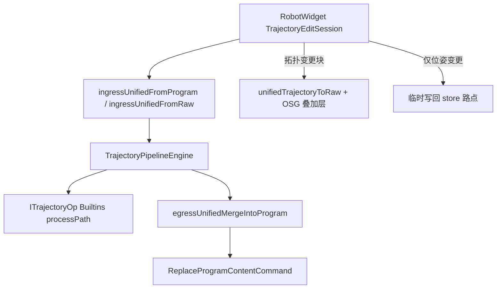

# TrajectoryAlgorithm 模块开发文档

## 1. 模块定位

`TrajectoryAlgorithm` + `TrajectoryAlgorithmBuiltins` 是 **轨迹编辑算法静态库**（无 Qt/OSG）：统一 `ITrajectoryOp` 接口、参数 Schema、注册表、JSON Codec、预览/Apply 中间动作与刚体数学。

| 属性 | 说明 |
|------|------|
| 输出 | `TrajectoryAlgorithm.lib`、`TrajectoryAlgorithmBuiltins.lib`（**仅 x64**；链入 `RobotScene.dll`） |
| 命名空间 | `trajectory_algo` |
| 数据契约 | `RobotInstruction::TrajectoryOpDescriptor` / `OpScope` 定义在 [`RobotScene/inc/TrajectoryPipelineTypes.h`](../RobotScene/inc/TrajectoryPipelineTypes.h) |
| UI 访问 | `RobotWidget` **不**直接链接本库；经 [`RobotScene/inc/TrajectoryOpBridge.h`](../RobotScene/inc/TrajectoryOpBridge.h) 导出 API，保证单例 `TrajectoryOpRegistry` |

**统一执行模型**：所有轨迹块均实现 `ITrajectoryOp::processPath`，在 [`UnifiedTrajectory`](../RobotScene/inc/UnifiedTrajectory.h) 上变换；[`TrajectoryPipelineEngine`](../RobotScene/inc/TrajectoryPipelineEngine.h) 为唯一执行器。CAD 离散结果经 `RawTrajectory` → Ingress → 引擎 → Egress 写入 `RobotProgram`；无 raw 时由程序路点 Ingress 进入同一条管道。`RawTrajectoryOpKind` 已废弃，几何能力以 `TrajectoryOpKind` 原子块注册在本库 Builtins 中。

依赖方向：`TrajectoryAlgorithm` → `GeometryEngine` + RobotScene 头文件；**不得** include `ProgramEditCommand.h` 或 Qt。

---

## 2. 目录与工程

```
src/Robot/
├── TrajectoryAlgorithm/           # 框架静态库
│   inc/  ITrajectoryOp.h, TrajectoryOpRegistry.h, TrajectoryOpConfigRegistry.h,
│         IOpParamConfig.h, IOpParamAccess.h, TrajectoryParamJsonIo.h,
│         TrajectoryOpParamSchema.h, TrajectoryOpParamAccess.h,
│         TrajectoryOpDescriptorCodec.h,
│         TrajectoryTransformMath.h
│   source/  ITrajectoryOp.cpp, TrajectoryOpConfigRegistry.cpp, TrajectoryParamJsonIo.cpp, …
└── TrajectoryAlgorithmBuiltins/   # 18 种原子块 + 每块四件套
    inc/  TrajectoryOpConfigImpl.h, TrajectoryUnifiedScope.h, UnifiedTrajectoryPathMath.h
    ops/<Name>/  <Name>Op / <Name>OpConfig / <Name>OpParamAccess  (.h/.cpp)
    source/  TrajectoryOpBuiltinsRegister.cpp, TrajectoryUnifiedScope.cpp, …
```

每块四件套 + `resource/trajectory/ops/<Name>.json`，由 `TrajectoryOpConfigRegistry` 聚合。详见 [`../RobotScene/resource/trajectory/README.md`](../RobotScene/resource/trajectory/README.md)。

| 工程 | GUID | 链接方 |
|------|------|--------|
| `TrajectoryAlgorithm.vcxproj` | `{C1A2B3D4-...}` | `RobotScene` |
| `TrajectoryAlgorithmBuiltins.vcxproj` | `{C2A3B4D5-...}` | `RobotScene` |

构建定义（算法 TU）：`TRAJECTORY_ALGORITHM_LIB`、`ROBOT_SCENE_LIB`（与 RobotScene 同进程导出描述符符号）。消费者 DLL（`RobotWidget`）通过 `TrajectoryOpBridge` 使用 **dllimport**。

---

## 3. 核心类型

### `ITrajectoryOp`

每个轨迹块实现：`kind()`、`capabilities()`、`makeDefaultDescriptor()`、`paramFields()`、`validate()`、`formatSummary()`，以及核心 **`processPath(op, UnifiedTrajectory&)`**。预览与 Apply 均经 `TrajectoryPipelineEngine`，无独立 Pose/Command 支路。

### `TrajectoryOpCapability`

| 标志 | 含义 |
|------|------|
| `PreviewPoseTransform` | 位姿类块：参与 `collectPreviewWaypointIds` 的 scope 路点收集 |
| `None` | 几何/结构块：预览由引擎 + overlay 或 ingress 路点探测 |

### `TransformReferenceFrame`（`TrajectoryPipelineTypes.h`）

| 值 | 预览/Apply 语义 |
|----|----------------|
| `World` | `target.composeColumn(delta)` |
| `Body` | `delta.composeColumn(target)` |

统一实现：[`TrajectoryTransformMath.cpp`](source/TrajectoryTransformMath.cpp) 中 `applyTransformDelta()`、`rigidDeltaFromTranslate()`、`rigidDeltaFromRotate()`。

---

## 4. 参数 Schema 与 UI

1. 算法 `paramFields()` 声明 `TrajectoryOpParamField`（key、类型、范围、分组、`visibleWhenScopeKind` 等）。
2. [`TrajectoryOpParamAccess`](source/TrajectoryOpParamAccess.cpp) 将 key 映射到 `TrajectoryOpDescriptor` 字段（含 `commonScopeFields()`）。
3. RobotWidget [`TrajectoryOpParamPanel`](../UI/RobotWidget/source/TrajectoryOpParamPanel.cpp) + [`TrajectoryParamWidgetFactory`](../UI/RobotWidget/source/TrajectoryParamWidgetFactory.cpp) 按 Schema **自动生成**控件；**无需**在 `TrajectoryEditPageWidget` 为每种块写 SpinBox 分支。

---

## 5. 预览与 Apply 调用链



- **预览**：`TrajectoryPipelineEngine::executeFull` 得 `UnifiedTrajectory`；含几何/拓扑块时 OSG 叠加层展示形状，同时可将位姿/工艺属性写回已有路点（混合预览）；无拓扑变更时快照后全量写回 scope 路点。
- **Apply**：`TrajectoryEditSession::apply` → 同一引擎 → `unifiedTrajectoryMergeIntoProgram` / `ReplaceProgramContentCommand`。

---

## 6. 注册与启动

```cpp
// RobotScene / RobotWidget 入口（经 Bridge 转发）
RobotInstruction::ensureTrajectoryOpBuiltinsRegistered();
```

[`TrajectoryOpBuiltinsRegister.cpp`](../TrajectoryAlgorithmBuiltins/source/TrajectoryOpBuiltinsRegister.cpp) 注册 18 种原子块：Translate / Rotate / Mirror / Delete / Duplicate / Reorder / Resample / OffsetAlongNormal / OffsetLateral / SmoothPose / AssignBlend / AssignSpeedZone / Weave / Approach / Retract / ReachabilityFilter / ExternalAxisSearch；同步注册 `TrajectoryOpConfigRegistry`（Config + ParamAccess）。

调色板顺序：`TrajectoryOpRegistry::paletteKinds()`。

---

## 7. 算法编写指南

### 7.1 新建块步骤

| 步骤 | 位置 |
|------|------|
| 1 | `TrajectoryPipelineTypes.h` 增加 `TrajectoryOpKind` 与参数字段 |
| 2 | `ops/<Name>/<Name>Op.{h,cpp}` 实现 `ITrajectoryOp`（含 `processPath` 若参与 Unified） |
| 3 | `TrajectoryOpParamAccess.cpp` 注册 param key |
| 4 | `TrajectoryOpBuiltinsRegister.cpp` → `registerOp(std::make_unique<...>())` |
| 5 | x64 编译 `TrajectoryAlgorithmBuiltins` + `RobotScene` |

**无需**修改 `TrajectoryEditPageWidget` 的块类型 switch（参数区由 Schema 驱动）。

### 7.2 示例：TranslateOp（平移 + 坐标系）

**capabilities**：`PreviewPoseTransform`。

**processPath**：`applyUnifiedPathOp` → `applyUnifiedTrajectoryOp`（scope 内渐变平移）。

### 7.3 示例：DeleteOp（结构编辑）

- `capabilities()` → `None`。
- `processPath`：`resolveScopedPointIndices` 后删除 Unified 点。

### 7.4 示例：MirrorOp（轴反向）

- `capabilities()` → `PreviewPoseTransform`。
- `processPath`：`applyUnifiedPathOp` 内 `applyAxisReverse`。

### 7.5 参数读写与模板 JSON

```cpp
RobotInstruction::TrajectoryOpDescriptor op =
    RobotInstruction::trajectoryOpGet(RobotInstruction::TrajectoryOpKind::Translate)
        ->makeDefaultDescriptor(scope);

trajectory_algo::TrajectoryParamValue v;
RobotInstruction::trajectoryOpParamRead(op, field, v);

nlohmann::json j = RobotInstruction::trajectoryPipelineToJson({ op });
```

Codec 形状：`{ "kind":"Translate", "scope":{...}, "params":{ "translate.frame":"World", ... } }`（见 [`TrajectoryOpDescriptorCodec.cpp`](source/TrajectoryOpDescriptorCodec.cpp)）。

---

## 8. 序列化与模板

- 轨迹页「保存/加载模板」：`QSettings` 键 `pipelineJson` + `trajectoryPipelineToJson` / `trajectoryPipelineFromJson`。
- 旧版按字段拆分的 QSettings 格式不再读取。

---

## 9. 自检与常见错误

| 现象 | 原因 |
|------|------|
| 调色板空 / `get(kind)==nullptr` | 未调用 `ensureTrajectoryOpBuiltinsRegistered()` |
| LNK2019 `trajectory_algo::...` from RobotWidget | UI 应走 `TrajectoryOpBridge`，勿直接链 `TrajectoryAlgorithm.lib` |
| 双 Registry / 预览与 Apply 不一致 | 同上；算法静态库只能链入 **一个** 模块（RobotScene） |
| `Body` 与 `World` 预览不一致 | 检查 `applyUnifiedTrajectoryOp` 中 `applyTransformDelta` 的 frame |
| 参数面板不刷新 | `TrajectoryOpParamPanel::rebuildForOp` 是否在切换块时调用 |

---

## 10. 算法作者检查清单

- [ ] 四件套：`*Op` + `*OpConfig` + `*OpParamAccess` + `ops/<Name>.json`
- [ ] `*OpParamAccess` 注册到 `TrajectoryOpBuiltinsRegister`（`registerOpParamAccess`）
- [ ] `*OpConfig` 注册到 `TrajectoryOpBuiltinsRegister`（`registerOpConfig`）
- [ ] `paramFields()` C++ 实现保留作 JSON 缺失时的兜底（deprecated 方向，勿删）
- [ ] 平移/旋转预览与 Apply 均经 `applyTransformDelta`
- [ ] `validate` 覆盖非法输入；`formatSummary` 含 scope / 坐标系 / 主参数
- [ ] 几何块已实现 `processPath`（或引擎 fallback `applyUnifiedTrajectoryOp`）
- [ ] 已在 `TrajectoryOpBuiltinsRegister.cpp` 注册（可用 `REGISTER_TRAJECTORY_OP` 宏）
- [ ] 手动：轨迹页拖块 → 改参 → Preview → Apply → Undo

---

## 11. 管道引擎与 `processPath`

统一 IR 执行由 [`RobotScene/inc/TrajectoryPipelineEngine.h`](../RobotScene/inc/TrajectoryPipelineEngine.h) 负责；算法块通过 `ITrajectoryOp::processPath` 参与 Unified 路径变换。

| API | 说明 |
|-----|------|
| `processPath(op, UnifiedTrajectory&, errMsg)` | 几何块 override；默认 `false` 时引擎走 `applyUnifiedTrajectoryOp` |
| `TrajectoryOpPathApply.h` | Builtins 内 `applyUnifiedPathOp` 薄封装 |
| `runTrajectoryPipelineEngineSelfCheck()` | 引擎自检（Translate+Rotate 全量 vs `executeFrom`） |

新建几何块示例：

```cpp
bool FooOp::processPath(
    const RobotInstruction::TrajectoryOpDescriptor& op,
    RobotInstruction::UnifiedTrajectory& traj,
    std::string* errMsg) const
{
    return applyUnifiedPathOp(op, traj, errMsg);
}
```

## 12. 编码与注释

实施与审阅遵循 Skill：`cpp-coding-standards`、`code-comment`。

- 本库 **不得** include Qt
- 注释聚焦 Why（如 Recipe 为何走 raw 往返），避免解释字面代码
- 新枚举使用 `enum class`；错误出参 `bool` + `std::string* errMsg`

---

## 13. 相关文档

- 内置原子块：[`../TrajectoryAlgorithmBuiltins/DEVELOPER_GUIDE.md`](../TrajectoryAlgorithmBuiltins/DEVELOPER_GUIDE.md)
- UI 编排：[`../UI/RobotWidget/DEVELOPER_GUIDE.md`](../UI/RobotWidget/DEVELOPER_GUIDE.md) §轨迹编辑
- Command / Builder：[`../RobotScene/DEVELOPER_GUIDE.md`](../RobotScene/DEVELOPER_GUIDE.md) §13
- 刚体约定：[`../Geometry/GeometryEngine/CONVENTIONS.md`](../Geometry/GeometryEngine/CONVENTIONS.md)
- 模块索引：[`../../docs/MODULE_DEVELOPER_GUIDES.md`](../../docs/MODULE_DEVELOPER_GUIDES.md)
