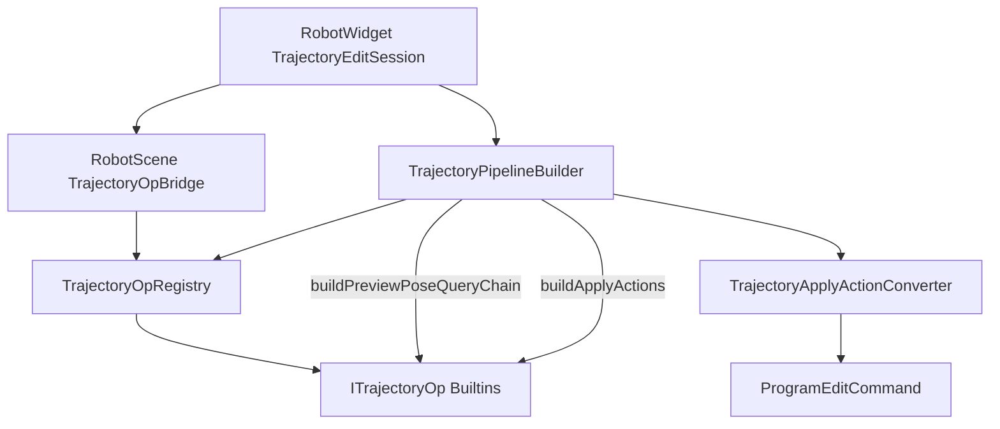

# TrajectoryAlgorithm 模块开发文档

## 1. 模块定位

`TrajectoryAlgorithm` + `TrajectoryAlgorithmBuiltins` 是 **轨迹编辑算法静态库**（无 Qt/OSG）：统一 `ITrajectoryOp` 接口、参数 Schema、注册表、JSON Codec、预览/Apply 中间动作与刚体数学。

| 属性 | 说明 |
|------|------|
| 输出 | `TrajectoryAlgorithm.lib`、`TrajectoryAlgorithmBuiltins.lib`（**仅 x64**；链入 `RobotScene.dll`） |
| 命名空间 | `trajectory_algo` |
| 数据契约 | `RobotInstruction::TrajectoryOpDescriptor` / `OpScope` 定义在 [`RobotScene/inc/TrajectoryPipelineTypes.h`](../RobotScene/inc/TrajectoryPipelineTypes.h) |
| UI 访问 | `RobotWidget` **不**直接链接本库；经 [`RobotScene/inc/TrajectoryOpBridge.h`](../RobotScene/inc/TrajectoryOpBridge.h) 导出 API，保证单例 `TrajectoryOpRegistry` |

**与 CAD 轨迹流水线的边界**：[`RobotScene/inc/RawTrajectory.h`](../RobotScene/inc/RawTrajectory.h) 定义 `RawTrajectoryOpKind`（Resample、OffsetAlongNormal、Weave 等），作用于 **离散后、写入 Program 前** 的 TCP 轨迹；本库的 `ITrajectoryOp` 作用于 **已有 `RobotProgram` 路点** 的装饰编辑（Translate/Rotate/Delete/Duplicate）。二者在 `emitRawTrajectoryToProgram` / 轨迹编辑页汇合。

依赖方向：`TrajectoryAlgorithm` → `GeometryEngine` + RobotScene 头文件；**不得** include `ProgramEditCommand.h` 或 Qt。

---

## 2. 目录与工程

```
src/Robot/
├── TrajectoryAlgorithm/           # 框架静态库
│   inc/  ITrajectoryOp.h, TrajectoryOpRegistry.h, TrajectoryOpParamSchema.h,
│         TrajectoryOpParamAccess.h, TrajectoryApplyAction.h,
│         TrajectoryOpDescriptorCodec.h, TrajectoryTransformMath.h
│   source/
└── TrajectoryAlgorithmBuiltins/   # 内置六种块
    ops/Translate|Rotate|Delete|Duplicate|Mirror|Reorder/
    source/TrajectoryOpBuiltinsRegister.cpp
```

| 工程 | GUID | 链接方 |
|------|------|--------|
| `TrajectoryAlgorithm.vcxproj` | `{C1A2B3D4-...}` | `RobotScene` |
| `TrajectoryAlgorithmBuiltins.vcxproj` | `{C2A3B4D5-...}` | `RobotScene` |

构建定义（算法 TU）：`TRAJECTORY_ALGORITHM_LIB`、`ROBOT_SCENE_LIB`（与 RobotScene 同进程导出描述符符号）。消费者 DLL（`RobotWidget`）通过 `TrajectoryOpBridge` 使用 **dllimport**。

---

## 3. 核心类型

### `ITrajectoryOp`

每个轨迹块实现：`kind()`、`capabilities()`、`makeDefaultDescriptor()`、`paramFields()`、`validate()`、`formatSummary()`、`contributePreviewTransform()`、`buildApplyActions()`。

### `TrajectoryOpCapability`

| 标志 | 含义 |
|------|------|
| `PreviewPoseTransform` | 参与预览路点收集与 `TransformMotionPoseQuery` |
| `ApplyPoseTransform` | Apply 可走 `TransformMotionSegmentCommand` |
| `ApplyStructuralEdit` | Delete/Duplicate 等结构编辑 |

### `TransformReferenceFrame`（`TrajectoryPipelineTypes.h`）

| 值 | 预览/Apply 语义 |
|----|----------------|
| `World` | `target.composeColumn(delta)` |
| `Body` | `delta.composeColumn(target)` |

统一实现：[`TrajectoryTransformMath.cpp`](source/TrajectoryTransformMath.cpp) 中 `applyTransformDelta()`、`rigidDeltaFromTranslate()`、`rigidDeltaFromRotate()`。

### `TrajectoryApplyAction`

算法层中间动作（**不**直接依赖 `ProgramEditCommand`）。RobotScene [`TrajectoryApplyActionConverter`](../RobotScene/source/TrajectoryApplyActionConverter.cpp) 转为 `ProgramEditCommand`。

---

## 4. 参数 Schema 与 UI

1. 算法 `paramFields()` 声明 `TrajectoryOpParamField`（key、类型、范围、分组、`visibleWhenScopeKind` 等）。
2. [`TrajectoryOpParamAccess`](source/TrajectoryOpParamAccess.cpp) 将 key 映射到 `TrajectoryOpDescriptor` 字段（含 `commonScopeFields()`）。
3. RobotWidget [`TrajectoryOpParamPanel`](../UI/RobotWidget/source/TrajectoryOpParamPanel.cpp) + [`TrajectoryParamWidgetFactory`](../UI/RobotWidget/source/TrajectoryParamWidgetFactory.cpp) 按 Schema **自动生成**控件；**无需**在 `TrajectoryEditPageWidget` 为每种块写 SpinBox 分支。

---

## 5. 预览与 Apply 调用链



- **预览**：`contributePreviewTransform` → `PreviewTransformStep`（含 `frame`）→ `TransformMotionPoseQuery`。
- **Apply**：`buildApplyActions` → `convertApplyActionsToCommands` → `ProgramEditService::execute`。

---

## 6. 注册与启动

```cpp
// RobotScene / RobotWidget 入口（经 Bridge 转发）
RobotInstruction::ensureTrajectoryOpBuiltinsRegistered();
```

[`TrajectoryOpBuiltinsRegister.cpp`](../TrajectoryAlgorithmBuiltins/source/TrajectoryOpBuiltinsRegister.cpp) 注册：Translate、Rotate、Delete、Duplicate、Mirror（占位）、Reorder（占位）。

调色板顺序：`TrajectoryOpRegistry::paletteKinds()`。

---

## 7. 算法编写指南

### 7.1 新建块步骤

| 步骤 | 位置 |
|------|------|
| 1 | `TrajectoryPipelineTypes.h` 增加 `TrajectoryOpKind` 与参数字段 |
| 2 | `ops/<Name>/<Name>Op.{h,cpp}` 实现 `ITrajectoryOp` |
| 3 | `TrajectoryOpParamAccess.cpp` 注册 param key |
| 4 | `TrajectoryOpBuiltinsRegister.cpp` → `registerOp(std::make_unique<...>())` |
| 5 | x64 编译 `TrajectoryAlgorithmBuiltins` + `RobotScene` |

**无需**修改 `TrajectoryEditPageWidget` 的块类型 switch（参数区由 Schema 驱动）。

### 7.2 示例：TranslateOp（平移 + 坐标系）

**capabilities**：`PreviewPoseTransform | ApplyPoseTransform`。

**paramFields**：`translate.frame`（Enum World/Body）、`translate.dxMm/dyMm/dzMm`。

**预览**：

```cpp
out.delta = rigidDeltaFromTranslate(op.translate);
out.frame = op.translate.frame;
out.kind = PreviewTransformStep::Kind::TranslateOnly;
```

**Apply**：

```cpp
TrajectoryApplyAction a{};
a.kind = TrajectoryApplyActionKind::TransformSegment;
a.transformOps = { op };
return { a };
```

### 7.3 示例：DeleteOp（仅结构编辑）

- `capabilities()` → `ApplyStructuralEdit`。
- `paramFields()` → `{}`（作用域由 `commonScopeFields()` 提供）。
- `contributePreviewTransform` → `false`。
- `buildApplyActions` → 多条 `RemoveInstruction`（scope 解析在 RobotScene 转换层）。

### 7.4 示例：MirrorOp（占位）

- `capabilities()` → `None`；`validate` 返回未实现。
- `paramFields()` 含 `Message` 字段；UI 自动灰显，Preview/Apply 由能力位禁用。

### 7.5 参数读写与模板 JSON

```cpp
RobotInstruction::TrajectoryOpDescriptor op =
    RobotInstruction::trajectoryOpGet(RobotInstruction::TrajectoryOpKind::Translate)
        ->makeDefaultDescriptor(scope);

trajectory_algo::TrajectoryParamValue v;
RobotInstruction::trajectoryOpParamRead(op, field, v);

nlohmann::json j = RobotInstruction::trajectoryPipelineToJson({ op });
```

Codec 形状：`{ "kind":"Translate", "scope":{...}, "params":{ "translate.frame":"World", ... } }`（见 [`TrajectoryOpDescriptorCodec.cpp`](source/TrajectoryOpDescriptorCodec.cpp)）。

---

## 8. 序列化与模板

- 轨迹页「保存/加载模板」：`QSettings` 键 `pipelineJson` + `trajectoryPipelineToJson` / `trajectoryPipelineFromJson`。
- 旧版按字段拆分的 QSettings 格式不再读取。

---

## 9. 自检与常见错误

| 现象 | 原因 |
|------|------|
| 调色板空 / `get(kind)==nullptr` | 未调用 `ensureTrajectoryOpBuiltinsRegistered()` |
| LNK2019 `trajectory_algo::...` from RobotWidget | UI 应走 `TrajectoryOpBridge`，勿直接链 `TrajectoryAlgorithm.lib` |
| 双 Registry / 预览与 Apply 不一致 | 同上；算法静态库只能链入 **一个** 模块（RobotScene） |
| `Body` 与 `World` 预览不一致 | 检查 `PreviewTransformStep::frame` 与 `applyTransformDelta` |
| 参数面板不刷新 | `TrajectoryOpParamPanel::rebuildForOp` 是否在切换块时调用 |

---

## 10. 算法作者检查清单

- [ ] `paramFields()` 的 key 已在 `TrajectoryOpParamAccess` 注册
- [ ] 平移/旋转预览与 Apply 均经 `applyTransformDelta`
- [ ] `validate` 覆盖非法输入；`formatSummary` 含 scope / 坐标系 / 主参数
- [ ] `buildApplyActions` 不直接依赖 `ProgramEditCommand`
- [ ] 已在 `TrajectoryOpBuiltinsRegister.cpp` 注册
- [ ] 手动：轨迹页拖块 → 改参 → Preview → Apply → Undo

---

## 11. 相关文档

- UI 编排：[`../UI/RobotWidget/DEVELOPER_GUIDE.md`](../UI/RobotWidget/DEVELOPER_GUIDE.md) §轨迹编辑
- Command / Builder：[`../RobotScene/DEVELOPER_GUIDE.md`](../RobotScene/DEVELOPER_GUIDE.md) §13
- 刚体约定：[`../Geometry/GeometryEngine/CONVENTIONS.md`](../Geometry/GeometryEngine/CONVENTIONS.md)
- 模块索引：[`../../docs/MODULE_DEVELOPER_GUIDES.md`](../../docs/MODULE_DEVELOPER_GUIDES.md)
