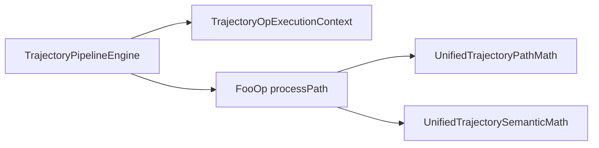

# TrajectoryAlgorithmBuiltins 模块开发文档

## 1. 模块定位

`TrajectoryAlgorithmBuiltins` 是轨迹管道的 **内置原子块实现库**，依赖 [`TrajectoryAlgorithm`](../TrajectoryAlgorithm/DEVELOPER_GUIDE.md) 框架，向 `TrajectoryOpRegistry` / `TrajectoryOpConfigRegistry` 注册全部 `TrajectoryOpKind` 实现。

| 属性 | 说明 |
|------|------|
| 输出 | `TrajectoryAlgorithmBuiltins.lib`（**仅 x64**；链入 `RobotScene.dll`） |
| 命名空间 | `trajectory_algo` |
| 执行入口 | `ITrajectoryOp::processPath` → [`TrajectoryPipelineEngine`](../RobotScene/inc/TrajectoryPipelineEngine.h) |
| UI 访问 | 经 [`TrajectoryOpBridge.h`](../RobotScene/inc/TrajectoryOpBridge.h)，**不**直接被 `RobotWidget` 链接 |

与 `TrajectoryAlgorithm` 的分工：框架库提供接口、Registry、Codec、Config 聚合；本库提供 **20 种原子块** 的具体算法与参数绑定。

---

## 2. 目录与工程

```
TrajectoryAlgorithmBuiltins/
├── inc/
│   ├── TrajectoryOpConfigImpl.h      # IOpParamConfig 通用 JSON 绑定
│   ├── TrajectoryOpFormat.h          # paramFields 辅助工厂
│   ├── TrajectoryUnifiedScope.h      # scope 解析（点序 / 指令 id）
│   ├── UnifiedTrajectoryPathMath.h   # 路径几何原语（重采样/偏移/摆动等）
│   └── UnifiedTrajectorySemanticMath.h # 位姿语义（平移/镜像/进退刀等）
├── ops/<Name>/
│   ├── <Name>Op.h / .cpp             # ITrajectoryOp 实现（核心 processPath）
│   ├── <Name>OpConfig.h / .cpp       # make<Name>OpConfig() → JSON schema
│   └── <Name>OpParamAccess.h / .cpp  # descriptor 字段读写
└── source/
    ├── TrajectoryOpBuiltinsRegister.cpp  # 启动注册
    ├── TrajectoryOpConfigImpl.cpp
    ├── TrajectoryOpFormat.cpp
    ├── TrajectoryUnifiedScope.cpp
    ├── UnifiedTrajectoryPathMath.cpp
    └── UnifiedTrajectorySemanticMath.cpp
```

VS 筛选器：`inc` 放所有 `.h`，`src` 放所有 `.cpp`（含 `ops/` 下源文件）。

| 工程 | GUID | 依赖 |
|------|------|------|
| `TrajectoryAlgorithmBuiltins.vcxproj` | `{C2A3B4D5-...}` | `TrajectoryAlgorithm`、`GeometryEngine` |

构建定义：`TRAJECTORY_ALGORITHM_BUILTINS_LIB`、`TRAJECTORY_ALGORITHM_LIB`、`ROBOT_SCENE_LIB`。

外置 JSON：`../RobotScene/resource/trajectory/ops/<Name>.json`，详见 [`resource/trajectory/README.md`](../RobotScene/resource/trajectory/README.md)。

---

## 3. 原子块一览

| 分类 | Kind | 目录 | processPath 实现方式 | 预览拓扑变更 |
|------|------|------|----------------------|--------------|
| 位姿编辑 | Translate / Rotate | `ops/Translate` `ops/Rotate` | `UnifiedTrajectorySemanticMath` | 否（写回路点） |
| 结构编辑 | Delete / Duplicate | `ops/Delete` `ops/Duplicate` | 自有逻辑 | **是**（OSG overlay） |
| 姿态策略 | Mirror / Reorder | `ops/Mirror` `ops/Reorder` | `UnifiedTrajectorySemanticMath` | 否 |
| 路径几何 | Resample | `ops/Resample` | `resampleUnifiedTrajectory` | **是** |
| 路径几何 | OffsetAlongNormal / OffsetLateral | `ops/Offset*` | `*InScope`（`TrajectoryUnifiedScope`） | **是**（OSG overlay） |
| 路径几何 | SmoothPose | `ops/SmoothPose` | `smoothPoseUnifiedInScope` | **是** |
| 工艺属性 | AssignBlend / AssignSpeedZone | `ops/Assign*` | `assign*InScope` | 否（写回 blend/speed） |
| 工艺属性 | Weave | `ops/Weave` | `weaveUnifiedInScope` | **是** |
| 进退刀 | Approach / Retract | `ops/Approach` `ops/Retract` | `UnifiedTrajectorySemanticMath`（含 Custom 方向、Segment 分段） | **是** |
| 几何投影 | ProjectToGeometry | `ops/ProjectToGeometry` | `ctx.geometryProjection`（`IGeometryProjection` 注入） | **是** |
| 非刚性纠正 | NonRigidRegistration | `ops/NonRigidRegistration` | `ctx.nonRigidTrajectoryWarp`（`INonRigidTrajectoryWarp` 注入） | 否（写回 pose） |
| 工件型转换 | ToWorkpieceInHand | `ops/ToWorkpieceInHand` | 外部 TCP 参数 + `ctx.workpieceReferenceInBase`（Session 注入当前 TCP） | 否（写回 pose/speed） |
| 可达性 | ReachabilityFilter | `ops/ReachabilityFilter` | `reachabilityFilterUnified` | 否 |
| 可达性 | ExternalAxisSearch | `ops/ExternalAxisSearch` | `externalAxisSearchUnified`（读对象外轴配置；未启用则跳过） | 否 |

调色板顺序由 `TrajectoryOpRegistry::paletteKinds()` 决定（注册顺序）。

---

## 4. 四件套约定

每个原子块由四部分组成，缺一不可：

| 部分 | 文件 | 职责 |
|------|------|------|
| **Op** | `<Name>Op.{h,cpp}` | `kind`、`processPath`、`validate`、`formatSummary` |
| **OpConfig** | `<Name>OpConfig.{h,cpp}` | `make<Name>OpConfig()` → `TrajectoryOpConfigImpl` 绑定 `ops/<Name>.json` |
| **OpParamAccess** | `<Name>OpParamAccess.{h,cpp}` | `IOpParamAccess`：参数字段 ↔ `TrajectoryOpDescriptor` 成员 |
| **JSON** | `resource/trajectory/ops/<Name>.json` | UI Schema + 默认值 |

注册点（[`TrajectoryOpBuiltinsRegister.cpp`](source/TrajectoryOpBuiltinsRegister.cpp)）：

```cpp
void ensureTrajectoryOpBuiltinsRegistered()
{
    registerTrajectoryOpBuiltins(TrajectoryOpRegistry::instance());  // *Op
    registerOpConfigs();  // *OpConfig + *OpParamAccess
}
```

---

## 5. 共享基础设施

### `UnifiedTrajectoryPathMath`

路径级几何原语，供 Resample / Offset / Weave 等块在 `processPath` 内直接调用，避免各 Op 重复实现折线数学。

### `TrajectoryUnifiedScope`

`resolveScopeInstructionIds` / `resolveScopedPointIndices` 将 `OpScope` 映射到 Unified 点序或指令 id；`program` 由 `TrajectoryOpExecutionContext` 传入。

### `UnifiedTrajectorySemanticMath`

Translate / Rotate / Mirror / Reorder / Approach / Retract 的 `processPath` 直接调用本库（scope 内插值、进退刀插入等），**禁止**在 RobotScene 增加 `TrajectoryOpKind` 分支。

### `TrajectoryOpConfigImpl`

`makeTrajectoryOpConfig(kind, "ops/Foo.json")` 工厂；`paramFields()` 优先读 JSON，缺失时回退 `*Op::paramFields()`。

---

## 6. 执行链路



引擎逐步调用 `processPath`；块内不得直接修改 `RobotProgram`，只读写 `UnifiedTrajectory&`。

---

## 7. 新建原子块步骤

| 步骤 | 位置 |
|------|------|
| 1 | [`TrajectoryPipelineTypes.h`](../RobotScene/inc/TrajectoryPipelineTypes.h) 增加 `TrajectoryOpKind` 与参数字段 |
| 2 | `ops/<Name>/<Name>Op.{h,cpp}` 实现 `processPath` |
| 3 | `<Name>OpConfig` + `<Name>OpParamAccess` |
| 4 | `resource/trajectory/ops/<Name>.json` |
| 5 | `TrajectoryOpBuiltinsRegister.cpp` 三处注册（Op / Config / ParamAccess） |
| 6 | `TrajectoryAlgorithmBuiltins.vcxproj` + `.filters` 加入新文件 |
| 7 | x64 编译 Builtins + RobotScene；轨迹页拖块 → Preview → Apply |

可用代码生成：

```text
python CloudSim/tools/gen_atomic_ops.py
python CloudSim/tools/gen_trajectory_json.py
```

---

## 8. 实现示例

### 8.1 路径几何块（Resample）

```cpp
bool ResampleOp::processPath(
    const RobotInstruction::TrajectoryOpDescriptor& op,
    RobotInstruction::UnifiedTrajectory& traj,
    const TrajectoryOpExecutionContext& ctx,
    std::string* errMsg) const
{
    if (traj.points.empty()) { return false; }
    resampleUnifiedTrajectory(traj, op.resample.stepMm);
    return true;
}
```

- `capabilities()` → `None`（预览走引擎 overlay）
- 预览侧：Session 检测拓扑变更 → OSG overlay（见 RobotWidget §预览分支 B）

### 8.2 位姿块（Translate）

```cpp
bool TranslateOp::processPath(..., const TrajectoryOpExecutionContext& ctx, ...) const
{
    return applyTranslateRotateInScope(op, traj, ctx.program);
}
```

- `capabilities()` → `PreviewPoseTransform`（供 Session 收集 scope 路点）
- 预览侧：无拓扑变更 → 引擎结果写回 store 路点（分支 C）

### 8.3 OpConfig 样板

```cpp
std::unique_ptr<IOpParamConfig> makeFooOpConfig()
{
    return makeTrajectoryOpConfig(
        RobotInstruction::TrajectoryOpKind::Foo,
        "ops/Foo.json");
}
```

---

## 9. 与工艺预设的关系

[`ProcessFlowPresets.json`](../RobotScene/resource/trajectory/ProcessFlowPresets.json) 的焊缝/涂胶/打磨预设由 **本库原子块** 组成，例如焊缝：

`Resample → OffsetAlongNormal → SmoothPose → AssignBlend → Approach → Retract`

### 验收场景（手工）

| ID | 场景 | 期望 |
|----|------|------|
| T-AR1 | 两块 Approach 各设 Custom 方向 | 各块方向独立，overlay 点数正确 |
| T-AR2 | Approach Custom + Body 帧 | 方向随锚点姿态旋转 |
| T-AR3 | Segment + IndexRange 进退刀 | 仅指定段首尾插点 |
| T-PJ1~3 | ProjectToGeometry 点云/mesh/BREP | scope 点落到对应几何 |
| T-PJ4 | 射线未命中 | 原点保留，RunInfo 警告，Apply 成功 |
| T-PJ5 | Resample → ProjectToGeometry → AssignBlend | 混合预览与 Apply 一致 |
| T-NR1 | 源 mesh + 目标点云 | 三角面绑定 + 轨迹随 SPARE 变形；源 backend 未改 |
| T-NR2 | 源 mesh + 目标 mesh | 同上 |
| T-NR3 | 源点云 + 目标 mesh | 最近点绑定 + PC→Mesh SPARE |
| T-NR4 | 源点云 + 目标点云 | 最近点绑定 + PC→PC SPARE |
| T-NR5 | 绑定点超距 | 跳过并警告；其余点成功 |
| T-NR6 | BREP 或缺失 backend | validate/processPath 失败 |

`buildRecipePreset(Weld/Glue/Grind)` 仅加载预设 JSON，**不再**存在 `RecipeWeld` 复合 Op。

---

## 10. 自检与常见错误

| 现象 | 原因 |
|------|------|
| 调色板缺块 | `ensureTrajectoryOpBuiltinsRegistered()` 未调用或 Builtins 未链入 RobotScene |
| 参数面板空白 | `*OpConfig` / `*OpParamAccess` 未注册，或 JSON 路径错误 |
| Preview 与 Apply 点数不一致 | 拓扑变更块未走 overlay；检查 `pipelineChangesPointTopology` |
| LNK2019 `makeFooOpConfig` | vcxproj 未加入新 cpp |
| 块 validate 通过但 processPath 失败 | scope 内无点；检查 `TrajectoryUnifiedScope` 与 `OpScope` |

---

## 11. 作者检查清单

- [ ] 四件套：Op + OpConfig + OpParamAccess + `ops/<Name>.json`
- [ ] `processPath` 有明确失败路径（`errMsg` + `false`）
- [ ] 路径几何优先复用 `UnifiedTrajectoryPathMath`
- [ ] 程序语义块调用 `UnifiedTrajectorySemanticMath`；几何投影用 `ctx.geometryProjection`；非刚性纠正用 `ctx.nonRigidTrajectoryWarp`
- [ ] `TrajectoryOpBuiltinsRegister.cpp` 三处注册
- [ ] vcxproj / filters 已更新
- [ ] 手动：拖入块 → 改参 → Preview → Apply → Undo

---

## 12. 相关文档

- 框架库：[`../TrajectoryAlgorithm/DEVELOPER_GUIDE.md`](../TrajectoryAlgorithm/DEVELOPER_GUIDE.md)
- 管道引擎 / Command：[`../RobotScene/DEVELOPER_GUIDE.md`](../RobotScene/DEVELOPER_GUIDE.md) §13
- UI 预览分支：[`../UI/RobotWidget/DEVELOPER_GUIDE.md`](../../UI/RobotWidget/DEVELOPER_GUIDE.md) §轨迹编辑
- JSON 资源：[`../RobotScene/resource/trajectory/README.md`](../RobotScene/resource/trajectory/README.md)
- 模块索引：[`../../docs/MODULE_DEVELOPER_GUIDES.md`](../../../docs/MODULE_DEVELOPER_GUIDES.md)
