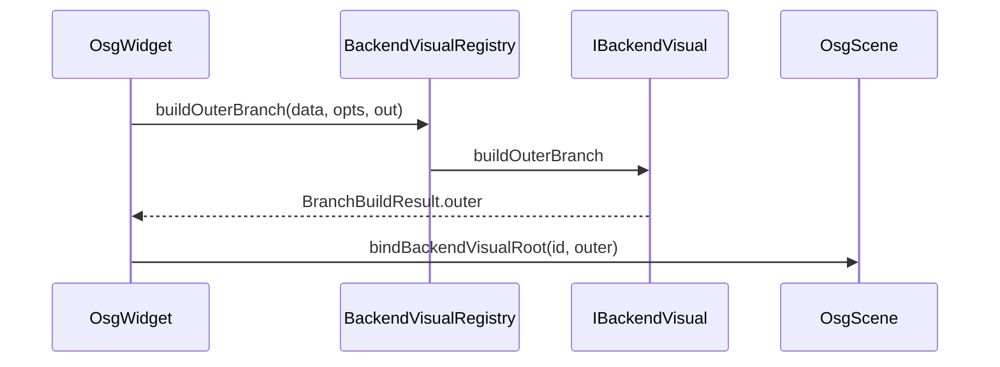

# BackendVisual 模块开发文档

> **空间契约**：[`../../../docs/spatial_contract_world_pose.md`](../../../docs/spatial_contract_world_pose.md) §1.1 — `pose`=模型原点世界坐标；内旋 ZYX、主动旋转、行/列向量见契约；outer=`osgMatrixFromRigidTransform`；inner PAT 恒 `(0,0,0)`。

## 1. 模块定位

`BackendVisual` 解决 **「后端数据对象」与「OSG 可渲染场景分支」** 之间的转换。通过策略接口 `IBackendVisual` + 注册表 `BackendVisualRegistry`，使 `OsgWidgetCore` 不必硬编码点云/网格构建细节。

| 属性 | 说明 |
|------|------|
| x64 输出 | `BackendVisual.dll` |
| 依赖 | `Data`（`BackendDataBase` 等）、`GeometryEngine`、`OpenSceneGraph` |
| 不依赖 | Qt |
| 导出 | `BACKENDVISUAL_EXPORT`（x64 构建：`BACKENDVISUAL_LIB`） |

---

## 2. 场景分支约定（与 Gizmo/FK 对齐）

```text
outer (osg::MatrixTransform)     ← worldMatrixFromBackendPoseEuler → osgMatrixFromRigidTransform（行向量 R×T）
└─ inner (PositionAttitudeTransform)  ← 恒 position = (0,0,0)；旋转绕模型原点
   └─ Geode / Group（geometry 已为世界绝对坐标）
```

**pose/rotation 口径**（详表见契约 §1.1）：`pose`=模型原点世界坐标；`rotation`=内禀 ZYX（`R=Rz·Ry·Rx`）；**主动**把 `p_model` 变到 `p_world`；绕原点转时 `pose` 不变。

| 选项 | 结构体字段 | 效果 |
|------|------------|------|
| 网格线框 | `showWireOutline` | 附加 feature-edge 线框 Geode |
| 光照 | `useSceneLighting` | per-vertex 法线 + `GL_LIGHTING`（见 §4.2） |

**已移除**：`MeshVisualOptions::skipInnerModelCenterRebase` 及 inner `-modelCenter` 主路径。世界烘焙导入（URDF q0、DXF 分件、装配 STEP）依赖顶点坐标 + `pose`，而非内层去心。

---

## 3. 核心类型

### 3.1 `struct MeshVisualOptions`

| 成员 | 默认 | 说明 |
|------|------|------|
| `showWireOutline` | `true` | 线框叠加 |
| `useSceneLighting` | `false` | 塑料光照材质 |

### 3.2 `struct BranchBuildResult`

| 成员 | 说明 |
|------|------|
| `outer` | 外层 `MatrixTransform`，挂到场景并绑定 `backendId` |
| `modelCenter` | AABB 中心（gizmo / 拾取缓存） |
| `diagonal` | AABB 对角线，≥ 1.0（罗盘缩放） |
| `brepArtifacts` | BREP 专用：`getOrBuildBrepImportArtifacts`（Phase1）；`shared_ptr<BrepImportArtifacts>` 经 `bindBackendVisualRoot(..., artifacts)` 传给拾取索引 |

### 3.3 `class IBackendVisual`（抽象策略）

| 方法 | 返回值 | 作用 |
|------|--------|------|
| `typeKey()` | `string` | 注册键，如 `"PointCloudBackendData"`、`"Model"` |
| `buildOuterBranch(data, meshOptions, out, errorMessage)` | `bool` | 构建完整分支；失败写 `errorMessage` |
| `computeModelCenterAndDiagonal(data, outCenter, outDiagonal)` | `void` | 不建场景，仅算外包络指标 |

---

## 4. 具体实现类

### 4.1 `PointCloudBackendVisual`

| 方法 | 作用 |
|------|------|
| `typeKey()` | `"PointCloudBackendData"` |
| `makeStagingGeode(data, err)` | 导入预览：单 Geode，无 PAT 包装 |
| `buildOuterBranch(...)` | `GL_POINTS` + `BackendIdUserData` 挂 outer |
| `computeModelCenterAndDiagonal(...)` | 委托 `backend_geometry_metrics::pointCloud*` |

**数据输入**：`PointCloudBackendData::pointPositionsXyz()`，可选 per-vertex RGBA。

### 4.2 `MeshBackendVisual`

| 方法 | 作用 |
|------|------|
| `typeKey()` | `"Model"`（与 `MeshBackendData::className()` 一致） |
| `makeDisplayNode(data, options, err)` | 无 outer 的显示 `Group`（填充 + 可选线框） |
| `buildOuterBranch(...)` | 完整分支；outer=`worldMatrixFromBackendPoseEuler`，inner=(0,0,0) |
| `computeModelCenterAndDiagonal(...)` | 三角 soup AABB |

**数据输入**：`MeshBackendData::triangleSoup()`（每三角 9 float：v0,v1,v2 各 xyz）。

**法线（`useSceneLighting=true`）**：

| 条件 | 法线来源 |
|------|----------|
| `data.hasTriangleVertexNormals()` | `triangleVertexNormals()`，与顶点一一对应（OBJ 含 `vn` 时由 Data 填入） |
| 否则 | 由 soup 绕序计算 `n = (p1-p0) × (p2-p0)` 并归一化（每三角三顶点同法向） |

与 Data §4.2.1 配合：STEP 靠绕序修正；带 `vn` 的 OBJ 靠文件法线，**不要**仅依赖绕序重算法线。

**光照与发黑（CGAL ply/stl/off 等）**

| 现象 | 原因 |
|------|------|
| 部分三角面黑、邻面正常 | soup 绕序局部不一致 → 叉积法线朝内，`N·L < 0` |
| 整片发黑 | 全局内外反或无法线且绕序全反 |

`LitMeshMaterial::applyPlastic` 已对 `FRONT_AND_BACK` 设 ambient/diffuse，问题主要在**法线方向**，而非 `GL_CULL_FACE` 剔除。修正应在 Data 导入（`orient_polygon_soup` + 封闭体体积整体翻转，见 Data §4.2.1），而非在 Visual 层逐面翻转。

### 4.3 `BrepBackendVisual`

| 方法 | 作用 |
|------|------|
| `typeKey()` | `"BrepModel"`（与 `BrepBackendData` 注册 catalog 一致） |
| `buildOuterBranch(...)` | `getOrBuildBrepImportArtifacts`（Phase1）→ 填充三角 Geode；优先用 `artifacts.displayNormals`；`out.brepArtifacts` 供 bind |
| `computeModelCenterAndDiagonal(...)` | 由 `BrepBackendData::geometryBounds()` / artifacts soup 算 AABB |

**数据输入**：`BrepBackendData::shapeRef()`（`geoalgo::ShapeHandle`）。显示与 `BrepPickIndex` 共用同一份 artifacts；装配多逻辑零件共享 Phase1 缓存。

**导入显示约定**：Host `registerAdoptedBrepAndLoadScene` / 装配父节点默认 **`showWireOutline=false`**（首帧不等 Phase2）；`useSceneLighting=true` 时用法线自 Phase1 预计算。用户开启线框或首次边拾取时经 `ensureBrepImportPickArtifacts` 补 Phase2。

**装配显示约定**：层级 STEP 仅在 `importParent` 上 `loadBackendFromBackendData(...)` 建一次 OSG 分支；子零件 `registerAdoptedBrepAndLoadScene(..., loadScene=false)` + `setPickVisualAlias(partId → importParentId)`（见 Host §4.4.1b、OsgWidgetCore §5.7a）。

---

## 5. `BackendVisualRegistry`（静态工厂）

| 方法 | 作用 |
|------|------|
| `ensureBuiltinsRegistered()` | 注册点云 + 网格（`Model`）+ BREP（`BrepModel`） |
| `registerType(className, factory)` | 扩展新后端类型 |
| `createForClassName(className)` | `unique_ptr<IBackendVisual>` |
| `buildOuterBranch(data, meshOptions, out, err)` | 按 `data->className()` 分发 |
| `computeModelCenterAndDiagonal(...)` | 分发；未知类型用默认 |
| `buildPointCloudGeode` / `buildMeshDisplayNode` | 快捷 staging 入口 |

---

## 6. 拾取与 ID 绑定

### 6.1 `class BackendIdUserData`

| 方法 | 作用 |
|------|------|
| `BackendIdUserData(id)` | 存储 backend id |
| `backendId()` | 只读 id |
| `attach(root, backendId)` | 在 outer 根节点设置 userData |
| `findInNodePath(path)` | 自叶向根查找第一个 `BackendIdUserData` |

### 6.2 `backendVisualResolvePickNode(outerBranchRoot)`

从 outer 取 **inner PAT 的 child(0)** 作为几何拾取根。

---

## 7. 数学与度量（命名空间）

### `backend_geometry_metrics`

| 函数 | 输入 |
|------|------|
| `pointCloudCenterFromXyz` / `pointCloudDiagonalFromXyz` | xyz 交错 float |
| `meshCenterFromSoup` / `meshDiagonalFromSoup` | 三角 soup |

### `backendvisual_math`

| 函数 | 约定 |
|------|------|
| `eulerDegToQuat` / `quatToEulerDeg` | 内禀 ZYX（`qz·qy·qx`），与 `Adapters` / `ObjectGizmoFrame` 一致；见契约 §1.1 |
| `worldMatrixFromBackendPoseEuler` | 委托 `engine::rigidTransformFromBackendPoseEuler` + `osgMatrixFromRigidTransform` |

---

## 8. 典型调用链



---

## 9. 扩展新可视化类型

1. 实现 `IBackendVisual` 子类。
2. `BackendVisualRegistry::registerType`（或在启动时 `ensureBuiltinsRegistered` 旁注册）。
3. 在 `Data` 侧注册对应 `BackendRegistry` 工厂（`className` 必须一致）。
4. 在 `OsgWidget::load*FromBackendData` 中确保调用 `buildOuterBranch` + `bindBackendVisualRoot`。

---

## 10. 与 Host / UI 边界

本模块 **只负责** 从 `BackendDataBase` 构建 OSG 分支几何，**不** 持有业务对象注册、属性协议或工程 I/O。

| 操作 | 推荐层 | 说明 |
|------|--------|------|
| 注册 mesh/点云、发事件 | Host `DocumentImportFacade::registerAdopted*` | 内部 `load*FromBackendData` → 本模块 `buildOuterBranch` |
| 属性改 pose/颜色 | `IDataService::applyPropertyChange` → Host `BackendVisualSync` | 写 Data 后 `syncOuterPatFromBackend`（经 `OsgWidgetSceneBridge`） |
| 仅换几何、不改 pose | `OsgWidget::loadMeshFromBackendData` 等 | 导入/选中缺分支时由 Widget/Host 触发 |
| Follow 求解后写回 | Host `BackendFollowSolve` | 批量 `sceneBridge().syncOuterPatFromBackend` |

**禁止**：在 UI 中重复实现 outer PAT 矩阵拼装（与 `MeshBackendVisual::buildOuterBranch` 约定不一致会导致 gizmo 跳变）。矩阵语义见 [`../OsgWidgetCore/DEVELOPER_GUIDE.md`](../OsgWidgetCore/DEVELOPER_GUIDE.md) §3。

---

## 11. 相关文档

- 场景与拾取：[`../OsgWidgetCore/DEVELOPER_GUIDE.md`](../OsgWidgetCore/DEVELOPER_GUIDE.md)
- 网格/点云数据：[`../Data/DEVELOPER_GUIDE.md`](../Data/Data/DEVELOPER_GUIDE.md)
- Host 导入/属性同步：[`../Host/CloudSimHost/DEVELOPER_GUIDE.md`](../Host/CloudSimHost/DEVELOPER_GUIDE.md) §4.2a–4.2b
- Core 契约：[`../Contracts/CloudSimCore/DEVELOPER_GUIDE.md`](../Contracts/CloudSimCore/DEVELOPER_GUIDE.md)
