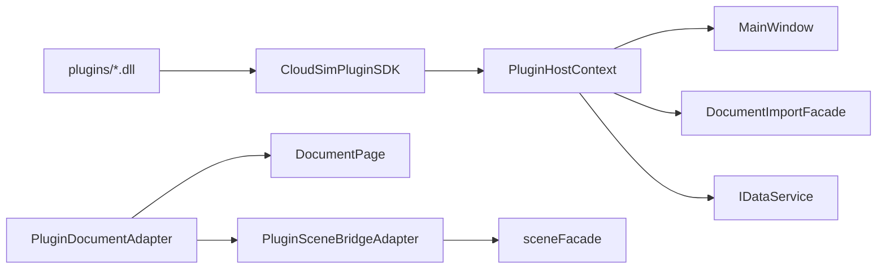

# CloudSimPluginHost 开发文档

## 1. 模块定位

`CloudSimPluginHost` 是 **动态插件的宿主实现**：扫描 `plugins/`、`QPluginLoader` 加载、`IPluginHostContext` / `IPluginDocument` 适配到 `DocumentPage` 与 Host 契约。**源码在** `src/UI/CloudSimPluginHost/`，**编译进 `Widget.dll`**（非独立 DLL）。

| 属性 | 说明 |
|------|------|
| 对外 ABI | 插件仅见 [`CloudSimPluginSDK`](../../Plugins/CloudSimPluginSDK/DEVELOPER_GUIDE.md)（`ICloudSimPlugin`、`IPluginHostContext`） |
| 宿主实现 | 本目录 `PluginHostContext`、`PluginDocumentAdapter`、`PluginManager` |
| 数据/场景 | 经 `IDataService`、`DocumentImportFacade`、`BackendSceneDocumentFacade`（不直连 `BackendDataManager*` 给插件） |

---

## 2. 核心类

### 2.1 `PluginManager`

| 职责 | 说明 |
|------|------|
| 构造 | 创建 `PluginHostContext`，`attachDocumentTabSignals()` |
| `loadAllFromPluginsDirectory` | 扫描 exe 旁 `plugins/<id>/plugin.json`，校验 `minHostVersion`、`enabled`，`QPluginLoader` → `ICloudSimPlugin::initialize` |
| `shutdownAll` | 逆序 `shutdown()`、卸载 |

由 `MainWindowUiSetup` / 应用启动路径构造（见 `Widget` 工程）。

### 2.2 `PluginHostContext`（`IPluginHostContext`）

| API 分类 | 实现要点 |
|----------|----------|
| 文档 | `refreshDocumentAdapters()` 为每个 `DocumentPage` 建 `PluginDocumentAdapter`；`activeDocument()` / `documentAt()` |
| UI 注册 | `registerDockWidget`、`registerSidePanelTab`、`registerMenuPath` / `registerAction`（动作在 UI 线程触发） |
| 线程 | `enqueueJob` → `MainWindow::jobSystem()`；`invokeOnUiThread` → `QMetaObject::invokeMethod` |
| **导入** | `importFileIntoActiveDocument` → `DocumentImportFacade::importFileIntoDocument`（`ImportOptionsDto::isPointCloud`） |
| **网格** | `createPrimitiveMesh` / `registerTriangleMesh` → `registerAdoptedMesh`（Host） |
| **类型** | `registerBackendType` → `BackendRegistry` + `PluginDelegatedBackend` 包装 `IPluginBackendObject` |
| 日志 | `RunLogger` info/warn/error |

**禁止**：插件 DLL 链接 `Widget.lib` / `CloudSimHost.lib`；宿主侧可 include Host/Widget 头。

### 2.3 `PluginDocumentAdapter`（`IPluginDocument`）

| API | 实现 |
|-----|------|
| `backendIds` / `containsBackend` / 名称 | 读 `DocumentPage::backend()` |
| `removeBackendObject` | `page->data().unregisterSubtree` → Host `removeBackendSubtree` + 事件 |
| `sceneBridge()` | `PluginSceneBridgeAdapter` → `page->sceneFacade().bridge()` |
| `documentId()` | `DocumentPage::documentId()` |

### 2.4 `PluginSceneBridgeAdapter`（`IPluginSceneBridge`）

委托 `DocumentPage::sceneFacade()`：`setBackendObjectVisible` 经 `BackendSceneEntity`；矩阵/分支 API 经 `IBackendSceneBridge`。

### 2.5 `PluginDelegatedBackend`

将插件 `IPluginBackendObject` 适配为 `BackendDataBase`，供 `registerBackendType` 注册进 `BackendRegistry`。

---

## 3. 与 Host 接线（推荐路径）

| 插件 SDK 调用 | 宿主实现 |
|---------------|----------|
| `importFileIntoActiveDocument(path, isPointCloud)` | `DocumentImportFacade::importFileIntoDocument` |
| `pointCloudHost()->…` | `PluginPointCloudHostImpl` → `DocumentPointCloudOps` → `point_cloud_backend_ops` → OSG 刷新 |
| `IPluginDocument::queryPointCloudInfo` / `measurePointCloud` | `DocumentPointCloudOps` 读 `PointCloudBackendData` |
| `createPrimitiveMesh` / `registerTriangleMesh` | `DocumentImportFacade::registerAdoptedMesh` |
| `IPluginDocument::removeBackendObject` | `IDataService::unregisterSubtree` |
| 场景矩阵/显隐 | `IPluginSceneBridge` → `BackendSceneDocumentFacade` |

导入/注册成功后会由 Host 发布 `BackendObjectRegisteredEvent`；`MainWindow` 订阅刷新后端树（与菜单导入一致）。

大文件 **ply 点云** 异步 Job 仍在 `MainWindowImportCaptureRenderController`；插件处理已导入点云请用 **`pointCloudHost()`**（snapshot → Job → UI 写回 + `loadPointCloudFromBackendData`）。

`importFileIntoActiveDocument(..., isPointCloud=true)` 且扩展名为 `.ply` 时：若头含 `element face`（`PlyIo::plyFileHasTriangleFaces`），Host `importPointCloudFile` 自动改 `importMeshFile`，注册为 `Model` 网格而非点云。

| 路径 | 说明 |
|------|------|
| `inc/DocumentPointCloudOps.h` | 解析 `PointCloudBackendData`、OSG 提交、mesh 注册 |
| `inc/PluginPointCloudHostImpl.h` | `IPluginPointCloudHost` 实现 |

---

## 4. 文件布局

| 路径 | 说明 |
|------|------|
| `inc/PluginHostContext.h` | 宿主上下文 |
| `inc/PluginDocumentAdapter.h` | 单文档适配 |
| `inc/PluginSceneBridgeAdapter.h` | 场景桥接 |
| `inc/PluginManager.h` | 加载器 |
| `inc/PluginDelegatedBackend.h` | 插件对象 → Data |
| `source/*.cpp` | 实现 |

工程：`CloudSimPluginHost.vcxproj`（输出进 `Widget` 链接，不单独生成 DLL）。

---

## 5. 相关文档

| 文档 | 内容 |
|------|------|
| [`CloudSimPluginSDK/DEVELOPER_GUIDE.md`](../../Plugins/CloudSimPluginSDK/DEVELOPER_GUIDE.md) | 插件作者 ABI、清单、线程 |
| [`CloudSimHost/DEVELOPER_GUIDE.md`](../../Host/CloudSimHost/DEVELOPER_GUIDE.md) | `DocumentImportFacade`、`DataServiceAdapter` |
| [`CloudSimCore/DEVELOPER_GUIDE.md`](../../Contracts/CloudSimCore/DEVELOPER_GUIDE.md) | `IDataService`、`EventHub` |
| [`Widget/DEVELOPER_GUIDE.md`](../Widget/DEVELOPER_GUIDE.md) | 主窗口、JobSystem |
| [`ARCHITECTURE_SUMMARY.md`](../../../ARCHITECTURE_SUMMARY.md) §10 | 插件运行时与目录约定 |
