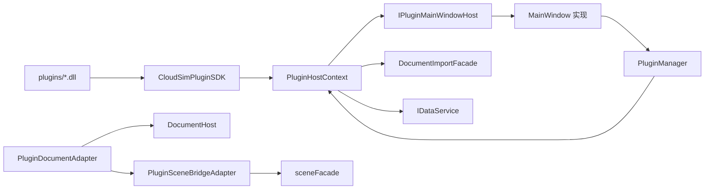

# CloudSimPluginHost 开发文档

## 1. 模块定位

`CloudSimPluginHost` 是 **动态插件的宿主实现**：扫描 `plugins/`、`QPluginLoader` 加载、`IPluginHostContext` / `IPluginDocument` 适配到 `DocumentHost` 与 Host 契约。**源码在** `src/UI/CloudSimPluginHost/`，**编译进 `CloudSimHost.dll`**（非独立 DLL，也不再编入 `Widget.dll`）。

| 属性 | 说明 |
|------|------|
| 对外 ABI | 插件仅见 [`CloudSimPluginSDK`](../../Plugins/CloudSimPluginSDK/DEVELOPER_GUIDE.md)（`ICloudSimPlugin`、`IPluginHostContext`） |
| 宿主实现 | 本目录 `PluginHostContext`、`PluginDocumentAdapter`、`PluginManager`（`CLOUDSIM_HOST_EXPORT`） |
| UI 反向依赖 | Host **不** `#include MainWindow.h`；经 **`IPluginMainWindowHost`** 回调 Widget 能力 |
| 数据/场景 | 经 `IDataService`、`DocumentImportFacade`、`DocumentHost::sceneFacade()`（不直连 `BackendDataManager*` 给插件） |



---

## 2. 核心类

### 2.1 `PluginManager`

| 职责 | 说明 |
|------|------|
| 构造 | 创建 `PluginHostContext`，`attachDocumentTabSignals()` |
| `loadAllFromPluginsDirectory` | 扫描 exe 旁 `plugins/<id>/plugin.json`，校验 `minHostVersion`、`enabled`，`QPluginLoader` → `ICloudSimPlugin::initialize` |
| `shutdownAll` | 逆序 `shutdown()`、卸载 |

**编译位置**：`CloudSimHost.vcxproj`（导出 `PluginManager`）。**构造位置**：`MainWindow`（`MainWindowPlugins.cpp`）传入 `this` 作为 `IPluginMainWindowHost*`。

### 2.2 `IPluginMainWindowHost`

Widget 侧 UI 能力契约（`inc/IPluginMainWindowHost.h`），供 Host 内 `PluginHostContext` / Ops 使用，**避免 Host 链接 Widget 具体类型**。

| API 分类 | 说明 |
|----------|------|
| 文档 | `documentTabs()`、`currentDocumentHost()`、`documentHostAt(tabIndex)` → `cloudsim::host::DocumentHost*` |
| UI 注册 | `addPluginSidePanelTab`、`addPluginDockWidget`、`menuBar()` |
| OSG / 渲染 | `currentDocumentHost()->render()`；截图 `captureActiveViewportPng` → `IRenderView::captureViewportPng` |
| 树/导入 | `focusBackendInTree`、`focusBackendInTreeAfterImport` |
| 后台任务 | `enqueueBackgroundJob` → Widget `JobSystem` |
| 运行信息 | `appendRunInfo` |
| AI 轨迹 | `resolveTrajectoryWorkpieceForAi`、`commitAiTrajectoryFeaturesForAi` 等 |

`MainWindow` 公开实现该接口；`PluginJobProgressFn` 在本地定义，避免 Widget/exe 依赖 PluginSDK 头。

### 2.3 `PluginHostContext`（`IPluginHostContext`）

| API 分类 | 实现要点 |
|----------|----------|
| 文档 | `refreshDocumentAdapters()` 为每个 `DocumentHost` 建 `PluginDocumentAdapter`；`activeDocument()` / `documentAt()` |
| UI 注册 | `registerDockWidget`、`registerSidePanelTab`、`registerMenuPath` / `registerAction`（经 `IPluginMainWindowHost`） |
| 线程 | `enqueueJob` → `IPluginMainWindowHost::enqueueBackgroundJob`；`invokeOnUiThread` → `QMetaObject::invokeMethod` |
| **导入** | `importFileIntoActiveDocument` → `DocumentImportFacade::importFileIntoDocument`（`ImportOptionsDto::isPointCloud`） |
| **网格** | `createPrimitiveMesh` / `registerTriangleMesh` → `registerAdoptedMesh`（Host） |
| **视口截图** | **1.6.0+** `captureActiveViewportPng` → `currentDocumentHost()->render().captureViewportPng` |
| **几何拾取** | **1.7.0+** `geometryHost()->pickStepElementFromViewport`：`OsgWidget::meshPickCommitted` + 模型坐标反变换 + `resolveStepFace/EdgeIndex` |
| **类型** | `registerBackendType` → `BackendRegistry` + `PluginDelegatedBackend` 包装 `IPluginBackendObject` |
| 日志 | `RunLogger` info/warn/error |

**禁止**：插件 DLL 链接 `Widget.lib` / `CloudSimHost.lib`；宿主侧可 include Host 头与 `IPluginMainWindowHost.h`。

### 2.4 `PluginDocumentAdapter`（`IPluginDocument`）

| API | 实现 |
|-----|------|
| `backendIds` / `containsBackend` / 名称 | 读 `DocumentHost::backend()`（Host 内部） |
| `removeBackendObject` | `host->data().unregisterSubtree` → Host `removeBackendSubtree` + 事件 |
| `sceneBridge()` | `PluginSceneBridgeAdapter` → `host->sceneFacade().bridge()` |
| `documentId()` | `DocumentHost::documentId()` |

持有 **`DocumentHost*`**（非 `DocumentPage*`），Widget 与 Host 共用同一文档对象。

### 2.5 `PluginSceneBridgeAdapter`（`IPluginSceneBridge`）

委托 **`DocumentHost::sceneFacade()`**：`setBackendObjectVisible` 经 `BackendSceneEntity`；矩阵/分支 API 经 `IBackendSceneBridge`。

### 2.6 `PluginDelegatedBackend`

将插件 `IPluginBackendObject` 适配为 `BackendDataBase`，供 `registerBackendType` 注册进 `BackendRegistry`。

---

## 3. 与 Host 接线（推荐路径）

| 插件 SDK 调用 | 宿主实现 |
|---------------|----------|
| `importFileIntoActiveDocument(path, isPointCloud)` | `DocumentImportFacade::importFileIntoDocument` |
| `pointCloudHost()->…` | `PluginPointCloudHostImpl` → `DocumentPointCloudOps` → `point_cloud_backend_ops` → OSG 刷新 |
| `geometryHost()->listComputableBackends` | `PluginGeometryHostImpl` 读取 `DocumentHost::backend()` + `backendSourcePath()`；仅**顶层** STEP/BRep 工件（`parentsOf` 为空），同路径去重优先 `BrepModel` |
| `geometryHost()->pickStepElementFromViewport` | `PluginGeometryHostImpl` 监听 `OsgWidget::meshPickCommitted` 并回填 `PluginGeometryStepRef` |
| `IPluginDocument::queryPointCloudInfo` / `measurePointCloud` | `DocumentPointCloudOps` 读 `PointCloudBackendData` |
| `createPrimitiveMesh` / `registerTriangleMesh` | `DocumentImportFacade::registerAdoptedMesh` |
| `IPluginDocument::removeBackendObject` | `IDataService::unregisterSubtree` |
| 场景矩阵/显隐 | `IPluginSceneBridge` → `BackendSceneDocumentFacade` |

导入/注册成功后会由 Host 发布 `BackendObjectRegisteredEvent`；`MainWindow` 订阅刷新后端树（与菜单导入一致）。

大文件 **ply 点云** 异步 Job 仍在 `MainWindowImportCaptureRenderController`；插件处理已导入点云请用 **`pointCloudHost()`**（snapshot → Job → UI 写回 + `loadPointCloudFromBackendData`）。

`importFileIntoActiveDocument(..., isPointCloud=true)` 且扩展名为 `.ply` 时：若头含 `element face`（`PlyIo::plyFileHasTriangleFaces`），Host `importPointCloudFile` 自动改 `importMeshFile`，注册为 `Model` 网格而非点云。行为与菜单「打开点云」一致；磁盘路径使用 Qt 本地编码（`QFile::encodeName`），见 [`Data/Data/DEVELOPER_GUIDE.md`](../../Data/Data/DEVELOPER_GUIDE.md) §4.0。

| 路径 | 说明 |
|------|------|
| `inc/DocumentPointCloudOps.h` | 解析 `PointCloudBackendData`、OSG 提交、mesh 注册、**模板配准坐标变换**、**树/插件导出**（`exportPointCloudToPly` / `exportBrepToStep`） |
| `inc/PluginPointCloudHostImpl.h` | `IPluginPointCloudHost` 实现 |

### 3.7 模板 B-rep 更新（点云 → CAD 面拟合）

**专题文档**：[`docs/template_brep_pointcloud_update.md`](../../../docs/_archive/template_brep_pointcloud_update.md)

| API | 说明 |
|-----|------|
| `registerScanToCadTemplate` | 世界系 ICP Job + `applyTemplateRegistrationToVisual` + `TemplateBrepAlignCache` |
| `updateTemplateBrepFromAlignedScan` | 校验缓存 → `updateBrepFromAlignedScan` → `registerAdoptedBrepAndLoadScene` → `alignFaceUpdatedBrepWithTemplateVisual` |
| `applyTemplateRegistrationToVisual` | `applyWorldMatrixIncrement(icpDeltaWorld)` + OSG 同步（几何不变） |
| `alignFaceUpdatedBrepWithTemplateVisual` | `new.worldMatrix = template.worldMatrix` |
| `restoreTemplateShapeFromStep` | 预览失败时恢复模板原始 STEP 几何 |

**Breaking v2**：cache 仅存 `templateWorldMatrixAtRegister` + `icpRmseMm`；无 `alignedWorkXyz` / 烘焙 shape。

面重构注册：`resetViewToHome=false`；注册后调用 `alignFaceUpdatedBrepWithTemplateVisual` 同步 `worldMatrix`。`clearBrepImportArtifactsCache()` 后 load。

坐标变换要点（`DocumentPointCloudOps.cpp`）：

- 模板/扫描 backend id 经 **`OsgWidget::resolvePickScopeBackendId`** 解析 visual id（装配 alias）。
- 坐标变换遵循 [`../../../docs/spatial_contract_world_pose.md`](../../../docs/spatial_contract_world_pose.md)；`feature_pick_transform` 经 `getBackendRootWorldMatrix`（**不**加减 `modelCenter`）。
- 禁止对模板 id 直接使用 logical id 取 world 矩阵而不 resolve，否则装配体子件会出现 `frameCheck pairHits=0`。

配准编排与日志见 `geometry_backend_ops::registerScanToCadTemplate`（`Geometry/GeometryServices/source/GeometryBackendOps.cpp`）。

### 3.8 网格后处理（1.9.0+，VcgAlgorithms）

基于 vcglib 的网格后处理能力，通过 `VcgAlgorithms.dll` 实现。

| API | 说明 |
|-----|------|
| `queryMeshInfo` | UI 线程查询面数/顶点数（`DocumentPointCloudOps::queryMeshInfo`） |
| `simplifyMesh` | `runMeshMutateJob` → `point_cloud_backend_ops::simplifyMesh` → vcglib quadric-edge-collapse |
| `smoothMesh` | Laplacian 或 Implicit Fairing 平滑 |
| `repairMesh` | 去退化面/重复顶点/非流形/填孔 |
| `remeshMeshIsotropic` | 各向同性重网格（均匀三角形分布） |

**调用链路**：

```text
PluginPointCloudHostImpl::simplifyMesh(...)
  → runMeshMutateJob(通用模板)
    → [后台线程] point_cloud_backend_ops::simplifyMesh(soupIn, soupOut, ...)
      → LoadLibrary("VcgAlgorithms.dll")
      → vcgalgo::simplifyQuadricEdgeCollapse(...)
    → [UI线程] registerReconstructedMesh(新 mesh 对象)
```

**关键设计**：
- `runMeshMutateJob` 是网格异步操作通用模式：读 soup → 后台处理 → 注册新 mesh
- `point_cloud_backend_ops` 通过运行时 `LoadLibrary` 加载 `VcgAlgorithms.dll`，避免硬依赖
- 操作结果创建新 mesh 对件，不修改原始对象（与重建一致）

| 路径 | 说明 |
|------|------|
| `inc/DocumentPointCloudOps.h` | 新增 `resolveMesh`、`queryMeshInfo` |
| `inc/PluginPointCloudHostImpl.h` | 新增 5 个 override 方法 |

### 3.9 网格缺陷分析（1.10.0+，只读）

| API | 说明 |
|-----|------|
| `analyzeMeshDefects` | `runMeshAnalyzeJob` → `point_cloud_backend_ops::analyzeMeshDefects` → `vcgalgo::detectMeshDefects` |
| `clearMeshDefectHighlight` | `OsgWidget::hideMeshElementHighlight()` |

**调用链路**：

```text
PluginPointCloudHostImpl::analyzeMeshDefects(...)
  → runMeshAnalyzeJob（只读，不 registerReconstructedMesh）
    → [后台] point_cloud_backend_ops::analyzeMeshDefects(soupIn, ...)
    → [UI] defectFacesToWorldVerts → showMeshFaceHighlight
```

切换网格目标或点击「清除高亮」时调用 `clearMeshDefectHighlight`。

### 3.10 管状铸件特征构建（1.15.0+）

| API | 说明 |
|-----|------|
| `beginTubularGrindingSession` | 绑定 `docId + meshBackendId`，创建 `geoalgo::TubularGrindingSession` |
| `runTubularGrindingStage` | 后台 `geometry_backend_ops::runTubularGrindingStage`；UI 注册各阶段场景对象 |
| `clearTubularGrindingSession` | 移除会话及全部临时对象（见下表） |

**场景注册**（`PluginPointCloudHostImpl.cpp`）：

| 阶段 | 注册方式 | 显示名后缀 |
|------|----------|------------|
| Segment | `registerTubularGrindingColoredMeshFromSoup` | `_管段着色` |
| Segment | `registerTubularGrindingColoredMeshFromSoup` | `_环着色`（环验证） |
| Segment | `registerTubularGrindingPointCloud` | `_环圆心` |
| Segment | `registerTubularGrindingNormalAxisLines`（`MeshBackendData::setOverlayLineSegments`） | `_法向` |
| Centerline / TemplatePoints / Project | `registerTubularGrindingPointCloud`（继承源 mesh 位姿） | `_中心线` / `_模板点位` / `_投影点位` |

`PluginTubularGrindingReport` 回填各 `*BackendId` 供插件查询。Segment 摘要示例：`管段分割完成：N 个管段，M 个环，交汇面 K，环心簇 C`。

会话 id 前缀 `tg_<n>`；阶段顺序门禁与曲面重构 `isNextPluginStage` 同模式。RunInfo 前缀 `[特征构建]`。

算法（环分割）：[`GeometryAlgorithm/DEVELOPER_GUIDE.md`](../../Geometry/GeometryAlgorithm/DEVELOPER_GUIDE.md) §3.5。

---

## 4. 文件布局

| 路径 | 说明 |
|------|------|
| `inc/IPluginMainWindowHost.h` | Widget UI 反向契约（Host 编译，Widget 实现） |
| `inc/PluginHostContext.h` | 宿主上下文 |
| `inc/PluginDocumentAdapter.h` | 单文档适配（`DocumentHost*`） |
| `inc/PluginSceneBridgeAdapter.h` | 场景桥接 |
| `inc/PluginManager.h` | 加载器（`CLOUDSIM_HOST_EXPORT`） |
| `inc/PluginDelegatedBackend.h` | 插件对象 → Data |
| `source/*.cpp` | 实现 |

工程：**`CloudSimHost.vcxproj`**（`CloudSimPluginHost.vcxproj` 保留为逻辑分组，产物进 Host DLL）。

---

## 5. 相关文档

| 文档 | 内容 |
|------|------|
| [`CloudSimPluginSDK/DEVELOPER_GUIDE.md`](../../Plugins/CloudSimPluginSDK/DEVELOPER_GUIDE.md) | 插件作者 ABI、清单、线程 |
| [`CloudSimHost/DEVELOPER_GUIDE.md`](../../Host/CloudSimHost/DEVELOPER_GUIDE.md) | `DocumentImportFacade`、`DocumentHost::sceneFacade()`、`osgWidgetFrom` |
| [`CloudSimCore/DEVELOPER_GUIDE.md`](../../Contracts/CloudSimCore/DEVELOPER_GUIDE.md) | `IDataService`、`EventHub` |
| [`Widget/DEVELOPER_GUIDE.md`](../Widget/DEVELOPER_GUIDE.md) | `MainWindow` 实现 `IPluginMainWindowHost`、JobSystem |
| [文档索引](../../../docs/README.md) §10 | 插件运行时与目录约定 |
| [`docs/template_brep_pointcloud_update.md`](../../../docs/_archive/template_brep_pointcloud_update.md) | 模板 B-rep + 点云配准与面更新 |
| [`CloudSimAiSDK/DEVELOPER_GUIDE.md`](../../Plugins/CloudSimAiSDK/DEVELOPER_GUIDE.md) | AI 助手、`ai_config`、训练索引 |
| [`tools/ai-training/CONFIGURATION.md`](../../../tools/ai-training/CONFIGURATION.md) | `ai_config.json` 字段 |
| [`tools/ai-training/README.md`](../../../tools/ai-training/README.md) | 离线训练与 Ollama 部署 |

### AI 实现位置（`source/Ai/`）

| 类 | 职责 |
|----|------|
| `AiAssistantHostImpl` | `IAiAssistantHost`：解析链、配置、执行委托 |
| `AiIntentParser` | 规则解析（创建基本体；尺寸可省略） |
| `AiMeshDefaults` | `mesh_create_defaults` 加载；`applyMissingDimensions` 补全 `dimensions_mm` |
| `AiLlmClient` | OpenAI 兼容 HTTP（Ollama / 云端）；mesh 提示词含缺省/口语策略 |
| `AiActionPlanExecutor` | JSON → `createPrimitiveMesh` / `importFile`；含 `booleanMesh` 的 compose 计划默认内存布尔（仅注册结果） |
| `MeshCreateDomainHandler` / `MeshComposeDomainHandler` / `GeometryRecognizeDomainHandler` / `TrajectoryFeatureDomainHandler` | 内置分域 |
| `MeshBoolean`（Data） | CGAL PMP；`booleanMeshSoups` / `booleanMesh` 调用 |
| `PluginHostContext` 1.4.0+ | `buildPrimitiveMeshSoup`、`booleanMeshSoups`、`booleanPrimitiveMeshes`（预注册布尔） |
| `geometry_backend_ops`（Data） | `FeatureSpec` 离散 / Catalog；轨迹页与 AI `trajectory.feature` 共用 |

### `TrajectoryFeatureDomainHandler`（`trajectory.feature`）

**完整流程、会话状态、3D 叠加与验收清单见 [`docs/trajectory_feature_ai.md`](../../../docs/_archive/trajectory_feature_ai.md)。**

| 项 | 说明 |
|----|------|
| 输出 | `StructuredJson`：`features[]`（`FeatureSpec`）+ `selectedCandidateIds` + `suggestedPipelineTemplate` |
| `validateOutput` | 逐项 `featureSpecFromJson` + `validateFeatureSpec` |
| `execute` | 仅校验；实际离散由 UI「确认并离散」→ `commitAiTrajectoryFeatures` |
| 路由 | `AiDomainRouter`：轨迹/焊缝/涂胶/打磨等关键词 |

### `AiTrajectoryFeatureCatalog`（`source/Ai/`）

| API | 职责 |
|-----|------|
| `inferFeatureAxisFromText` | 线 / 面 / ambiguous |
| `buildCatalogSliceJson` | 全量 catalog 按轴切片，写入 `displayIndex` 1..N（默认不截断；可传 maxItems） |
| `tryParseTrajectoryFeatureRules` | rules 路径：`suggestFeaturesFromCatalog` 或前 8 项回退 |
| `parseDisplayIndexSelection` | 「选 1 和 3」→ `candidateId[]` |
| `buildFeaturePlanFromCandidateIds` | 编号 → 完整 `features[]` 计划 |

### `IPluginHostContext` 1.7.0+（轨迹 AI）

| API | Widget 桥接 |
|-----|-------------|
| `resolveTrajectoryWorkpiece` | `MainWindow::resolveTrajectoryWorkpieceForAi` |
| `buildTrajectoryFeatureCatalogSlice` | `PluginHostContext` → OCCT `enumerateFeatureCatalog` + 切片 |
| `showAiFeatureCandidatePreview` | → `FeatureTrajectoryPageWidget::buildAndShowCandidatePreview`（overlay 坐标经 `feature_pick_transform` + `IRobotOsgViewHost` pick alias / skip-rebase） |
| `commitAiTrajectoryFeatures` | → `commitFeaturePlanFromAi`（离散 + `pipeline[]` 或 recipe 回退） |
| `proposeAndConfirmTrajectoryPlan` | enrich + `TrajectoryPlanConfirmDialog` |
| `loadBoundTrajectoryPlanForAi` / `reviseAiTrajectoryPlan` | 已作用再编辑 |

---
