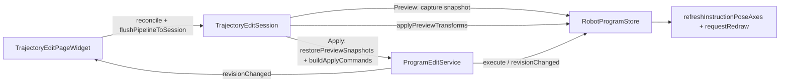

# RobotWidget Developer Guide

Robot simulation and device UI live in this x64 DLL (`RobotWidget.dll`, `ROBOTWIDGET_LIB`). Widget keeps `DocumentPage`, `OsgWidget`, and TCP drag teach; orchestration uses host interfaces.

## Build (x64)

| Item | Value |
|------|--------|
| Output | `RobotWidget.dll` |
| Defines | `ROBOTWIDGET_LIB` |
| Links (import lib) | `Data`, `OsgWidgetCore`, `BackendVisual`, `GeometryEngine`, `RobotScene`, `RobotUrdf`, `RobotKinematics`, `RunLogger` + OSG |

与 `Widget.dll` **共享**上述引擎 DLL 运行时实例，不在本 DLL 内重复静态嵌入。

## Layout

| Area | Location |
|------|----------|
| Simulation dock (Instructions / Axis / Frames / **Trajectory Generation** / **Trajectory Edit**) | `RobotSimulationDockWidget`, page widgets |
| Orchestration | `RobotSimulationController` |
| Host contracts | `IRobotMainWindowHost`, `IRobotDocumentHost`, `IRobotOsgViewHost` |
| FK / matrix helpers | `RobotSimulationMath` |
| Instruction planning context | `RobotInstructionPlanning` |
| URDF import entry | `RobotUrdfImport::registerUrdfRobot` → host |
| 程序 JSON（多程序 / 分组 / v4） | `RobotProgramStore` → `RobotProgramCatalog`；序列化见 `RobotProgramJsonIo` |
| 程序编辑撤销栈 | `ProgramEditService` + `ProgramEditStack`（`RobotScene`） |
| 轨迹编辑流水线 | `TrajectoryEditPageWidget` / `TrajectoryEditSession` / `TrajectoryPipelineBuilder` |
| **CAD 轨迹生成** | `FeatureTrajectoryPageWidget`：`FeatureSpec` → 离散 → `RawTrajectory` 写入 `TrajectoryEditSession` |
| Property-panel feasible-axis query | `RobotInstructionPropertyEditor` |

## Widget integration

- `MainWindowRobotHost` implements `IRobotDocumentHost` / `IRobotOsgViewHost` / `IRobotMainWindowHost`.
- `MainWindowUiSetup` creates `RobotSimulationController`, simulation dock, and attaches `m_robotSimTimer` via `attachPlaybackTimer`.
- `MainWindowRobotStubs.cpp` forwards slots (`onSimulationInstructionSelectionChanged`, `onRobotAxisJointAnglesChanged`, TCP teach, etc.) to the controller.
- `MainWindowPropertyPanel` still owns the Qt property browser; the controller calls `refreshInstructionPropertyPanel` on the host.

### Host pitfalls (per-link URDF)

| 项 | 说明 |
|----|------|
| `IRobotDocumentHost::robotBackendManagerForKinematics()` | **必须**转发到 `DocumentPage::robotBackendManagerForKinematics()`。默认基类返回 `nullptr` 会导致 `applyJointAnglesViaLinkBackends` 失败，轴控制/拖动/预览均无场景更新。 |
| `IRobotOsgViewHost` 生命周期 | `osgView()` 在 `currentOsgWidget()` 变化时重建 `OsgViewHost`；勿缓存首次 `OsgWidget*`。 |
| `IRobotDocumentHost` 文档切换 | `document()` 在 `currentPage()` 变化时重建 `DocumentHost`（与 OSG 规则一致）。 |

## Build

- Platform: **x64** only (Debug/Release).
- Output: `bin/x64(d)/RobotWidget.dll`.
- Depends: `RobotScene`, `RobotUrdf`, `RobotKinematics`, `GeometryEngine`, `Data`, `RunLogger`, `OsgWidgetCore`, `BackendVisual`, OSG.

See also [`../Widget/DEVELOPER_GUIDE.md`](../Widget/DEVELOPER_GUIDE.md) §13–§16 and [`../ARCHITECTURE_SUMMARY.md`](../ARCHITECTURE_SUMMARY.md) §6.4.

---

## `RobotSimulationController`

Central orchestration (formerly in `MainWindow.cpp`). Wired in `wireSimulationSignals()` after dock creation.

**重构进度**（详见 `ARCHITECTURE_SUMMARY.md` §迁移路线图）：
- 阶段 1.1-1.5 已完成：运动学（6 处 `applyJointAnglesForInstance`）、坐标系管理、TCP IK 已通过 `IRobotDocumentHost` 委托
- 阶段 1.6 待定：导出功能需 Controller 内部状态

| 职责 | 入口 | 委托方式 |
|------|------|----------|
| 轴控制 | `onRobotAxisJointAnglesChanged` | `doc->applyJointAnglesRad()` |
| 指令选中预览 | `onSimulationInstructionSelectionChanged` → `applyRobotPoseForInstructionPreview` | 仍经 Controller |
| 添加运动点 | `onSimulationAddInstructionRequested` | 仍经 Controller |
| 运行/停止 | `onSimulationRunRequested` / `onSimulationStopRequested` | 仍经 Controller |
| TCP 拖动示教 | `onSimulationTcpDragTeachModeChanged` / `onTcpDragTeachPoseChanged` | IK 经 `doc->solveTcpDragTeachIk()` |
| 程序起点 | `captureMotionPreviewProgramStartJoints` | 仍经 Controller |
| 坐标系捕获 | `onCaptureToolFrameFromTcp` / `onCaptureUserFrameFromTcp` | `doc->captureToolFrameFromTcp()` / `doc->captureUserFrameFromTcp()` |
| 坐标系重置 | `onResetToolFrame` | `doc->resetToolFrame()` |

### `wireSimulationSignals`

连接 `SimulationCommandWidget` / `RobotAxisControlWidget` / `RobotFrameSettingsWidget` / **`TrajectoryEditPageWidget`** / **`FeatureTrajectoryPageWidget`** 信号到 controller 槽。`ProgramEditService`、`TrajectoryEditSession` 在 dock 创建时实例化，文档就绪后 `bindStore`（`refreshSimulationProgramStore`）。

`FeatureTrajectoryPageWidget`：`bindHost` + `bindSession` + `setStepPathResolver`（`doc->meshBackendStepSourcePath`）；见 §CAD 轨迹生成。`TrajectoryEditPageWidget` 承接 session 内 RawTrajectory 的配方与生成程序。

`QTabWidget::currentChanged` 须在 dock 与 `attachPlaybackTimer` 之后连接（见 `MainWindowUiSetup`），避免构造期 `stopRobotSimulation` 空指针。

轨迹编辑：`opsChanged` → `syncSessionPipeline`（结构变更）；参数 SpinBox → `updatePipelineOps`（见 §轨迹编辑）。

---

## 示教关节与位姿真源

### `context.currentJointRadCsv`

添加 PTP/LINE 时写入当前实例关节角（rad，逗号分隔）。**预览**与 **Run** 对该指令优先使用示教角，**不再**对该点重算 IK（避免与拖动/捕获姿态不一致）。

| API | 模块 |
|-----|------|
| `RobotInstructionPlanning::encodeJointAnglesRadCsv` | 写入 |
| `RobotInstructionPlanning::jointAnglesRadFromInstructionContext` | 读取 |
| `RobotInstructionPlanning::motionDurationSecFromInstruction` | 段时长（缺省 0.5s） |

### `prepareMotionInstructionForPlanning`

仅设置规划上下文，**禁止**用当前 `rollingQ` 的 FK 覆盖指令 `pose/euler`（`writeTargetTransformToInstruction` 已移除）。写入：

- `context.currentJointRadCsv`（链式种子）
- `context.urdfPath` / `context.tcpLinkName`
- `context.toolFrameMat4`

### 程序起点 `m_motionPreviewProgramStartJointRad`

- 链式预览/Run 的**第一段起点**（与 `initialAngles` 同源）。
- **仅在**该机器人**第一条**运动指令加入程序时更新（`collectMotionInstructions` 条数 ≤ 1）；后续点不再覆盖，避免多点示教时起点被第二点关节顶替。
- 优先从 `m_aggregatedJointAnglesRad` 捕获，否则回退轴滑块。

### TCP 拖动 IK（`applyTcpDragTeachIkFromPose`）

1. `ctx.T_base_target` 来自罗盘（`tcpDragTeachPoseChanged`），并缓存到 `m_lastTcpDragTargetInBase`。
2. `RobotTeachIk::solveTeachIk` → 关节角按 URDF 限位 **钳位**（`clampJointAnglesToInstanceLimits`）。
3. `setJointAnglesRad`（UI 钳位）后 `onRobotAxisJointAnglesChanged(jointAnglesRad())`，保证场景与滑块一致。
4. `updateTcpDragTeachFromTarget` 用钳位后 FK 对齐罗盘（IK 残差时可能略有偏差）。
5. **不**在拖动每帧更新程序起点（仅添加第一条运动指令或空程序结束拖动时可选捕获）。

### 添加指令（`onSimulationAddInstructionRequested`）

| 步骤 | 行为 |
|------|------|
| 位姿 | 若存在 `m_lastTcpDragTargetValid`，用罗盘 `T_base_target` 写 `pose/euler` 与 `writeTargetTransformToInstruction`；否则 `tryCaptureCurrentRobotTcpPose`（关节角优先 `m_aggregatedJointAnglesRad`） |
| 关节上下文 | `context.currentJointRadCsv` = `localJointAnglesForInstance` |
| 添加后 | `captureMotionPreviewProgramStartJoints`（仅首条运动）、`m_skipInstructionPreviewOnce` → 避免立即链式预览把机器人拉离示教姿态 |
| 选中 | `onSimulationInstructionSelectionChanged` 刷新属性与叠加轴 |

### 指令预览（`applyRobotPoseForInstructionPreview`）

自 `motionPreviewProgramStartJointsLocal` 链式处理 `collectMotionInstructions` 至选中点：

- 若该点有 `context.currentJointRadCsv` 且长度 = `nj`：**直接**采用示教关节，跳过 `validate/plan`。
- 否则：`prepareMotionInstructionForPlanning` + `validate` + `plan`，`rollingQ` 取 `plan.jointTargetsRad`。
- 写回 `applyJointAnglesForInstance` 与轴滑块（`m_suppressMotionPreviewStartCapture` 防止误改程序起点）。

### 运行（`onSimulationStartTriggered`）

- `initialAngles` 优先 `m_motionPreviewProgramStartJointRad`，否则当前滑块。
- 对每条运动指令构建 `PlanResult`：有示教 CSV 则 `plan.ok=true`、`jointTargetsRad=示教角`（`plannerName=taughtJointCsv`）；否则走 `RobotInstructionController::plan`。
- `RobotProgramExecutor::tryStart` + `tick` 按段插值 `jointTargetsRad`。

---

## `RobotInstructionPlanning`

| 符号 | 说明 |
|------|------|
| `backupInstructionPose` / `restoreInstructionPose` | 规划前保存/恢复位姿与 extensions |
| `prepareMotionInstructionForPlanning` | 写规划上下文（见上） |
| `encodeJointAnglesRadCsv` / `jointAnglesRadFromInstructionContext` | 示教关节持久化 |
| `motionDurationSecFromInstruction` | 段时长 |

---

## `RobotSimulationMath` / 捕获

`tryCaptureCurrentRobotTcpPose`（controller）：优先 `targetInBaseFromUrdfFlangeFk` + 工具系；关节角优先聚合向量再滑块。per-link 场景见 `captureTcpFromSceneFlangeBackend`。

---

## 页面控件（简要）

| 类 | 说明 |
|----|------|
| `SimulationCommandWidget` | 指令树、Run/Stop、TCP 拖动；**程序下拉 / 新建 / 重命名 / 删除**；**指令**分组（PTP/LINE/…）与 **功能**分组（末端拖动/删除/清空）；Ctrl 多选 + 右键创建分组；`setProgramStore`、`activeProgramChanged` / `groupsChanged` |
| `RobotAxisControlWidget` | 关节滑块；`setJointAngle` 内 `qBound` 限位 |
| `RobotFrameSettingsWidget` | 工具/用户系；`framesChanged` → 叠加刷新 |
| `TrajectoryEditPageWidget` | 轨迹编辑 Dock 子页：**工艺模板**区 + 调色板 + Program Op 流水线 + 参数区 + 预览勾选/Apply/Reset/Undo |
| `InstructionProgramTreeWidget` | 层级指令树；`NodeKind::Group` 嵌套显示分组；Ctrl 多选根层级指令 → 右键创建分组；拖放维护 `memberInstructionIds`；`instructionSelected` → 预览 |
| `TrajectoryEditSession` | 预览（临时改 store 中 pose）与 Apply（Command 落盘）；`reset` / `abandonPreview`；**并行持有** `m_rawTrajectory`（`setRawTrajectory` / `rawTrajectoryChanged`，与 Program 预览快照解耦）；见 §轨迹编辑 |
| `ProgramEditService` | `execute` / `undo` / `redo`；`revisionChanged` → 轨迹页 `syncUiAfterProgramRevision` + 指令树刷新 |
| `DevicePageWidget` | URDF 导入 → `onUrdfImportRequested` |

TCP 拖动 OSG 实现仍在 [`../Widget/DEVELOPER_GUIDE.md`](../Widget/DEVELOPER_GUIDE.md) §13.1。

### `SimulationCommandWidget` 布局（指令子页）

Dock **机器人** 页内指令编辑区自上而下：

| 区域 | 控件 |
|------|------|
| 提示 | 选择机器人、插入指令、Ctrl 多选 + 右键分组、拖放排序 |
| 机器人 / TCP | `m_robotCombo`、`m_tcpLinkCombo` |
| 程序 | 下拉 + 新建 / 重命名 / 删除 |
| **指令**（`m_instructionGroupBox`） | PTP、LINE、\|、WAIT、IF、WHILE、SET_DO、SET_AO |
| **功能**（`m_functionGroupBox`） | 末端拖动、删除、清空 |
| 指令树 | `InstructionProgramTreeWidget`（占剩余高度） |
| 运行 | Run / Stop / Export |

分组创建/解散/重命名在**树右键**完成，经 `ProgramEditService` 落盘并 `emit groupsChanged()` 供轨迹编辑页刷新顶栏分组下拉。程序切换：`onProgramComboChanged` → `rebuildCommandListWidget()` 绑定当前程序 `steps` + `groups`。

---

## 轨迹编辑（Trajectory Edit）

Dock **「轨迹编辑」**页（在「轨迹生成」之后）。Dock 主标签为 **机器人** / Robot（原「指令仿真」）。默认中文 UI；`MainWindow::applyLanguage` → `trajectoryEditPage()->setUseChinese` / `featureTrajectoryPage()->setUseChinese`；页签索引见 `RobotSimulationDockWidget::kTabIndexTrajectoryGeneration` / `kTabIndexTrajectoryEdit`。

### 工艺模板与原始轨迹（CAD 离散结果）

页顶 **「工艺模板」** 区用于将焊缝/涂胶/打磨一键填充到统一流水线；`RawTrajectory` 仍作为离散输入来源：

| 控件 | 行为 |
|------|------|
| 状态标签 | `TrajectoryEditSession::hasRawTrajectory()` → 点数；否则提示先在轨迹生成页离散 |
| 工艺下拉 | 焊缝 / 涂胶 / 打磨（映射 `RecipeWeld/RecipeGlue/RecipeGrind` 模板） |
| 填充工艺流水线 | `buildRecipePreset` → `m_pipeline->setOps(...)`，插入统一算法块链（焊缝/打磨默认附加 `Approach + Retract`） |
| 生成程序 | 保留 `emitRawTrajectoryToProgram` 入口用于 raw 直出；**Apply 成功后自动禁用**，避免覆盖已应用结果；发生新编辑或 Raw 更新后恢复可用 |

`rawTrajectoryChanged` 刷新状态；`reset()` / `abandonPreview` **不清** `m_rawTrajectory`。当流水线含 Recipe/Approach/Retract 时，Apply 走 Unified IR 分支。

### 组件与绑定（Program Op 流水线）

| 组件 | 职责 |
|------|------|
| `TrajectoryEditPageWidget` | UI：程序/分组、调色板、流水线、`TrajectoryOpParamPanel`、预览勾选/Apply/Undo |
| `TrajectoryPipelineListWidget` | `m_ops` 真源；列表项由 `rebuildItems()` 从 `m_ops` 生成 |
| `TrajectoryEditSession` | 持有 `m_ops` 副本 + `TrajectoryPipelineBuilder`；Preview 快照 / Apply Command；`reset` / `abandonPreview` |
| `ProgramEditService` | Apply 时优先 `executeBatch(cmds)`（单次 `renumberAndNotify` + `revisionChanged`）；Undo/Redo 恢复程序树 |
| `RobotProgramStore` | `activeCatalog()` / `activeProgram()`；与 Instructions 页共用 |

`RobotSimulationController::wireSimulationSignals` 创建并绑定 `ProgramEditService`、`TrajectoryEditSession`；文档就绪后 `bindStore`（见 controller 内 `refreshSimulationProgramStore`）。

### 流水线 ↔ Session 同步（必读）

| 操作 | UI 路径 | Session API |
|------|---------|-------------|
| 增删/排序/拖入/加载模板 | `opsChanged` → `syncSessionPipeline()` | **`setPipeline`**（先 `reset()` 清预览） |
| 仅改参数（Schema 面板） | `applyParamsToSelectedOp()` → `syncSessionParams()` | **`updatePipelineOps`**（不 reset；已预览则 `reapplyPreview()`） |
| 预览勾选 / Apply | `reconcilePipelineScopes()` + `flushPipelineToSession()`（预览勾选时自动或手动触发） | 有选中块 → `applyParamsToSelectedOp`；否则 `syncSessionParams` |
| 撤销 / 重做（任意 Command） | `ProgramEditService::revisionChanged` → `syncUiAfterProgramRevision()` | 刷新分组下拉、丢弃预览、协调流水线 scope（见下） |

**禁止**在参数变更路径调用 `setPipeline()`，否则预览位姿会被 `reset()` 立刻还原。

### 撤销 / 重做与作用域协调

程序树变更（含轨迹 **Apply**、分组创建/删除、指令增删等）均走 `ProgramEditService` 撤销栈。`revisionChanged` 时轨迹页 **`syncUiAfterProgramRevision()`**：

| 步骤 | 行为 |
|------|------|
| 刷新 UI | `refreshUndoButtons`、`refreshProgramAndGroupCombos`（保留顶栏/参数区/当前选中块的分组选中项） |
| 丢弃预览 | `TrajectoryEditSession::abandonPreview()` — **不**还原快照（程序已被 undo/redo 改写，旧快照会污染 store） |
| 协调 scope | `reconcilePipelineScopes()` — 分组块引用的 `groupId` 若已不存在或成员为空：先回退顶栏当前分组，否则改为 `EntireProgram` |
| 同步参数面板 | 若有选中块 → `loadSelectedOpToParams()` |

**典型场景**：预览/应用后撤销「创建分组」→ 流水线块仍带旧 `groupId` → 若不协调会报「作用域内无运动路点」；协调后自动回退为全程序作用域。

`applyParamsToSelectedOp` 在 UI 分组下拉无有效项时，**仅当** `storedGroupId` 仍存在于当前程序分组列表时才恢复，避免保留已失效 id。

### Session：`reset` vs `abandonPreview`

| API | 何时用 | 行为 |
|-----|--------|------|
| `reset()` | 用户点 **Reset**、切换程序、`setPipeline`（结构变更） | 若预览中：先 `restorePreviewSnapshots()` 还原 store，再清快照 |
| `abandonPreview()` | `syncUiAfterProgramRevision`（undo/redo 后） | 仅清快照与 `m_previewActive`，**不写回** store |

### 按钮与交互一览

| 控件 | 行为 |
|------|------|
| **预览（勾选框，默认勾选）** | 勾选：`runPreviewIfEnabled`（`reconcile` → `flush` → `preview`）；取消：`session->reset()` 恢复路点。流水线/参数变更且仍勾选时自动重跑预览 |
| **Apply** | `reconcilePipelineScopes` → `flush` → `apply`：普通块沿用 Program Command；含 Recipe/Approach/Retract 时走 Unified IR + `ReplaceProgramContentCommand`；成功后清空流水线并**取消勾选**预览 |
| **Apply 后生成门控** | 页面状态 `m_pipelineAppliedSinceLastRawChange=true`，`m_rawEmitBtn` 禁用；`onRawEmitProgram` 也有硬门禁提示，防止绕过按钮状态覆盖结果 |
| **Reset** | `session->reset()` + `pipeline->setOps({})`（`opsChanged` → `setPipeline` 同步 Session） |
| **Undo / Redo** | `ProgramEditService::undo/redo` → `revisionChanged` → `syncUiAfterProgramRevision` |
| **流水线右键** | 移除块 / 上移 / 下移（`opsChanged` → `syncSessionPipeline` + 勾选时自动预览） |
| **加载模板** | `setOps` + `syncSessionPipeline` + 勾选时 `runPreviewIfEnabled` |

### 调色板拖放

调色板为内部类 `TrajectoryOpPaletteWidget`（`TrajectoryEditPageWidget.cpp`），`startDrag` 必须写入 `TrajectoryPipelineListWidget::kMimeType` + `TrajectoryOpKind` 整型。

| 方式 | 行为 |
|------|------|
| 双击调色板 | `appendOp(makeDefaultOp(kind))`（`opsChanged` 同步 Session 并可选自动预览） |
| 拖入流水线 | `dropEvent` 解析 MIME → `makeDefaultOp`（默认 scope）→ 写入 `m_ops` |
| ~~Qt 默认 QListWidget 拖放~~ | **已禁用**（`dropEvent` 对未知 MIME `ignore()`）— 仅会产生无数据的「幽灵项」 |

拖入/新建块的默认 scope：`defaultScopeForNewOp()` — **顶栏「分组」**非「（无）」→ `OpScope::Group`（写入 `groupId`），否则 `EntireProgram`。参数区作用域默认「分组」；顶栏分组变更会同步参数区分组下拉，**不**使用指令树选中项。

### 预览 vs 应用

| 阶段 | 行为 |
|------|------|
| **Preview** | `reconcilePipelineScopes` → `collectPreviewWaypointIds`（凡 `PreviewPoseTransform` 能力块）→ 快照原始 pose → `buildPreviewPoseQuery` 链式算目标位姿（含 World/Body `frame`）→ **临时**写回 store → `syncPreviewRenderMatrices` → `refreshInstructionPoseAxes` |
| **Preview（Raw 场景）** | 当 `TrajectoryEditSession::hasRawTrajectory()==true` 时，页面改走 `Raw -> Unified -> pipeline -> Unified->Raw`，并调用 `showRawTrajectoryPreview` 回显；不再依赖 Program 路点预览链 |
| **参数变更且已预览** | `updatePipelineOps` → `reapplyPreview()`（restore 快照 → 重算 → 刷新 OSG）；平移/旋转按作用域点序执行起点→终点线性插值 |
| **Apply** | Raw 存在时强制 `Raw -> Unified -> pipeline -> Program`（Unified 分支）；否则沿用 `restorePreviewSnapshots()` → `buildApplyCommands` → `executeBatch` |
| **Undo / Redo** | `syncUiAfterProgramRevision`：`abandonPreview` + `reconcilePipelineScopes` + 刷新分组 UI |
| **Reset** | `session->reset()` 恢复快照；UI 流水线 `setOps({})` |

预览错误提示（区分原因）：

| 条件 | 文案 |
|------|------|
| `m_ops.empty()` | 流水线为空，请先添加算法块 |
| 无可预览能力块 | 当前流水线无可预览块（Recipe/Approach/Retract 仅 Apply 生效） |
| scope 解析无路点 | 作用域内无运动路点（常见：分组已被撤销但流水线仍引用旧 `groupId`；应先走 `reconcilePipelineScopes`） |

### pose 与 targetTransform 一致性约束（2026-05 修订）

- `TrajectoryEditSession::restorePreviewSnapshots()` 在恢复 `pose/euler + extensions` 时，若快照中不存在 `context.targetTransformQuatCsv` / `context.targetTransformTransMmCsv`，必须先显式 `eraseExtensionProperty`。
- 原因：预览阶段会写入 `context.targetTransform*`；若恢复时仅覆盖 `pose/euler` 而不清理残留键，会出现 `pose` 与 `readTargetTransformFromInstruction` 的真值不一致，Apply 会以错误基线再次增量，表现为“位置像被作用多次”。
- 验证口径：Apply 三阶段（restore 前/后、execute 后）应满足 `pose == targetTransform`，且 `after_execute = baseline + 本次 op`。

### 参数面板（Schema 驱动）

| 组件 | 职责 |
|------|------|
| `TrajectoryOpParamPanel` | 根据 `ITrajectoryOp::paramFields()` 动态建控件；读写经 [`TrajectoryOpBridge.h`](../../Robot/RobotScene/inc/TrajectoryOpBridge.h) |
| `TrajectoryParamWidgetFactory` | Double / Int / Enum / Vec3 / Message 等控件工厂 |
| 顶栏分组 Combo | 页级持有；`scope.groupId` 行复用同一控件，面板 `clearRows` 时不销毁 |

构造时 `RobotInstruction::ensureTrajectoryOpBuiltinsRegistered()`。调色板种类来自 `trajectoryOpPaletteKinds()`；默认块 `makeDefaultDescriptor(defaultScopeForNewOp())`。

流水线摘要 `formatOpSummary`：委托 Registry 中对应 `ITrajectoryOp::formatSummary`（含坐标系、Δ、角度等）。

模板：`QSettings` 键 `pipelineJson`，`trajectoryPipelineToJson` / `trajectoryPipelineFromJson`（见 [`TrajectoryAlgorithm/DEVELOPER_GUIDE.md`](../../Robot/TrajectoryAlgorithm/DEVELOPER_GUIDE.md) §8）。

### 已知限制（Phase 2b）

- Mirror 已实现为“轴反向”（选轴后姿态反向，位置不变）
- Reorder 已实现为“固定姿态”（以作用域首点姿态为基准对齐全部点）
- Delete 预览高亮、ghost 轨迹、`previewMotionWithAccess` FK 链未做
- 预览直接改指令 `pose`，非 Run 级 FK 链（MVP 足够显示路点轴偏移）

业务类型、算法块与 scope 解析见 [`../RobotScene/DEVELOPER_GUIDE.md`](../RobotScene/DEVELOPER_GUIDE.md) §12–§14、[`../TrajectoryAlgorithm/DEVELOPER_GUIDE.md`](../TrajectoryAlgorithm/DEVELOPER_GUIDE.md)。

---

## CAD 轨迹生成（Trajectory Generation）

Dock 页签 **「轨迹生成」**（`FeatureTrajectoryPageWidget`，`kTabIndexTrajectoryGeneration`）。与 §轨迹编辑 区分：本页仅 **特征离散 → 原始 `RawTrajectory` 预览**；配方流水线与 `emitRawTrajectoryToProgram` 在轨迹编辑页完成。

| 步骤 | UI / API |
|------|----------|
| 选 STEP 工件 | `m_backendCombo`：`className=="Model"`、id 非 `RobotURDF_*`、`meshBackendStepSourcePath` 扩展名 `.step`/`.stp` |
| **3D 拾取边/面** | 复用 `MeshEdgeFacePickOperation` → `OsgWidget::meshPickCommitted` → `buildFeatureSpecFromModelPick`（世界坐标经 `feature_pick_transform::worldPointToStepModelMm` 反变换后 `resolveStepFace/EdgeIndex`） |
| 面离散类型 | 拾取前下拉：`FaceBoundary` / `FaceUVGrid` |
| 枚举特征目录 | `geometry_backend_ops::enumerateFeatureCatalog`（Catalog JSON ≠ FeatureSpec，须组装或 3D 拾取） |
| 离散参数 UI | `m_discretizeGroup`：`applyDiscretizeUiToSpecJson` / `syncDiscretizeUiFromSpecJson` ↔ `FeatureSpec` JSON |
| 离散预览 | `discretizeFeature` → `importRawPathToTrajectory` → `TrajectoryEditSession::setRawTrajectory` → `applyRawTrajectoryPreviewToOsg` |

**离散参数 UI ↔ JSON**（V1 不增 schema 字段）：

| 模式 | UI 控件 | JSON 路径 | 默认 |
|------|---------|-----------|------|
| 线/轮廓（`EdgeChain` / `FaceBoundary`） | 步距、曲线精度 | `discretize.stepMm`、`discretize.linearDeflectionMm` | 2.0 mm、0.01 mm |
| 面网格（`FaceUVGrid`） | U/V 点数、网格旋转 | `refs.uvCountU/V`、`refs.gridAngleDeg` | 16×16、0° |

拾取写 Spec 时 UI 当前值覆盖 `buildFeatureSpecFromModelPick` 默认；离散完成后状态栏显示实际点数（如「步距 2 mm → 共 N 点」或「UV 16×16 → 共 N 点」）。

**3D 拾取数据流**：轨迹页「拾取边/面」→ `IRobotOsgViewHost::setMesh*PickMode` + `setMeshPickScopeBackendId`（当前 combo backend）→ 视口左键 → `MainWindowRobotHost::notifyMeshPickCommitted` → 自动填 `FeatureSpec` 并离散。

**坐标系约定**：`RawTrajectory.points` 与 OCCT 离散结果同在 **STEP 文件坐标**（非视口世界坐标）。预览与 `emitRawTrajectoryToProgram` 前经 `feature_pick_transform::stepModelPointToWorldMm` / `transformRawTrajectoryToWorld` 按 **当前** `workpiece.backendIdUtf8` 的 `getBackendRootWorldMatrix` + `modelCenter` 变换（与 `ObjectGizmoFrame` / `buildOuterBranch` 一致）。session 内 raw 保持 file 坐标；工件移动后重新离散或刷新预览即可跟随。

**预览叠加层**：原始轨迹用 `setRawTrajectoryOverlay`（折线 + 点）+ 可选 `setRawTrajectoryOverlayFrames`（稀疏 TCP 轴，默认 15 mm，X/Y/Z 红/绿/蓝）。UI「显示坐标轴」+「轴间隔」（0 = 自动 max(1, n/20)，最多 50 轴）。`RobotSimulationController::m_rawTrajectoryPreviewActive` 时跳过 `refreshInstructionPoseAxes`，避免被指令树预览覆盖。选中指令树节点会清除 raw 预览并恢复指令路点轴。

**生成程序后显示**：`TrajectoryEditPageWidget::onRawEmitProgram` 在 `refreshInstructionList()` 后调用 `refreshInstructionPoseAxes(false)` 并 `clearRawTrajectoryOverlay` / `clearRawTrajectoryOverlayFrames`，3D 立即显示指令 TCP 轴，无需再点树。`emitRawTrajectoryToProgram` 写入 LINE 后**默认创建分组**（组名 = `sourceFeature.featureId`，成员 = 全部可达 LINE id）。

**当前特征锁定**：3D 拾取或离散成功后缓存 `FeatureSpec`；调整离散参数时自动对**上次特征**重新离散（400 ms 防抖），无需再次拾取；编辑器仍为 catalog JSON 时不影响参数调参。

**性能**：指令树选中时 `refreshInstructionPoseAxes(false)`（不算全程序可达性）；树选择 50 ms debounce；程序步数 &gt; 100 时 `rebuildFromProgram` 不 `expandAll`。大量路点写入程序后树操作仍较重，建议适当增大离散步距或后续使用路径分组 emit。

**V1 限制**：单次拾取一条边或一个面；层级 STEP 子件共享整件 STEP 索引；索引解析容差默认 2 mm；已 emit 的 LINE 为发射时刻世界坐标，工件再移动不会自动更新程序。

数据流：`FeatureTrajectoryPage` 离散 → `TrajectoryEditSession::m_rawTrajectory` → `TrajectoryEditPage` 应用配方 / 生成程序。

| 依赖 | 说明 |
|------|------|
| `geometry_backend_ops` | [`Data/inc/GeometryRef.h`](../../Data/Data/inc/GeometryRef.h) |
| `RawTrajectory` | [`RobotScene/inc/RawTrajectory.h`](../../Robot/RobotScene/inc/RawTrajectory.h) |
| STEP 路径 | `IRobotDocumentHost::meshBackendStepSourcePath`（`DocumentHost::backendSourcePath`） |
| 预览 | `setRawTrajectoryOverlay` / `setRawTrajectoryOverlayFrames` / `clearRawTrajectoryOverlay*`；指令路点仍用 `setInstructionPoseAxes` |

AI 入口：领域 `trajectory.feature`（`TrajectoryFeatureDomainHandler`）校验 LLM 输出的 `features[]`；规则回退 `suggestFeaturesFromCatalog`。见 [`CloudSimPluginHost/DEVELOPER_GUIDE.md`](../CloudSimPluginHost/DEVELOPER_GUIDE.md)、[`CloudSimAiSDK/DEVELOPER_GUIDE.md`](../../Plugins/CloudSimAiSDK/DEVELOPER_GUIDE.md)。

---

## Project I/O（与 Host / Widget）

保存/加载编排主体在 [`../Widget/DEVELOPER_GUIDE.md`](../Widget/DEVELOPER_GUIDE.md) §11；本模块提供 **机器人 JSON 语义** 与 **文档宿主数据**。

| 阶段 | 模块 | 说明 |
|------|------|------|
| 保存 · 采集关节角 | `MainWindowProjectIo` + `RobotSimulationController::aggregatedJointAnglesRad`（或轴控制页回退） | Widget 收集 `QVector<double>*`，不写入 JSON 本身 |
| 保存 · 写 kinematics | Host [`ProjectPackageIo::mergeRobotKinematicsIntoProjectRoot`](../../Host/CloudSimHost/inc/ProjectPackageIo.h) | 内部 `RobotProjectIo::writeRobotKinematics(root, IRobotDocumentHost*, angles)` |
| 保存 · programs | Host `mergeRobotProgramsIntoProjectRoot` | `RobotProgramStore` → `robotPrograms[]` |
| 加载 · kinematics | Host `restoreRobotKinematicsFromProjectJson` | perLink 实例恢复；Widget 再 `applyJointAngles` / 刷新仿真 UI |
| 加载 · programs | Host `loadRobotProgramsFromProjectJson` | 填入 `RobotProgramStore` |

**约定**：`IRobotDocumentHost` 由 `MainWindowRobotHost` 包装 `DocumentPage`；Host API 使用全局 `::IRobotDocumentHost*`（勿在 `cloudsim::host` 内前向声明同名类型）。

---

## 扩展指南

1. 仿真 UI/编排：改本 DLL；Widget 扩展 host 与 OSG/TCP。
2. 新增运动点字段：扩展 `RobotInstruction` extensions，并在**预览与 Run** 两条路径一致使用（勿只改其一）。
3. 若新增 `IRobotSimulationDocument` 虚函数，**DocumentHost 必须转发** `DocumentPage` 对应实现。
4. DLL 导出：页面类 `ROBOTWIDGET_EXPORT`（`robotwidget_global.h`）。
5. **轨迹编辑**：结构变更走 `setPipeline`；参数变更走 `updatePipelineOps`；Preview/Apply 前必须 `reconcilePipelineScopes` + `flushPipelineToSession`；undo/redo 后走 `syncUiAfterProgramRevision`（`abandonPreview`，勿在修订路径用 `reset()` 还原快照）；调色板拖放须用 `kMimeType`，勿依赖 Qt 默认列表拖放。

---

## 相关文档

- 总架构：[`../../ARCHITECTURE_SUMMARY.md`](../../ARCHITECTURE_SUMMARY.md)
- 模块索引：[`../../docs/MODULE_DEVELOPER_GUIDES.md`](../../docs/MODULE_DEVELOPER_GUIDES.md)
- Host 工程包 / kinematics：[`../Host/CloudSimHost/DEVELOPER_GUIDE.md`](../Host/CloudSimHost/DEVELOPER_GUIDE.md) §4.2c
- Widget 宿主 / TCP / 保存流程：[`../Widget/DEVELOPER_GUIDE.md`](../Widget/DEVELOPER_GUIDE.md)
- 指令/执行器：[`../RobotScene/DEVELOPER_GUIDE.md`](../RobotScene/DEVELOPER_GUIDE.md)
- 刚体/工具链：[`../GeometryEngine/DEVELOPER_GUIDE.md`](../GeometryEngine/DEVELOPER_GUIDE.md)
