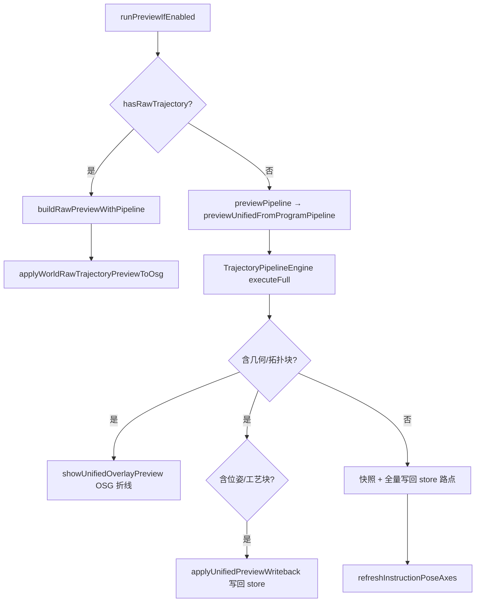

# RobotWidget Developer Guide

> **空间契约**：[`../../../docs/spatial_contract_world_pose.md`](../../../docs/spatial_contract_world_pose.md) — per-link FK、工具轴叠加、TCP 拖动示教均须遵守；实现见 `RobotSimulationMathExports.cpp`、`refreshRobotCoordinateFrameOverlays`。

Robot simulation and device UI live in this x64 DLL (`RobotWidget.dll`, `ROBOTWIDGET_LIB`). Widget keeps `DocumentPage`, `OsgWidget`, and TCP drag teach; orchestration uses host interfaces.

## Build (x64)

| Item | Value |
|------|--------|
| Output | `RobotWidget.dll` |
| Defines | `ROBOTWIDGET_LIB` |
| Links (import lib) | `Data`, `OsgWidgetCore`, `BackendVisual`, `GeometryEngine`, `RobotScene`, `RobotUrdf`, `RobotKinematics`, `RunLogger`, **`CloudSimUiAssets`** + OSG |

与 `Widget.dll` **共享**上述引擎 DLL 运行时实例，不在本 DLL 内重复静态嵌入。

## Layout

| Area | Location |
|------|----------|
| Simulation dock（工作区 **设备**：顶栏「机器人 / 自定义设备」；子页含轴控制；机器人：指令/轴控/…；自定义设备：设备指令/轴控） | `RobotSimulationDockWidget`, page widgets |
| **自定义设备组装** | `CustomDeviceAssemblyDialog`；「3D 选择零件」→ `beginPickSolidInView` / `extractBrepSolidByFace`；提交 `CustomDeviceAssemblyCommit` |
| **设备指令（姿态库 + DI 信号驱动）** | `DeviceCommandPageWidget` + `CustomDeviceSimService`；姿态/`poseSignalBindings`/`signals` 在 `CustomDeviceBackendData`；DI 来自本设备信号表 |
| **IO 网络 / 连接站** | 桌面：`IoSignalNetworkService`；属性 Dock：`设备` / `信号`；「信号」页按钮打开连接站；Tab stash `ioSignalNetworkCache`。网页/Headless：Host `IoSignalNetwork`（同侧车 JSON）+ Gateway `/api/io/network*`，见 [`docs/网页端信号网络与自定义设备/`](../../../docs/网页端信号网络与自定义设备/)。过程稿 [`docs/_archive/IO信号与流程/`](../../../docs/_archive/IO信号与流程/) |
| Orchestration | `RobotSimulationController`（门面；含 `IoSignalNetworkService` 等小服务） |
| Host contracts | `IRobotMainWindowHost`, `IRobotDocumentHost`, `IRobotOsgViewHost` |
| STEP 坐标变换 | [`inc/FeaturePickTransform.h`](inc/FeaturePickTransform.h) + `source/FeaturePickTransform.cpp`：`stepModelPointToWorldMm` / `worldPointToStepModelMm`（导出，非 header inline） |
| FK / matrix helpers | `RobotSimulationMath` |
| Instruction planning context | `RobotInstructionPlanning` |
| URDF import entry | `RobotUrdfImport::registerUrdfRobot` → host |
| 程序 JSON（多程序 / 分组 / v4） | `RobotProgramStore` → `RobotProgramCatalog`；序列化见 `RobotProgramJsonIo` |
| 程序编辑撤销栈 | `ProgramEditService` + `ProgramEditStack`（`RobotScene`） |
| 轨迹编辑流水线 | `TrajectoryEditPageWidget` / `TrajectoryEditSession` / `TrajectoryPipelineEngine` |
| **CAD 轨迹生成** | `FeatureTrajectoryPageWidget`（子页 CAD）：`FeatureSpec` → 离散 → `RawTrajectory` |
| **Mesh 轨迹生成** | `MeshTrajectoryPageWidget`（子页 Mesh）：截面法 / B 样条 → `MeshTrajectorySession` → `RawTrajectory` |
| 指令属性面板 UI | `InstructionPropertyPanel` + `MainWindowInstructionPropertyUiHost`（Widget 桥接） |
| Property-panel feasible-axis query | `RobotInstructionPropertyEditor` / `RobotSimulationController::scheduleDeferredFeasibleAxisProbe` |

## Widget integration

- `MainWindowRobotHost` implements `IRobotDocumentHost` / `IRobotOsgViewHost` / `IRobotMainWindowHost`.
- `MainWindowUiSetup` creates `RobotSimulationController`, simulation dock, and attaches `m_robotSimTimer` via `attachPlaybackTimer`.
- `MainWindowRobotStubs.cpp` forwards slots (`onSimulationInstructionSelectionChanged`, `onRobotAxisJointAnglesChanged`, TCP teach, etc.) to the controller.
- `MainWindowPropertyPanel` owns the Qt property browser shell; simulation instruction rows are built by `InstructionPropertyPanel`.
- Feasible-axis enum refresh: show cached tokens first, then `scheduleDeferredFeasibleAxisProbe` (background IK via `JobSystem`).

### Host pitfalls (per-link URDF)

| 项 | 说明 |
|----|------|
| `IRobotDocumentHost::robotBackendManagerForKinematics()` | **必须**转发到 `DocumentPage::robotBackendManagerForKinematics()`。默认基类返回 `nullptr` 会导致 `applyJointAnglesViaLinkBackends` 失败，轴控制/拖动/预览均无场景更新。 |
| **M0 与 P 分离** | bind 表 **M0** 在导入时冻结；整机关节链平移/旋转只更新 **P**（`basePlacementWorld`）。勿在 gizmo 松手或 TCP 前把场景世界矩阵 **W** 直接写入 **M0**。进入 TCP 示教前调用 `reconcilePerLinkOuterBindFromScene` 校正 bind。 |
| `robotBaseWorldMatrixForInstance` | per-link 时返回 **P**，供 `tcpTeachSetTargetFromToolWorld` 做基座↔世界变换；**勿**用根连杆 OSG 世界矩阵冒充 URDF 基座。 |
| `IRobotOsgViewHost` 生命周期 | `osgView()` 在文档页变化时重建 `WidgetOsgViewHost`；实现委托 `IRenderView`，勿缓存裸 `OsgWidget*`。 |
| `IRobotOsgViewHost` 坐标 | `feature_pick_transform` 经 `resolvePickScopeBackendId` + `getBackendRootWorldMatrix` 做 STEP 文件坐标↔世界（**不**加减 `modelCenter`）；`backendSkipsInnerModelCenterRebase` 已恒 `false`（遗留 API）。 |
| `IRobotDocumentHost` 文档切换 | `document()` 在 `currentPage()` 变化时重建 `DocumentHost`（与 OSG 规则一致）。 |

## Build

- Platform: **x64** only (Debug/Release).
- Output: `bin/x64(d)/RobotWidget.dll`.
- Depends: `RobotScene`, `RobotUrdf`, `RobotKinematics`, `GeometryEngine`, `Data`, `RunLogger`, `OsgWidgetCore`, `BackendVisual`, OSG.

See also [`../Widget/DEVELOPER_GUIDE.md`](../Widget/DEVELOPER_GUIDE.md) §3.3 / §13–§16 and [文档索引](../../../docs/README.md) §6.4.

### UI 图标（`CloudSimUiAssets`）

新按钮/菜单优先 `#include "UiIconDecorators.h"`，用 `UiIconDecorators::apply` 绑定 `UiIconId`；**勿**硬编码 `:/cloudsim/icons/...` 路径。文本与 tooltip 仍用现有 i18n（`setText` / `retranslateUi`）；图标 ID 不随语言变化。主题由 `ApplicationStyle::applyTheme`（Widget）统一刷新，RobotWidget 无需额外调用。

主次按钮：`setProperty("btnRole", "primary"|"secondary"|"danger")` 后 `style()->unpolish/polish`（见 `TrajectoryEditPageWidget`）。下拉用固定高度约 26px + `setMaxVisibleItems`，避免被全局大 padding 撑高。

---

## `RobotSimulationController`

Central orchestration (formerly in `MainWindow.cpp`). Wired in `wireSimulationSignals()` after dock creation.

**重构进度**（详见 `CloudSimHost/DEVELOPER_GUIDE.md` 演进说明）：
- 阶段 1.1-1.5 已完成：运动学（6 处 `applyJointAnglesForInstance`）、坐标系管理、TCP IK 已通过 `IRobotDocumentHost` 委托
- 阶段 1.6 已完成：品牌导出经 Controller（Canonical + pybind）

| 职责 | 入口 | 委托方式 |
|------|------|----------|
| 轴控制 | `onRobotAxisJointAnglesChanged` | `doc->applyJointAnglesRad()` |
| 指令选中预览 | `onSimulationInstructionSelectionChanged` → `applyRobotPoseForInstructionPreview` | 仍经 Controller |
| 添加运动点 | `onSimulationAddInstructionRequested` | 仍经 Controller |
| 运行/停止 | `onSimulationRunRequested` / `onSimulationStopRequested` | 仍经 Controller |
| TCP 拖动示教 | `onSimulationTcpDragTeachModeChanged` / `onTcpDragTeachPoseChanged` | IK 经 `doc->solveTcpDragTeachIk()` |
| 程序起点 | `captureMotionPreviewProgramStartJoints` | 仍经 Controller |
| 坐标系捕获 | `onCaptureToolFrameFromTcp` / `onCaptureUserFrameFromTcp` | `doc->captureToolFrameFromTcp()` / `doc->captureUserFrameFromTcp()` |
| 坐标系重置 | `onResetToolFrame` | `doc->resetToolFrame()` |

### `wireSimulationSignals`

连接 `SimulationCommandWidget` / `RobotAxisControlWidget` / `RobotFrameSettingsWidget` / **`TrajectoryEditPageWidget`** / **`FeatureTrajectoryPageWidget`** 信号到 controller 槽。`ProgramEditService`、`TrajectoryEditSession` 在 dock 创建时实例化，文档就绪后 `bindStore`（`refreshSimulationProgramStore`）。

`FeatureTrajectoryPageWidget`：`bindHost` + `bindSession` + `setStepPathResolver`（`doc->meshBackendStepSourcePath`）；见 §CAD 轨迹生成。`TrajectoryEditPageWidget` 承接 session 内 RawTrajectory 的配方与生成程序。

`QTabWidget::currentChanged` 须在 dock 与 `attachPlaybackTimer` 之后连接（见 `MainWindowUiSetup`），避免构造期 `stopRobotSimulation` 空指针。

轨迹编辑：`opsChanged` → `syncSessionPipeline`（结构变更）；参数 SpinBox → `updatePipelineOps`（见 §轨迹编辑）。

---

## 示教关节与位姿真源

### `context.currentJointRadCsv`

添加 PTP/LINE 时写入当前实例关节角（rad，逗号分隔）。**Run** 先经 `shouldUseTaughtJointCsv` 再校验位置/姿态残差（≤ 1 mm / ≤ **15°**）；**点击预览**在示教 CSV 可用时跳过残差 FK（`gateTaughtResidual=false`）以降低延迟。新鲜 IK 以位置为主（≤3 mm），姿态仅拦近翻转（≤45°）——联立求解按位置选优，旧 5° 门控会误杀可用解。**不因前序点曾 IK 而禁用示教 CSV**。IK/规划成功后 `persistTaughtJointsAndToolContext` 回写 CSV 与冻结工具 context。

| API | 模块 |
|-----|------|
| `RobotInstructionPlanning::encodeJointAnglesRadCsv` | 写入 |
| `RobotInstructionPlanning::jointAnglesRadFromInstructionContext` | 读取 |
| `RobotInstructionPlanning::motionDurationSecFromInstruction` | 段时长（缺省 0.5s） |

### `prepareMotionInstructionForPlanning`

仅设置规划上下文，**禁止**用当前 `rollingQ` 的 FK 覆盖指令 `pose/euler`（`writeTargetTransformToInstruction` 已移除）。写入：

- `context.currentJointRadCsv`（链式种子）
- `context.urdfPath` / `context.tcpLinkName` / `context.flangeLinkName`（由工具系解析法兰 link）
- `context.toolFrameMat4`

### 程序起点 `m_motionPreviewProgramStartJointRad`

- Run 链式规划的**第一段起点**（与 `initialAngles` 同源）；预览链式种子 `buildChainSeedJointRadForInstruction` 亦从此处起步。
- **仅在**该机器人**第一条**运动指令加入程序时更新（`collectMotionInstructions` 条数 ≤ 1）；后续点不再覆盖，避免多点示教时起点被第二点关节顶替。
- 优先从 `m_aggregatedJointAnglesRad` 捕获，否则回退轴滑块。

### TCP 拖动 IK（`applyTcpDragTeachIkFromPose`）

**进入示教**（`onSimulationTcpDragTeachModeChanged(true)`）：目标用连杆系 FK（勿把装配系 mesh 世界矩阵当法兰连杆）。per-link 罗盘挂法兰 mesh，`local=linkFrameLocalOnMeshBackend(T_tool)`；再 `reconcilePerLinkOuterBindFromScene`（关节角与轴控同源）；`resolveRobotBaseWorld` 取 **P**。法兰路径在 `syncTargetInBase` 时用挂载点场景位姿反推 `T_base`，避免 P 与外绑不一致时罗盘落在默认位。删机再导若 sceneBackendId 无交集则聚合角清零。详见 Widget §13.1。

1. 罗盘相对 `P_eff`；经 `tcpDragRigidPeffToP0` 得到 `T_p0`，缓存 `m_lastTcpDragTargetInBase`。鼠标位姿 pending 合并，IK 约 8ms 一拍；单步追赶约 220mm、关节步约 0.45rad；拖动中罗盘不跟 FK 残差回拉。
2. `doc->solveTcpDragTeachIk`：有启用 Workpiece 时按 REP（`T_work = inv(T_p0_work)*T_p0`，外层采样工件轴，内层 RobotBase `solveTeachIkCoordinatedDrag`）；否则仅 RobotBase。
3. 关节角按 URDF 限位 **钳位**（`clampJointAnglesToInstanceLimits`）；外轴经 `applyAxisControlExternalPose` 写回（含工件 backend）。
4. 拖动中 `updateTcpDragTeachFromTarget(..., false)` 保持鼠标目标；追赶未完成则自动再拍 IK。
5. **不**在拖动每帧更新程序起点（仅添加第一条运动指令或空程序结束拖动时可选捕获）。
6. 落点写指令时同步 `externalAxisQCsv` 与 `workingTcp*`（REP）。
### 添加指令（`onSimulationAddInstructionRequested`）

| 步骤 | 行为 |
|------|------|
| 位姿 | 若存在 `m_lastTcpDragTargetValid`，用罗盘 `T_base_target` 写 `pose/euler` 与 `writeTargetTransformToInstruction`；否则 `tryCaptureCurrentRobotTcpPose`（关节角优先 `m_aggregatedJointAnglesRad`） |
| ARC 两步 | 首次仅缓存 Via（`m_arcTeachPending`）；再次捕获 End → `appendArcInstructionFromPoses` + `writeViaTransformToInstruction` |
| 关节上下文 | `context.currentJointRadCsv` = `localJointAnglesForInstance` |
| 添加后 | `captureMotionPreviewProgramStartJoints`（仅首条运动）、`m_skipInstructionPreviewOnce` → 避免立即预览把机器人拉离示教姿态 |
| 选中 | `onSimulationInstructionSelectionChanged` 刷新属性与叠加轴 |

圆弧：[`docs/三点圆弧指令/`](../../../docs/三点圆弧指令/)、`CircularArcGeometry`、`ArcPlanner`。

### 指令树点击预览 vs 仿真运行

预览与 Run **规划策略已分离**（2025 性能优化）：预览只对选中点做 **1× IK**，Run 对全程序链式规划并缓存；**二者 IK 种子语义一致**（程序起点 + 前序路点链式 `rollingQ`），不再使用屏幕当前关节角作种子。

| 维度 | 点击预览 | 仿真运行 |
|------|----------|----------|
| 种子关节 | **链式** `buildChainSeedJointRadForInstruction`（程序起点 → 前序路点 `rollingQ`；失败回退 `motionPreviewProgramStartJointsLocal`） | 程序起点 + 链式 `rollingQ` |
| 规划范围 | **仅选中** PTP/LINE/ARC（1× IK） | 启动急算前缀 + 播放中懒补算（链式） |
| 缓存 | 不缓存 | `PlanResultCache` + Executor 槽位（含 `lazyPending`） |
| 运行中树 | — | `currentInstruction()` + `QSignalBlocker` 跟随选中，不触发预览 |
| 后台预读 | — | `tickLookaheadPlanning` → `enqueueBackgroundJob` + `updateMotionPlanResult` |

实现均在 `RobotSimulationController`；执行器为 `RobotProgramExecutor`（[`RobotScene/DEVELOPER_GUIDE.md`](../Robot/RobotScene/DEVELOPER_GUIDE.md)）。

#### 信号链

| 操作 | 调用链 |
|------|--------|
| 点击指令树 | `InstructionProgramTreeWidget::instructionSelected` → `SimulationCommandWidget::instructionSelectionChanged` → `onSimulationInstructionSelectionChanged` →（非 TCP 拖动）`applyRobotPoseForInstructionPreview` |
| 点 Run | `runRequested` → `onSimulationStartTriggered` → `tryStart` + 同步 `playbackRate` + `QTimer` → `onRobotSimulationTick` → `ensurePlaybackPlansReady` → `tick` + `tickLookaheadPlanning` |
| 仿真倍率 | Instructions 页 `Sim Rate` 下拉 → `playbackRateChanged` → `RobotProgramExecutor::setPlaybackRate`；虚拟时钟缩放播放，**不改** `plan.durationSec` |
| 选中路点高亮 | 指令树选中有位姿指令 → 3D 橙游标 + 该点序号；运行中树跟播时同步同一套（tick 内补刷，因 SignalBlocker） |
| 3D 拾取路点 | Instructions「拾取」→ 点击可见路点（屏幕 32px 最近邻）→ `selectInstructionByRaw` 跳树；与「拖动」互斥，运行中禁用 |

`emitSelection=false` 重建树时不发 `instructionSelected`，避免在工具扩展写入前触发预览/IK（见 `InstructionProgramTreeWidget`）。

#### 对比总览

| 维度 | 点击预览 | 仿真运行 |
|------|----------|----------|
| 触发 | 选中 **PTP/LINE**（及树刷新后的选中） | Run 按钮 |
| 规划时机 | 每次选中当场算，**不缓存** | 启动急算前缀；其余 `lazyPending` 段前/lookahead 补算；失败则播到该点前停止 |
| 机器人动作 | **一帧到位** | **定时器插值** |
| 写回指令 | `backup/restoreInstructionPose`，**不改** `motion.durationSec` | 可写 `motion.durationSec`；`PlanResult` 供播放 |
| 程序逻辑 | 选中预览不执行 WAIT / IF / WHILE / IO | 运行时 `advanceProgramStep` 执行 WAIT / IF / WHILE / SET_DO / SET_AO / DeviceAxis（经 `IRobotIoSink` / `CustomDeviceKinematics`） |
| 运行中 | `m_programExecutor.isRunning()` 时预览 **直接 return**；选中路径只刷属性，跳过链式种子与路点轴重建 | tick 内更新指令树选中 +（非拖窗时）并行预读 |

直观理解：**预览 = 用与 Run 相同语义的链式种子，对选中点单次 IK（或示教 CSV）并瞬间摆过去**；**运行 = 急算前缀 `PlanResult` + 播放中懒补算，再插值播放**。屏幕上的当前关节角**不参与**预览 IK 种子（`localJointAnglesForInstance` 仅用于添加指令、TCP 拖动等其它路径）。

#### `PlanResultCache` 与 fingerprint

- 类：`PlanResultCache`（`RobotWidget/inc/PlanResultCache.h`），仅 UI 线程读写；默认最多 384 条，可 `evictFarBehind`。
- `computePlanFingerprint` 纳入：指令 id、pose、euler、**viaPose/viaEuler/viaTransform**、speed、accel、axisConfig preset、`motion.tool.frameId`、`context.toolFrameMat4`、seed 关节、urdfPath、tcpLinkName。
- **失效**：`invalidateFeasibleAxisConfigurationCache`、`onRobotCoordinateFramesChanged`、`onSimulationRobotSelectionChanged`、`ProgramEditService::revisionChanged`。

#### 点击预览（`applyRobotPoseForInstructionPreview`）

**前置条件**：非 `m_skipInstructionPreviewOnce`、非 TCP 拖动示教、仿真未运行、选中类型为 PTP/LINE/ARC。

与 Run **共用** `planMotionConsistentWithPreview`（预览传 `gateTaughtResidual=false`）：

1. 示教 CSV（`shouldUseTaughtJointCsv`；预览不跑残差 FK，Run 仍 ≤1mm/≤15°）
2. 否则按种子顺序 IK：示教关节 → 链式种子 → 程序起点；位置≤3mm，姿态≤45°（防翻转）
3. 成功后 `persistTaughtJointsAndToolContext`

DH/外轴经 `ensureInstructionControllerKinematics` 按 URDF 路径缓存，避免每次点击重解析。选中路径：**先摆姿 → 属性面板 → 延后** `scheduleInstructionPoseAxesRefresh`（路点轴下一拍刷新）。

#### 路点轴 OSG 绘制（万级）

| 环节 | 说明 |
|------|------|
| 编排 | `refreshInstructionPoseAxes*` 收集可见路点 → `IRobotOsgViewHost::setInstructionPoseAxes` |
| 实现 | `OsgWidget::setInstructionPoseAxes`（`Widget/source/OsgWidget.cpp`，编入 Host） |
| 场景图 | **一批一个 Geode**：`POINTS`（可达绿/不可达红）+ `LINES`（XYZ）；**不是**一指令一 `MatrixTransform`/`ShapeDrawable` |
| 增删改 | 按当前指令列表**整批重建**（无指令 id↔顶点下标映射）；删点后对应标记随重建消失 |
| raw 帧 | `setRawTrajectoryOverlayFrames` 同批策略；折线仍 `setRawTrajectoryOverlay` |
| 例外 | 工具/用户坐标系 overlay 仍为少量独立轴 Geode |

**不**播放中间过程。

#### 仿真运行（`onSimulationStartTriggered`）

1. `initialAngles` / `playbackStartAngles`：优先 `m_motionPreviewProgramStartJointRad`，否则轴滑块当前角。
2. **懒规划（万级）**：启动只急算前 `kEagerPlanCount`（**16**）段；其余 `lazyPending`；**禁止**全量 IK。
3. 急算：`planMotionConsistentWithPreview`；**保留** `jointTrajectoryRad`（LINE/点云插帧依赖；勿再清空）。
4. **部分失败**：占位并停止后续急算；成功段≥1 则 `tryStart`。
5. 初始化 `m_playbackRollingSeedQ` / `m_playbackProgramStartQ` / 段起点外轴 qe；tick 前 `ensurePlaybackPlansReady`。

播放：`jointTrajectoryRad.size() >= 2` 时 Executor 优先轨迹插帧，否则起止 lerp；段结束对齐 `jointTargetsRad`。外轴按 `motionSegmentProgress01` 在段起点与 `plan.externalAxisQs` 间逐分量插值（见 [`docs/外部轴类型拓宽/DESIGN_外部轴类型拓宽.md`](../../../docs/外部轴类型拓宽/DESIGN_外部轴类型拓宽.md)）。

#### 段前补算（`ensurePlaybackPlansReady` / `syncPlanMotionAtIndex`）

- 窗口 `[current, current+2]`，**仅** `lazyPending` 才 sync（已 ok 不每帧 FK）。
- 游标前进时用上一段目标更新 **O(1) 滚动种子**（禁止从 0 扫到 N）。
- sync：示教 CSV → 门控 Cache（**位置≤1mm 且姿态≤15°**）→ `planMotionConsistentWithPreview`（内部 LINE **lite 优先，失败升满采**）。
- `PlanResultCache` 有界（默认 384）+ `evictFarBehind(游标, 64)`。
- **勿**因拖窗缩小该窗口：同一次 tick 可能切入下一段，未消掉的 `lazyPending` 会被 Executor 判为规划失败。

#### 运行中 UI 交互

- 播放定时器 `Qt::CoarseTimer`，避免 Precise 抢占系统拖窗消息。
- `isPlaybackUiInteractionBusy` 时只跳过叠加层刷新与 lookahead；**段前 ensure 窗宽不变**。
- 运行中指令树选中：只刷属性面板，**不**做链式种子 / 可行轴探测 / `refreshInstructionPoseAxes`（万级点会卡死拖动）。
- 叠加高亮 `shared_ptr` 按 activeMotion 缓存；per-link URDF root 枚举结果按 urdf 路径缓存。

#### 并行预读（`tickLookaheadPlanning`）

- `maxAdvanceBlocks=16`，`maxConcurrentJobs=4`；Worker 走 `planMotionLikePreviewWorker`（示教残差门控 + 多种子 + lite 升采样）；**只写成功 Cache**。
- Payload 携带 `frames`；段前 sync 再门控后才写入 Executor。

#### 点击链式种子（`buildChainSeedJointRadForInstruction`）

- 维护 `m_chainSeedEndJointsByIndex` 前缀缓存（程序指纹变更 / revision / 工具切换时失效）。
- 选中时 O(1) 命中或从缓存后缀增量补算；前序点 Cache 采用同样位置+姿态门控；IK 先 lite 再满采。

#### 可达性（`scheduleAsyncMotionReachabilityRefresh`）

- 按批 **64** 点后台 Job，结果增量合并进 `m_motionReachabilityCache` 并刷轴；批次间滚动种子衔接。
- Worker 与 Preview 共用 `planMotionLikePreviewWorker`。

`stopRobotSimulation` 清空 motions / lookahead / 游标种子。

#### 可行轴 IK 后台探测（`scheduleDeferredFeasibleAxisProbe`）

属性面板 `refreshFeasibleAxisOptions=true` 或指令树首次选中 `AUTO` 未 seed 时触发。

1. UI 线程：`buildChainSeedJointRadForInstruction` + fingerprint；命中 `m_cachedFeasibleAxis*` 则直接刷新面板。
2. 快照 `PlanJobPayload` + `RobotCoordinateFrameSet` → `enqueueBackgroundJob`（标题 `Feasible axis IK`）。
3. 工作线程：独立 `RobotInstruction::Controller` + `prepareMotionInstructionForPlanning` + `queryFeasibleMotionAxisConfigurationOptions`（同 lookahead/reachability，**禁止**碰共享 `Base`）。
4. `onFinished`（UI 线程）：写缓存；若 `activeInstructionForProperty()` 仍匹配则 `applySuggestedAxisPresetFromSeedIfNeeded` + `refreshInstructionPropertyPanel(false)`。
5. `invalidateFeasibleAxisConfigurationCache` 递增 `m_feasibleAxisJobToken` 丢弃过期结果。

显式 API `IRobotService::queryFeasibleMotionAxisOptions` 仍可走 `feasibleMotionAxisConfigurationOptionsForInstruction` **同步**路径（插件/契约查询）。

#### 关键 API（本模块）

| 符号 | 文件 | 说明 |
|------|------|------|
| `PlanResultCache` | `inc/PlanResultCache.h` | 有界 Run 规划缓存（FIFO + 落后游标淘汰） |
| `computePlanFingerprint` | `RobotSimulationController` | 缓存 key 的 fingerprint |
| `planMotionConsistentWithPreview` | 同上 | 预览/Run 共用求解（示教 CSV + 多种子 + 姿态门控） |
| `tickLookaheadPlanning` | 同上 | 后台预热 Cache（不盲写 Executor） |
| `ensurePlaybackPlansReady` / `syncPlanMotionAtIndex` | 同上 | 窗内 lazyPending 段前接入 |
| `buildChainSeedJointRadForInstruction` | 同上 | 预览/可行轴：程序起点 → 前序路点链式种子 |
| `applyRobotPoseForInstructionPreview` | 同上 | 选中预览（链式种子 + 单次 IK 或示教 CSV） |
| `scheduleDeferredFeasibleAxisProbe` | 同上 | 可行轴 IK 后台 Job + 缓存 |
| `scheduleAsyncMotionReachabilityRefresh` | 同上 | 可达性分批后台 Job（64/批，语义对齐 `planMotionLikePreviewWorker`） |
| `onSimulationStartTriggered` | 同上 | Run 启动 + 链式缓存 |
| `onRobotSimulationTick` | 同上 | 播放 + 树高亮 + 预读调度 |

Host 侧：`IRobotMainWindowHost::enqueueBackgroundJob` → `MainWindowRobotHost` → `MainWindow::jobSystem()`（见 [`../Widget/DEVELOPER_GUIDE.md`](../Widget/DEVELOPER_GUIDE.md) §12）。

Executor 侧：`RobotProgramExecutor::currentInstruction()`（见 [`../Robot/RobotScene/DEVELOPER_GUIDE.md`](../Robot/RobotScene/DEVELOPER_GUIDE.md) §7.2）。

#### 与添加指令的协作

- 首条运动指令加入时 `captureMotionPreviewProgramStartJoints` 冻结起点。
- 添加后设 `m_skipInstructionPreviewOnce`，避免树自动选中触发预览把机器人从刚示教姿态拉走。

#### 修改注意

- 预览与 Run **共享链式种子语义**；差异仅在规划范围（选中 1× vs 全程序）与 Run 缓存/预读。勿在预览中改回 `localJointAnglesForInstance` 作 IK 种子，除非产品需求变更。
- 改示教 CSV 判定、`prepareMotionInstructionForPlanning`（含 `flangeLinkName`）或姿态门控时，**须同时**核对预览与 Run 两处路径。
- 改 `computePlanFingerprint` 字段时同步检查缓存命中率与失效触发点。

---

## `RobotInstructionPlanning`

| 符号 | 说明 |
|------|------|
| `backupInstructionPose` / `restoreInstructionPose` | 规划前保存/恢复位姿与 extensions |
| `prepareMotionInstructionForPlanning` | 写规划上下文（见上） |
| `encodeJointAnglesRadCsv` / `jointAnglesRadFromInstructionContext` | 示教关节持久化 |
| `motionFollowsActiveToolFrame` / `syncInstructionToolContextFromFrames` / `persistTaughtJointsAndToolContext` | 工具系切换与 IK 后回写；**active 跟随路点 sync 始终用 `activeToolFrame(frames)`**，避免 stale `context.activeToolFrameId` |
| `motionDurationSecFromInstruction` | 段时长 |

---

## `RobotSimulationMath` / 捕获

`tryCaptureCurrentRobotTcpPose`（controller）：优先 `targetInBaseFromUrdfFlangeFk` + 工具系；关节角优先聚合向量再滑块。per-link 场景见 `captureTcpFromSceneFlangeBackend`。

---

## 页面控件（简要）

| 类 | 说明 |
|----|------|
| `SimulationCommandWidget` | 指令树、Run/Stop、**仿真倍率**下拉、TCP 拖动；**程序下拉 / 新建 / 重命名 / 删除**；扁工具条插入（PTP/LINE/ARC/…/PathPlan）与编辑（末端拖动/删除/清空）；TCP combo **界面隐藏**（`setTcpLinkOptions` / `selectedTcpLink` 仍供规划回退）；Ctrl 多选 + 右键创建分组；`setProgramStore`、`activeProgramChanged` / `groupsChanged`；**ARC 两步示教**（`setArcTeachPending`） |
| `RobotAxisControlWidget` | 关节/外轴滑条；顶部「显示可达域」+ 密度滑条（默认 50%，调采样数/体素边长）；Halton 采样细点 overlay | 关节滑块（`qBound` 限位）；外轴滑条（平移 mm / 旋转 deg，内部 rad） |
| `RobotFrameSettingsWidget` | 工具/用户系；`framesChanged` → `onRobotCoordinateFramesChanged`（见下） |
| `RobotExternalAxisSettingsWidget` | 多轴 Translate/Rotate × RobotBase/Workpiece；`workingFrameId` 工作架下拉（空=绑定根）；`setBackendIdOptions`；`externalAxesChanged` → `onRobotExternalAxesChanged`；Run 时由 `applyExternalAxisFromPlan` 按段进度插值 `externalAxisQs` |

#### 工具坐标系页 `framesChanged` 分级刷新

`onRobotCoordinateFramesChanged` 对比变更前后 `RobotCoordinateFrameSet`：

| 变更类型 | 典型操作 | 行为 |
|----------|----------|------|
| **无变更** | 仅切换工具列表行（spin 未改） | 不 emit `framesChanged` |
| **DisplayOnly** | 全局「显示工具系/用户系」或**单项** `showInScene` 勾选 | 只刷 overlay；不 invalidate plan / 不 IK |
| **StructuralOnly** | 添加/复制/删除**未激活**工具系 | `refreshInstructionPoseAxes(false)`；**不** invalidate plan 缓存；**不** preview |
| **ActiveToolChanged** | 「设为当前」切换激活工具 | `applyToolFrameChangeToProgram` + 失效 plan/可达性缓存；**异步** reachability + 选中点 preview |
| **ToolGeometryChanged** | 编辑 `T_flange_tool` / flange link | 对使用该工具 id 的路点失效示教关节；异步 reachability + preview |

`motion.tool.frameId` 为 `"active"` 或空的路点**跟随全局激活工具**（切换 active 时 `syncInstructionToolContextFromFrames` 写当前 `activeToolFrameId` / `toolFrameMat4`，不用 frozen id 解析）。具体 id 的路点仅在该工具几何变更时失效。

辅助 API（`RobotInstructionPlanningHelpers`）：`motionFollowsActiveToolFrame`、`syncInstructionToolContextFromFrames`、`persistTaughtJointsAndToolContext`。

Add/Duplicate/Remove 工具系时用 `m_blockSignals` 避免 `setCurrentRow` 触发双重 `framesChanged`。工具列表切换行时仅 spin 实际变更才 emit。

#### `RobotFrameSettingsWidget` 列表与显示

| UI | 行为 |
|----|------|
| 工具/用户列表每行 | 名称 + `*`（当前激活）；**右侧勾选** → 该项 `showInScene`（默认 `true`） |
| 「三维显示」分组 | 全局 `showToolFrameInScene` / `showUserFramesInScene`；关闭时全部 overlay 不绘制 |
| 单项勾选 | 仅隐藏该条坐标系轴；属 **DisplayOnly**，经 `coordinateFrameSetPlanningEquals` 忽略后对比 |
| 持久化 | 工程 JSON 每帧可选字段 `showInScene`；缺省视为显示 |

3D 叠加由 `refreshRobotCoordinateFrameOverlays` → `OsgWidget::setRobotFrameOverlays`：全局开关开启且该项 `showInScene` 才入队。

| per-link 模式 | 工具系 mount | 工具系 local |
|---------------|--------------|--------------|
| 任意（`meshVerticesInLinkFrame` true/false） | **法兰 link** backend | `linkFrameLocalOnMeshBackend(...)`：已是 link 系顶点时为 `T_flange_tool`；文件/装配系顶点时为 `T_flange_tool * inv(visual)` |

用户系挂 **URDF 根连杆**，经同一 `linkFrameLocalOnMeshBackend` 校正。多工具时 **必须** per-tool 计算 TCP（禁止共用激活工具矩阵）。TCP 拖动后须 `updateTcpDragTeachFromTarget` + IK 后 `refreshRobotCoordinateFrameOverlays`。Run 期间工具系与预览一致显示。

| 类 | 说明 |
|----|------|
| `TrajectoryEditPageWidget` | 轨迹编辑 Dock 子页：**工艺模板**区 + 调色板 + Program Op 流水线 + 参数区 + 预览勾选/Apply/Reset/Undo |
| `InstructionProgramTreeWidget` | 层级指令树；`NodeKind::Group` 嵌套显示分组；Ctrl 多选根层级指令 → 右键创建分组；拖放维护 `memberInstructionIds`；`instructionSelected` → 预览 |
| `TrajectoryEditSession` | 预览三分支（raw 叠加 / overlay / 位姿写回）与 Apply（Command 落盘）；`reset` / `abandonPreview`；**并行持有** `m_rawTrajectory`（`setRawTrajectory` / `rawTrajectoryChanged`，与 Program 预览快照解耦）；见 §轨迹编辑 |
| `ProgramEditService` | `execute` / `undo` / `redo`；`revisionChanged` → 轨迹页 `syncUiAfterProgramRevision` + 指令树刷新 |
| `DevicePageWidget` | Property Dock「设备」Tab：类型/品牌 Combo + 自适应缩略图网格；`urdfImportRequested`；**自定义设备**按钮 → `customDeviceCreateRequested` |

### `DevicePageWidget` 布局（Property Dock）

宿主为 **Property Dock** 第二 Tab（默认宽约 340px），非 RobotSimulationDock。

| 区域 | 控件 | 行为 |
|------|------|------|
| 筛选栏 | 类型 / 品牌 `QComboBox`、刷新 | 驱动 `m_packagesByTypeBrand`；仅 1 个品牌时隐藏品牌 Combo |
| 自定义设备 | 按钮 | `customDeviceCreateRequested` / 编辑 / 导出 → `CustomDeviceAssemblyDialog`；组装页「3D 选择零件」点面抽 Solid（`extractBrepSolidByFace`） |
| 型号网格 | `QScrollArea` + `QGridLayout` | 缩略图 96×88；列数随 viewport 宽度自适应；点击 → `urdfImportRequested` |
| 数据源 | `resource/models/{Type}/{Brand}/{Package}` | 扫描与 URDF 匹配逻辑不变 |

`RobotAxisControlWidget` 顶部 **目标** 下拉可在机器人实例与 `CustomDevice` 间切换；选设备时滑条驱动 `CustomDeviceKinematics::applyQ`。**轴控为跨模式单例**（`placeAxisTab` 在机器人/设备 Tab 间挂载同一页）；子 Tab **不可拖动**，索引常量才稳定。导航请用 `RobotSimulationController::showRobotDockTab` / `showDeviceDockTab`，页面勿直接 `setDockMode`。

#### 自定义设备数据契约

| 条件 | 真相 |
|------|------|
| 有 Link/Joint 图 | 持久化唯一源；`axes`/`q` 由 `syncAxesFromJoints` 投影 |
| 无图（旧扁平工程） | 不加载 `deviceAxes`；需在组装画布重新定义后方可轴控/导出 |

轴控、姿态库、`DeviceAxisInstruction` 只消费投影后的扁平接口；新功能优先挂图。

i18n：`setUseChinese` ← `MainWindow::applyLanguage`。

**资源侧注意**：ABB 去掉重复 `IRB 120-3-58.bmp`。INOVANCE 两台恢复原始 `link6` 装配网格+visual。TCP 悬空根因是工具轴叠加曾挂在 `base_link`；`refreshRobotCoordinateFrameOverlays` 已改为始终挂法兰 link，并用 `inv(visual)*T_tool` 对齐文件系网格（装配系 URDF 与本地系 URDF 均适用）。

TCP 拖动 OSG 实现仍在 [`../Widget/DEVELOPER_GUIDE.md`](../Widget/DEVELOPER_GUIDE.md) §13.1。

### `SimulationCommandWidget` 布局（指令子页）

Dock **设备** → 子 Tab **指令**（机器人程序，与「设备指令」隔离）。排版变更不得改信号名与 Controller 接线；属性仍在 Property Dock。

**参考 UI：**

```text
┌─ 播放条（顶栏 + 底部分隔线）───────────────────────┐
│ [▶ 运行] [■ 停止]  仿真倍率 [1×▼]        [导出]   │
├─ 上下文（标签定宽对齐）────────────────────────────┤
│ 机器人 [R-2000iC-165F ▼]                           │
│ 程序   [Main ▼]  [新建] [重命名] [删除]             │
├─ 工具条（扁标签，无厚 QGroupBox）──────────────────┤
│ 插入  PTP  直线  圆弧                                │
│       等待  条件  循环  DO  AO  路径                   │
│ 编辑  [拖动]  [删除]  [清空]                         │
│       （拖动开启时蓝底 + 提示行）                      │
├─ 指令树（stretch）─────────────────────────────────┤
│  InstructionProgramTreeWidget                      │
└────────────────────────────────────────────────────┘
（内部：m_tcpLinkCombo 隐藏，仍由 setTcpLinkOptions 维护 preferred）
```

| 区域 | 控件 | 说明 |
|------|------|------|
| 播放条 | Run / Stop / 仿真倍率 / Export | Run=`primary`，Stop=`danger`，Export=`secondary`；固定顶栏 |
| 机器人 | `m_robotLabel` + `m_robotCombo` | 全宽下拉 |
| TCP | `m_tcpLinkCombo` | **界面隐藏**；API 保留；示教 TCP 以「坐标系」工具系为准 |
| 程序 | 下拉 + 新建 / 重命名 / 删除 | 纯文字按钮，高度与程序下拉对齐（30px） |
| 插入（`m_insertLabel`） | PTP、LINE、ARC / WAIT、IF、WHILE、SET_DO、SET_AO、DeviceAxis、PathPlan | **两行网格**，避免窄 Dock 裁切 |
| 编辑（`m_editLabel`） | 末端拖动、删除、清空 | 删除/清空=`danger`；拖动按下=`primary` + 提示行，再点退出 |
| 指令树 | `InstructionProgramTreeWidget` | 占剩余高度；不在整页 ScrollArea 内 |

**本页样式比例（局部，不改 `ApplicationStyle`）：** 控件高 **30px**（容纳全局 padding + 边框，避免下边框被裁）；页边距 6；chrome 段间距 4；工具条内 spacing 2；上下文标签定宽对齐；插入钮 `min-width`≈52。

### 设备指令页（`DeviceCommandPageWidget`）

与机器人「指令」页 / `RobotProgramExecutor` **隔离**：

| 能力 | 说明 |
|------|------|
| 姿态库 | `CustomDeviceBackendData::namedPoses`（全轴 `q` 快照）；示教取当前 `qValues()` |
| 信号绑定 | `poseSignalBindings`：`signalName` = **本设备**信号表 DI；上升沿 → `DevicePoseMotionPlayer` → `CustomDeviceKinematics::applyQ` |
| 触发源 | 每设备 `NamedSignalTable` + sink（经 `IoSignalNetworkService`）；跨设备用连接站 DO→DI |
| 连接站 | 「信号」页按钮打开对话框：`SignalConnectionStationWidget`；Owner 节点，仅 DO→DI；侧车 `ioSignalNetwork.wires` |
| 同 DI 多绑定 | 每个设备取**第一条启用**绑定；多设备可同时响应 |
| 页签索引 | 顶栏「机器人 / 自定义设备」；机器人子 Tab：`Instructions=0`、`Axis=1` … `RobotComm=7`；设备子 Tab：`DeviceCommands=0`、`Axis=1`（两侧共用同一轴控实例） |

机器人程序内既有 `DeviceAxisInstruction`（单轴）保留，本页不依赖。

### 品牌程序导出

流程：`Export` → `BrandProgramExportDialog` 选程序（当前机器人 catalog 下全部，含 main）与品牌 → `QFileDialog` 选最终程序路径 → Canonical v1（**紧凑**临时 JSON，**不做万级全量 IK**；品牌脚本只用笛卡尔位姿）→ `PythonScriptCaller` 调用 `resource/Python/ExportPython/{Brand}Export.py`。

万级点性能：跳过 per-point IK（与 playback「禁止全量 IK」一致）、省略 `kinematics`、`dump()` 无缩进、Python 大缓冲流式写出、模块不 `reload`。

| 品牌 | 脚本 | 扩展名 |
|------|------|--------|
| ABB | ABBExport.py | .MOD |
| AIR | AIRExport.py | .arl |
| FANUC | FANUCExport.py | .LS |
| 汇川 | INOVANCEExport.py | .pro |
| 线加热 | LineHeatingExport.py | .LS |
| 珞石 | ROKAEExport.py | .mod |

源码：[`resource/Python/ExportPython/`](resource/Python/ExportPython/)；构建后复制到 `bin/x64(d)/resource/Python/ExportPython/`。调用封装：`PythonScriptCaller`。设计文档：[`docs/机器人程序品牌导出/`](../../../docs/机器人程序品牌导出/)。导入品牌程序不在本模块范围。

分组创建/解散/重命名在**树右键**完成，经 `ProgramEditService` 落盘并 `emit groupsChanged()` 供轨迹编辑页刷新顶栏分组下拉。程序切换：`onProgramComboChanged` → `rebuildCommandListWidget()` 绑定当前程序 `steps` + `groups`。

---

## 轨迹编辑（Trajectory Edit）

Dock **「轨迹编辑」**页（在「轨迹生成」之后）。Dock 主标签为 **设备** / Devices。默认中文 UI；`MainWindow::applyLanguage` → `trajectoryEditPage()->setUseChinese` / `featureTrajectoryPage()->setUseChinese`；页签索引见 `RobotSimulationDockWidget::kTabIndexTrajectoryGeneration` / `kTabIndexTrajectoryEdit`。

### 管道引擎与 Observer（2026 升级）

| 组件 | 职责 |
|------|------|
| `TrajectoryPipelineEngine` | `UnifiedTrajectory` 为管道 IR；`pendingPreRaw → committed → draft` 顺序重放；`executeFrom` 局部重跑 |
| `TrajectoryEditSession::m_pipelineEngine` | Raw/Unified Apply 与 `buildRawPreviewWithPipeline` 委托引擎 |
| `TrajectoryEditObserver` | Page/AI 统一入口：`loadPipeline` / `updateNodeParams` / `moveNode*` |
| `ProcessFlowPresetLoader` | 工艺默认流水线 JSON：`bin/resource/trajectory/ProcessFlowPresets.json` |
| 原子块实现 | [`TrajectoryAlgorithmBuiltins`](../../Robot/TrajectoryAlgorithmBuiltins/DEVELOPER_GUIDE.md) |

预览收敛为 **单引擎执行 + 多 egress**（OSG raw 叠加 / 临时写回路点轴）。有 raw 时改参可 `runPipelineEngineFrom(nodeIndex)` 再刷新叠加层。

流水线列表支持 **列表内拖拽排序**（`TrajectoryPipelineListWidget::startDrag` + 内部 MIME 行号）。

### 工艺模板与原始轨迹（CAD 离散结果）

页顶 **「工艺模板」** 区用于将焊缝/涂胶/打磨一键填充到统一流水线；`RawTrajectory` 仍作为离散输入来源：

| 控件 | 行为 |
|------|------|
| 状态标签 | `TrajectoryEditSession::hasRawTrajectory()` → 点数；否则提示先在轨迹生成页离散 |
| 工艺下拉 | 焊缝 / 涂胶 / 打磨（`buildRecipePreset` → `ProcessFlowPresets.json` 原子 `pipeline`） |
| 填充工艺流水线 | `ProcessFlowPresetLoader` 展开 Resample/Offset/Approach/Retract 等 → `m_pipeline->setOps(...)` |
| 生成程序 | 保留 `emitRawTrajectoryToProgram` 入口用于 raw 直出；绑定 PathPlan 时仅替换该条 `PathPlanOutput`，不删除其它 PathPlan 的分组与路点；**Apply 成功后自动禁用**，避免覆盖已应用结果；发生新编辑或 Raw 更新后恢复可用 |

`rawTrajectoryChanged` 刷新状态；`reset()` / `abandonPreview` **不清** `m_rawTrajectory`。Apply 统一走 `TrajectoryPipelineEngine`；有 raw 时引擎 `setUsingRaw(true)`，无 raw 时从程序 Ingress。

### Session 几何历史（多次 Apply / 预览对齐）

`TrajectoryEditSession` 在流水线 **Apply 成功后** 会 `clearPipelineAfterCommit()` 清空 UI/session 草稿流水线。有 raw 时保留 `m_bakedWorldRaw`（诊断用）；**不再**维护 `m_accumulatedGeometryOps` / `m_pendingPreRawGeometryOps`（已移除）。下次 Apply 始终从 `m_rawTrajectory`（CAD 源 raw）经引擎重放当前草稿。

| 成员 | 何时写入 | 用途 |
|------|----------|------|
| `m_bakedWorldRaw` | 有 raw 的 Apply 成功后由 `unifiedTrajectoryToRaw` 烘焙 | 诊断/状态；**不是** Apply 起点 |
| `m_rawTrajectory` | 轨迹生成页 `setRawTrajectory`；有 raw 的 Apply 可更新 `rawWorking` | 引擎 raw 路径的 **文件坐标** 输入 |

用户点轨迹编辑 **Reset** 时：`clearTrajectoryGeometryHistory()` 清空 `m_bakedWorldRaw`（`onResetClicked`）。`setRawTrajectory`（新离散）亦清 `m_bakedWorldRaw`。

**新离散**：`setRawTrajectory` 清几何烘焙；**已绑定** PathPlan 时 `Composite(UpdatePathPlanPipeline 清 appliedHistory + UpdatePathPlanRaw)`；无绑定时 `Composite(InsertPathPlan + UpdatePathPlanRaw)` 并自动命名。`bindPathPlan(id)` 加载 Session 内 `pipeline` / raw（**不**自动刷新轨迹编辑页流水线 UI）。Apply（有 raw）用 `CompositeProgramEditCommand` 一次撤销。删除 PathPlan：`RemovePathPlanCommand`（指令树删除按钮）。

**指令树 · 路径规划区**：根级虚拟节点「路径规划」下展示全部 `Type::PathPlan`（可拖放排序）；子节点可显示对应 `PathPlanOutput` 分组（只读）。运动程序（分组/路点）在其下方。`program.steps` 约定为 **PathPlan 块在前、运动指令在后**（`syncToProgram` 写回）。PathPlan **绑定**在轨迹生成页顶栏下拉或指令树选中 PathPlan 节点；轨迹编辑页顶栏**无**「规划」下拉（2026-03）。

### PathPlan 持久化与「开始修改」（2026-03）

每条 `PathPlanInstruction` 与 Session 共同持有三类可编辑状态：

| 内容 | 存储 | 写入时机 |
|------|------|----------|
| **特征 + 离散参数** | `sourceFeatureJson`（`FeatureListDocument` JSON） | 离散 / 拾取后 `setRawTrajectory` |
| **原始轨迹点列** | `pathPlanRaws` + `rawTrajectoryKey` | 同上 |
| **算子流水线** | `pipeline[]` | **仅 Apply** 经 `UpdatePathPlanPipelineCommand`（草稿期不直写 PathPlan） |

**轨迹生成页顶栏**（`TrajectoryGenerationPageWidget`）：路径规划下拉、`+` 新建、`开始修改`、`取消修改`。切换 PathPlan 仅 `bindPathPlan` + 清空 CAD 特征表；**不**自动重离散、**不**预显示 raw 叠加层（`shouldShowTrajectoryGenerationPreview` ← `FeatureTrajectoryPageWidget::isFeatureEditActive()`）。

**「开始修改」**（`beginEditBoundPathPlan`）统一恢复编辑态：

1. `TrajectoryEditSession::reloadBoundPathPlanFromStore()` — 从 PathPlan 重载 `m_ops` 与 raw（不 emit `pathPlanBound`）
2. `TrajectoryEditPageWidget::restoreBoundPathPlanForEdit()` — 算子列表 UI、组下拉、Apply 门控、预览引擎
3. `loadFeatureListFromJson(sourceFeatureJson)` — 特征表 + 离散参数面板（无特征 JSON 时仍可进入，仅加载算子）
4. `refreshPreviewFromSession()` — 进入 `m_featureEditActive` 后显示 3D 预览

**「取消修改」**（`cancelEditBoundPathPlan`）退出编辑态：

1. 退出拾取、清候选预览；`m_featureEditActive = false`
2. 清空特征表与离散参数面板；清 `m_lastLoadedSourceJson`（下次开始修改强制重载）
3. `abandonPreview` + `reloadBoundPathPlanFromStore` + 编辑页 `syncBoundPathPlanFromSession`
4. `clearBoundPathPlanPreview()` — 关闭轨迹生成 3D 叠加

**不**回滚已写入 PathPlan 的 raw / `sourceFeatureJson` / pipeline（与切换 PathPlan 清空表一致）。若需完整快照还原，另议。

拾取离散时 `normalizeEntryStrategyForGeometry` / 严格 `resolveStrategyIdForPick` 避免面特征误用 Line 策略。`m_strategyRowSyncDepth` 防止嵌套 `loadParams` 误触发策略下拉回写。

| API | 说明 |
|-----|------|
| `reloadBoundPathPlanFromStore()` | Session 从 store 重载 pipeline + raw |
| `restoreBoundPathPlanForEdit()` | 轨迹编辑页恢复算子 UI |
| `beginEditBoundPathPlan()` | CAD 页「开始修改」入口 |
| `cancelEditBoundPathPlan()` | CAD 页「取消修改」入口 |
| `clearBoundPathPlanPreview()` | 非编辑态清除 raw 叠加层 |
| `refreshPathPlanPreviewForActiveTab()` | 轨迹生成 tab 且 `isFeatureEditActive` 时才 bound 预览 |

树选中 PathPlan → `bindPathPlan`；编辑页算子 UI 与 CAD 特征表均经「开始修改」统一加载。

### 组件与绑定（Program Op 流水线）

| 组件 | 职责 |
|------|------|
| `TrajectoryEditPageWidget` | UI：程序/分组、调色板、流水线、`TrajectoryOpParamPanel`、预览勾选/Apply/Undo |
| `TrajectoryPipelineListWidget` | `m_ops` 真源；每行摘要 + 行末「启用」勾选（新建默认关）；列表项由 `rebuildItems()` 生成 |
| `TrajectoryEditSession` | 持有 `m_ops` + `TrajectoryPipelineEngine`；Preview 快照 / Apply Command；`reset` / `abandonPreview` |
| `ProgramEditService` | Apply 时优先 `executeBatch(cmds)`（单次 `renumberAndNotify` + `revisionChanged`）；Undo/Redo 恢复程序树 |
| `RobotProgramStore` | `activeCatalog()` / `activeProgram()`；与 Instructions 页共用 |

`RobotSimulationController::wireSimulationSignals` 创建并绑定 `ProgramEditService`、`TrajectoryEditSession`；文档就绪后 `bindStore`（见 controller 内 `refreshSimulationProgramStore`）。

### 流水线 ↔ Session 同步（必读）

| 操作 | UI 路径 | Session API |
|------|---------|-------------|
| 增删/排序/拖入/加载模板/启停勾选 | `opsChanged` → 压草稿栈 → `syncSessionPipeline()` | 已绑定 PathPlan：**`updatePipelineOps`**（**不**直写 PathPlan）；否则 **`setPipeline`**；勾选预览时重跑（仅 `enabled` 块进引擎） |
| 改参数（Schema / 几何下拉） | `applyParamsToSelectedOp` → 压草稿栈（300ms coalesce）→ `syncSessionParams` | **当前块已启用**才防抖预览；未启用只写回参数（勿 `setPipeline`） |
| 预览勾选 / Apply | `reconcilePipelineScopes()` + `flushPipelineToSession()` | 有选中块 → `applyParamsToSelectedOp`；否则 `syncSessionParams` |
| 撤销 / 重做 | 优先 `PipelineDraftEditStack`；空则 `ProgramEditService` → `syncUiAfterProgramRevision()` | 程序修订后 `replacePipelineOpsFromStore` + `loadRawFromBoundPathPlan` |

**禁止**在参数变更路径调用 `setPipeline()`，否则预览位姿会被 `reset()` 立刻还原。

### 撤销 / 重做与作用域协调

**双栈语义**：页上「撤销/重做」优先消费草稿栈（流水线结构/参数）；草稿栈空时才走 `ProgramEditService`（Apply、指令树、PathPlan Command）。Apply / Reset / 「开始修改」会 `clearDraftHistory()`。

程序树变更（含轨迹 **Apply**、分组创建/删除、指令增删等）均走 `ProgramEditService` 撤销栈。`revisionChanged` 时轨迹页 **`syncUiAfterProgramRevision()`**：

| 步骤 | 行为 |
|------|------|
| 刷新 UI | `refreshUndoButtons`、`refreshProgramAndGroupCombos`（保留顶栏/参数区/当前选中块的分组选中项） |
| 丢弃预览 | `TrajectoryEditSession::abandonPreview()` — **不**还原快照（程序已被 undo/redo 改写，旧快照会污染 store） |
| 同步 PathPlan | `syncBoundPathPlanFromSession`：UI `setOps` + `replacePipelineOpsFromStore` + `loadRawFromBoundPathPlan` + phase 门控；清空草稿栈 |
| 协调 scope | `reconcilePipelineScopes()` — 分组块引用的 `groupId` 若已不存在或成员为空：先回退顶栏当前分组，否则改为 `EntireProgram` |
| 同步参数面板 | 若有选中块 → `loadSelectedOpToParams()` |

**典型场景**：预览/应用后撤销「创建分组」→ 流水线块仍带旧 `groupId` → 若不协调会报「作用域内无运动路点」；协调后自动回退为全程序作用域。

`applyParamsToSelectedOp` 在 UI 分组下拉无有效项时，**仅当** `storedGroupId` 仍存在于当前程序分组列表时才恢复，避免保留已失效 id。

### Session：`reset` vs `abandonPreview`

| API | 何时用 | 行为 |
|-----|--------|------|
| `reset()` | 用户点 **Reset**、切换程序、`setPipeline`（结构变更） | 若预览中：先 `restorePreviewSnapshots()` 还原 store，再清快照 |
| `abandonPreview()` | `syncUiAfterProgramRevision`（undo/redo 后） | 仅清快照与 `m_previewActive`，**不** `restorePreviewSnapshots`（程序已被 undo/redo 改写） |

### 按钮与交互一览

| 控件 | 行为 |
|------|------|
| **预览（勾选框，默认勾选）** | `runPreviewIfEnabled`（`reconcile` → `flush` → 见下 §预览三分支）；取消：`session->reset()` 恢复路点。流水线/参数变更且仍勾选时 `schedulePreviewRun` 防抖重跑 |
| **Apply** | `reconcilePipelineScopes` → `flush` → `apply`：统一引擎 + `ReplaceProgramContentCommand`；成功后清空流水线、**取消勾选**预览、**关闭 raw/overlay 叠加层**并 `refreshInstructionPoseAxes` |
| **Apply 后生成门控** | 页面状态 `m_pipelineAppliedSinceLastRawChange=true`，`m_rawEmitBtn` 禁用；`onRawEmitProgram` 也有硬门禁提示，防止绕过按钮状态覆盖结果 |
| **Reset** | `session->reset()` + `pipeline->setOps({})`（`opsChanged` → `setPipeline` 同步 Session） |
| **Undo / Redo** | 优先草稿栈；否则 `ProgramEditService::undo/redo` → `revisionChanged` → `syncUiAfterProgramRevision` |
| **流水线右键** | 移除块 / 上移 / 下移（`opsChanged` → `syncSessionPipeline` + 勾选时自动预览） |
| **命名模板** | 下拉 + 保存/加载/删除/导入/导出（`UserTemplateLibrary`，AppData `templates/pipeline`） |

### 调色板拖放

调色板为内部类 `TrajectoryOpPaletteWidget`（`TrajectoryEditPageWidget.cpp`），`startDrag` 必须写入 `TrajectoryPipelineListWidget::kMimeType` + `TrajectoryOpKind` 整型。

| 方式 | 行为 |
|------|------|
| 双击调色板 | `appendOp(makeDefaultOp(kind))`（`enabled=false`；`opsChanged` 同步 Session） |
| 拖入流水线 | `dropEvent` → `makeDefaultOp`（默认 scope，`enabled=false`）→ 写入 `m_ops` |
| ~~Qt 默认 QListWidget 拖放~~ | **已禁用**（`dropEvent` 对未知 MIME `ignore()`）— 仅会产生无数据的「幽灵项」 |

拖入/新建块的默认 scope：`defaultScopeForNewOp()` —

| 条件 | 默认作用域 |
|------|------------|
| Session 有 raw 且点数 N>0 | **`PointIndexRange`（P 范围）** `1…N` |
| 否则顶栏「分组」非「（无）」 | `OpScope::Group`（写入 `groupId`） |
| 否则 | `EntireProgram` |

**作用域语义（参数区下拉，`CommonScope.json`）：**

| 作用域 | 含义 |
|--------|------|
| 全程序 | 全部 Unified / 路点 |
| 分组 | 指令组 `memberInstructionIds`（依赖 `sourceInstructionId`；**离散 raw 阶段无效**，会静默退化为全点——UI 会提示改用 P 范围） |
| P 范围 | 离散点云 **1-based 数组下标** `[P起, P止]`；引擎 `resolveScopedPointIndices` 过滤 |

顶栏分组变更会同步参数区分组下拉，**不**使用指令树选中项。P 起/止上限对齐当前 raw 点数。

### 预览 vs 应用（2026-06 修订）

入口均为 `TrajectoryEditPageWidget::runPreviewIfEnabled`：先 `reconcilePipelineScopes` + `flushPipelineToSession`，再按是否已有 raw 分派。



#### 预览分支

| 分支 | 条件 | API | 3D 显示 |
|------|------|-----|---------|
| **A. Raw 叠加层** | `hasRawTrajectory()` | `buildRawPreviewWithPipeline` → `showRawTrajectoryPreview(traj, posesAlreadyWorldMm=true)` | `applyWorldRawTrajectoryPreviewToOsg`：位姿已是**世界 mm** |
| **B. 程序 + Overlay** | 无 raw，含 Resample/Approach/Retract/Delete/Duplicate/Offset/Smooth/Weave | `previewUnifiedFromProgramPipeline` → `showUnifiedOverlayPreview` | `unifiedTrajectoryToRaw` + OSG 叠加；**不改** store 路点形状；大轨迹自动抽稀 overlay |
| **B′. 混合预览** | B + AssignBlend/AssignSpeedZone 或 Translate/Rotate | 同上 + `applyUnifiedPreviewWriteback` | 形状仍走 overlay；**工艺/位姿**写回已有 `sourceInstructionId` 路点（属性面板与 reset 可逆） |
| **C. 程序 + 写回** | 无 raw，仅平移/旋转/工艺属性块 | `previewUnifiedFromProgramPipeline`（无拓扑变更） | 快照 → 引擎结果写回 scope 路点 + `refreshInstructionPoseAxes` |

**Raw 预览引擎顺序**（与 Apply 一致，`configurePipelineEngineForRaw` + `executeFull`）：

1. `ingressUnifiedFromRaw`（`m_rawTrajectory` 文件坐标 → 世界 Unified）
2. `draft`（当前流水线 `m_ops`）
3. `unifiedTrajectoryToRaw` → 世界系 `outPreviewRaw` → 分支 A 画 OSG

**注意**：离散后、尚未「生成程序」时，预览只看 **raw 叠加层**（分支 A），不要与指令树路点轴混读。纯 overlay（B）时 `refreshPreviewVisuals` 跳过路点轴；**混合预览（B′）** 写回 store 但 3D 仍以 overlay 为准，选中路点可在属性面板看到 blend/speed。`m_rawTrajectoryPreviewActive` 时 `refreshInstructionPoseAxes` 直接返回。

**Apply 后 / Run 显示契约**：`pathPlanRaws` 持久化的是 **CAD 源 raw**（供再次编辑重放流水线），不是工件型等算子变换后的世界轨迹。`PathPlanPhase::Applied` 时 `refreshPathPlanRawOverlays` **跳过**该条 raw，3D 只画指令路点轴（`refreshInstructionPoseAxes`）。Run 启动只 `setRawTrajectoryPreviewActive(false)`：若此前开着 raw，其内部会清叠加并恢复指令轴；**已显示指令轴时不再全量重建**（播放只需刷机器人/跟随）。

#### Apply（统一引擎）

与 raw 预览相同引擎重放，最后 `unifiedTrajectoryToProgram` / `unifiedTrajectoryMergeIntoProgram` + `ReplaceProgramContentCommand`。成功后：

- 有 raw 时更新 `m_rawTrajectory`（`rawWorking`）、写入 `m_bakedWorldRaw`；
- PathPlan：`UpdatePathPlanPipelineCommand`（before 为 Apply 前 catalog 中的 pipeline，因草稿期未直写）；
- `syncRenderMatricesForInstructionIds(..., worldFrameTcp=true)`；
- 页面 `onApplyClicked`：`setRawTrajectoryPreviewActive(false)`、`clearRawTrajectoryOverlay*`、`refreshInstructionPoseAxes`、清空草稿栈。

无 raw 且程序无路点 → 报错「无原始轨迹且程序中无路点」。有 raw 的 Apply 经 `configurePipelineEngineForRaw` 配置 draft。

#### 坐标系

| 数据 | 坐标系 |
|------|--------|
| `m_rawTrajectory.points`（session 持久） | STEP **文件**坐标（轨迹生成页离散结果） |
| Unified 上 `ITrajectoryOp::processPath` | **世界** mm（`rebuildUnifiedFromSourceRaw` 之后） |
| `buildRawPreview` / Apply 写入程序 | 世界 targetTransform；渲染 `syncInstructionRenderMatricesFromWorldPose` |
| 轨迹生成页首次预览 | `applyRawTrajectoryPreviewToOsg`：file → world（[`FeaturePickTransform`](inc/FeaturePickTransform.h)） |
| 轨迹编辑页 raw 预览（分支 A） | `applyWorldRawTrajectoryPreviewToOsg`：**已是世界坐标**，避免往返变换抹掉平移 |

#### 其它 Session API

| API | 行为 |
|-----|------|
| `previewPipeline(ops)` | 设置 `m_ops` → `previewUnifiedFromProgramPipeline`；有 raw 时返回错误（用 `buildRawPreviewWithPipeline`） |
| `rebuildUnifiedFromSourceRaw` | file raw → world unified（引擎 raw 路径共用） |
| `reapplyPreview` | 无 raw → `previewUnifiedFromProgramPipeline`；**有 raw 时返回 false**（由页面 `schedulePreviewRun` 重算） |
| `clearOverlayPreview` | 清除拓扑预览 OSG 叠加层（`abandonPreview` / `reset` / Apply 后调用） |
| `updatePipelineOps` | 仅更新 `m_ops` + 失效 scope 缓存，**不**自动 reapply |
| `syncSessionParams`（页面） | `updatePipelineOps` + 勾选预览时 `schedulePreviewRun(80ms)` |

| 阶段 | 行为 |
|------|------|
| **Undo / Redo** | `syncUiAfterProgramRevision`：`abandonPreview` + `reconcilePipelineScopes` + 刷新分组 UI |
| **Reset** | `reset()` 恢复快照 + `clearTrajectoryGeometryHistory()`；UI 流水线 `setOps({})` |

预览错误提示（区分原因）：

| 条件 | 文案 |
|------|------|
| `m_ops.empty()` | 流水线为空，请先添加算法块 |
| 无可预览能力块 | 当前流水线无可预览块 |
| scope 解析无路点（分支 B/C） | 作用域内无运动路点，请先在程序中创建路点或完成轨迹离散 |
| 无 raw 且无路点 | 无原始轨迹且程序中无路点 |

### pose 与 targetTransform 一致性约束（2026-05 修订）

- `TrajectoryEditSession::restorePreviewSnapshots()` 在恢复 `pose/euler + extensions` 时，若快照中不存在 `context.targetTransformQuatCsv` / `context.targetTransformTransMmCsv`，必须先显式 `eraseExtensionProperty`。
- 原因：预览阶段会写入 `context.targetTransform*`；若恢复时仅覆盖 `pose/euler` 而不清理残留键，会出现 `pose` 与 `readTargetTransformFromInstruction` 的真值不一致，Apply 会以错误基线再次增量，表现为“位置像被作用多次”。
- 验证口径：Apply 三阶段（restore 前/后、execute 后）应满足 `pose == targetTransform`，且 `after_execute = baseline + 本次 op`。

### 参数面板（Schema 驱动）

| 组件 | 职责 |
|------|------|
| `TrajectoryOpParamPanel` | 根据 `ITrajectoryOp::paramFields()` 动态建控件；读写经 [`TrajectoryOpBridge.h`](../../Robot/RobotScene/inc/TrajectoryOpBridge.h) |
| `TrajectoryParamWidgetFactory` | Double / Int / Enum / Vec3 / Message 等控件工厂 |
| 顶栏分组 Combo | 页级持有；`scope.groupId` 行复用同一控件，面板 `clearRows` 时不销毁 |
| 几何 Backend Combo | `project.targetBackendId`：列出点云 / mesh / BREP，仅下拉选择 |
| 非刚性源/目标 Combo | `nrr.sourceBackendId` / `nrr.targetBackendId`：仅点云 / mesh，仅下拉选择 |
| `TrajectoryGeometryResolverHost` | 预览/Apply/改参 `executeFrom` 前均 `bindTrajectoryGeometryResolver`；几何**每次现取**当前 OSG 世界矩阵烘焙（不做 backendId 长缓存）；非刚性入口清空 SPARE 结果缓存 |

构造时 `RobotInstruction::ensureTrajectoryOpBuiltinsRegistered()`。调色板种类来自 `trajectoryOpPaletteKinds()`；默认块 `makeDefaultDescriptor(defaultScopeForNewOp())` 且 **`enabled=false`**（须勾选行末「启用」后才参与预览/应用）。旧 JSON 缺 `enabled` 字段反序列化为 `true`。

流水线摘要 `formatOpSummary`：委托 Registry 中对应 `ITrajectoryOp::formatSummary`（含坐标系、Δ、角度等）。

命名模板：`UserTemplateLibrary`（`AppDataLocation/CloudSim/templates/pipeline|discretize`）。流水线 payload 为 `trajectoryPipelineToJson` 数组；旧单槽 `QSettings pipelineJson` 首次启动迁移为「迁移的上次保存」。详见 [`docs/_archive/轨迹编辑模板与撤销/`](../../../docs/_archive/轨迹编辑模板与撤销/)。

### 已知限制（Phase 2b）

- Mirror 已实现为“轴反向”（参数 `mirror.axis` 为 Enum 下拉：X/Y/Z；姿态反向，位置不变）
- Reorder 已实现为“固定姿态”（以作用域首点姿态为基准对齐全部点）
- Delete 预览高亮、ghost 轨迹、`previewMotionWithAccess` FK 链未做
- 预览直接改指令 `pose`，非 Run 级 FK 链（MVP 足够显示路点轴偏移）

业务类型、算法块与 scope 解析见 [`../RobotScene/DEVELOPER_GUIDE.md`](../RobotScene/DEVELOPER_GUIDE.md) §12–§14、[`../TrajectoryAlgorithm/DEVELOPER_GUIDE.md`](../TrajectoryAlgorithm/DEVELOPER_GUIDE.md)。

---

## CAD 轨迹生成（Trajectory Generation → CAD）

Dock 页签 **「轨迹生成」** 内 **CAD** 子页（`FeatureTrajectoryPageWidget`，[`TrajectoryGenerationPageWidget`](inc/TrajectoryGenerationPageWidget.h) 子 Tab）。顶栏含 **路径规划下拉 / + / 开始修改**（见 §PathPlan 持久化与「开始修改」）。与 §Mesh 轨迹生成、§轨迹编辑 区分：本页 **FeatureList 离散 → 原始 `RawTrajectory` 预览**；配方与 `emitRawTrajectoryToProgram` 在轨迹编辑页完成。

| 步骤 | UI / API |
|------|----------|
| 选 PathPlan | 顶栏 `m_pathPlanCombo` → `TrajectoryEditSession::bindPathPlan` |
| 开始修改 | `beginEditBoundPathPlan()` — 特征表 + 离散参数 + 算子流程 + 预览 |
| 取消修改 | `cancelEditBoundPathPlan()` — 退出编辑态、清表/预览；已落盘 PathPlan 保留 |
| 选 STEP 工件 | `m_backendCombo`：仅**顶层** `Model`/`BrepModel`（`parentsOf` 为空）；切页/`showEvent` 会 `refreshWorkpieces`（`blockSignals` + 恢复原 backendId）。**不**在 `refreshBackendCombo` 里排队全量特征目录（Open Model 后 `bindHost` 会走到这里，大装配含二面角可达数分钟）。目录在用户切换 combo 或 AI `ensureFeatureCatalogEnumerated` 时再算 |
| **3D 拾取边/面** | 复用 `MeshEdgeFacePickOperation` → `OsgWidget::meshPickCommitted` → 由互斥按钮「追加到选中 / 新建特征」决定写入方式（当前模式 `btnRole=primary` 高亮 + 状态行提示；追加须表有选中行）；`FaceIntersection` 需同行 ≥2 面、`FaceOffsetCurve` 需同行面+边，几何未齐时保持/切换拾取态；右键「移除面/边…」勾选剔除索引 |
| 离散策略 | 拾取前下拉（面/线 affinity 过滤）；`resolveStrategyIdForPick` 严格匹配；`normalizeEntryStrategyForGeometry` 纠正策略/几何不一致 |
| 离散参数模板 | 策略行下方命名模板：保存/加载/删除/导入/导出（`UserTemplateLibrary` · Discretize；仅 `strategyId`+`params`） |
| 特征表 | `FeatureTableModel` + `FeatureDiscretizerParamPanel`；`discretizeFeatureList` → `setRawTrajectory` |
| 3D 轨迹叠加 | 仅 `m_featureEditActive` 时 `refreshBoundPathPlanPreview`（拾取/开始修改后）；轴控件控制 `previewOptions()` |
| BREP 信息 | 底部预览组只读展示选中特征 `featureId` / 类型 / `faceIndices` / `edgeIndices`；无「离散预览」按钮，离散仅走策略/参数/拾取自动路径 |
| 删除特征 | `syncDiscretizationAfterFeatureTableChange`：有剩余 → `discretizeFromTable`；清空 → `clearRawTrajectory`（含 `pathPlanRaws.remove`）经既有 `rawTrajectoryChanged` → `refreshPathPlanPreviewForActiveTab` 刷新 3D |

**离散参数 UI ↔ JSON**（扁平键，与 `discretizers/*.json` schema 一致）：

| 模式 | UI 控件 | JSON 键（`FeatureEntry.params`） | 默认 |
|------|---------|--------------------------------|------|
| 线/轮廓（`EdgeChain` / `FaceBoundary`） | 步距、曲线精度 | `stepMm`、`linearDeflectionMm` | 2.0 mm、0.01 mm |
| 面截面（`FaceSection`） | 截面间距、截面原点/绕转、交线离散、轨迹连接 | `stepMm`、`sectionOrigin*`、`sectionR*Deg`、`uvCountU`、`trajConnectMode` | 见策略 JSON |
| 参数面（`FaceParamSurface`） | 行/列间距、扫描偏转、轨迹%、异母组合 | `stepMm`、`colSpacingMm`、`gridAngleDeg`、`heteroCombineMode` 等 | 见策略 JSON；单面行数由扫描向 3D 弧长 `ceil(L/step)+1` 决定，行位 **等 UV**；`RowStitch` 多面先取各面自然行数之 **max**，再强制同档行数建网格后按行拼接（短面行距可密于设定值，换接缝连续）；面序保留拾取顺序 |

拾取写 Spec 时 UI 当前值覆盖 `buildFeatureSpecFromModelPick` 默认；离散完成后状态栏显示实际点数（如「步距 2 mm → 共 N 点」或「UV 16×16 → 共 N 点」）。

**3D 拾取数据流**：轨迹页「拾取边/面」→ `IRobotOsgViewHost::setMesh*PickMode` + `setMeshPickScopeBackendId`（当前 combo backend）→ 视口左键 → `MainWindowRobotHost::notifyMeshPickCommitted` → 默认「新建特征」写入新行；切「追加到选中」则向该 `FeatureEntry.geometry` 追加索引。多输入策略（交线/偏置）未齐几何时不退出拾取；右键可勾选移除单面/单边。

**坐标系约定**：`RawTrajectory.points` 与 OCCT 离散结果同在 **STEP 文件坐标**。预览与 `emitRawTrajectoryToProgram` 前经 `feature_pick_transform::stepModelPointToWorldMm` / `transformRawTrajectoryToWorld`：`resolvePickScopeBackendId` 后乘 `getBackendRootWorldMatrix`（统一世界坐标契约，**不**加减 `modelCenter`）。AI 特征编号 overlay 走同一路径。

**预览叠加层**：原始轨迹用 `setRawTrajectoryOverlay`（折线 + 点）+ 可选 `setRawTrajectoryOverlayFrames`（稀疏 TCP 轴；与指令路点轴一样走**单 Geode 批点/线**，非每帧一球）。

| API | 用途 |
|-----|------|
| `applyRawTrajectoryPreviewToOsg` | **文件坐标** raw（轨迹生成页离散后首次预览） |
| `applyWorldRawTrajectoryPreviewToOsg` | **世界坐标** raw（轨迹编辑页 `buildRawPreviewWithPipeline` 输出） |

`m_rawTrajectoryPreviewActive` 时 `refreshInstructionPoseAxes` 直接返回，避免 raw 叠加层与指令路点轴叠成「双轨」。轨迹编辑 Apply 成功后会主动清除 raw 叠加并刷新指令轴。选中指令树节点会清除 raw 预览并恢复指令路点轴。

**生成程序后显示**：`TrajectoryEditPageWidget::onRawEmitProgram` 在 `refreshInstructionList()` 后调用 `refreshInstructionPoseAxes(false)` 并 `clearRawTrajectoryOverlay` / `clearRawTrajectoryOverlayFrames`，3D 立即显示指令 TCP 轴，无需再点树。`emitRawTrajectoryToProgram` 写入 LINE 后**默认创建分组**（组名 = `sourceFeature.featureId`，成员 = 全部可达 LINE id）。多 PathPlan 时每次生成/Apply 只更新当前绑定项的输出组，先前规划的分组与路点保留。

**当前特征锁定**：`m_featureEditActive` 为 true 时（「开始修改」或拾取/离散成功后），调整离散参数自动对特征表重离散（400 ms 防抖）。

**性能**：指令树选中时 `buildChainSeedJointRadForInstruction` **只算一次**，预览与可行轴探测共用 `PrecomputedChainSeed`；示教 CSV 链式种子**不**逐点 FK 残差；可行轴完整枚举经 **后台 Job**；路点轴 `scheduleInstructionPoseAxesRefresh` 延后一拍；OSG 侧路点轴/raw 帧为**批点+线**（见上「路点轴 OSG 绘制」），避免万级 `ShapeDrawable` 拖视图卡顿；DH 按 URDF 缓存。树选择 debounce **0ms**（同事件循环内多次选中仍合并）。程序步数 &gt; 100 时 `rebuildFromProgram` 不 `expandAll`。

**V1 限制**：单次拾取一条边或一个面；层级 STEP 子件共享整件 STEP 索引；索引解析容差默认 2 mm；已 emit 的 LINE 为发射时刻世界坐标，工件再移动不会自动更新程序。

数据流：`FeatureTrajectoryPage` 离散 → `TrajectoryEditSession::m_rawTrajectory` → `TrajectoryEditPage` 应用配方 / 生成程序。

| 依赖 | 说明 |
|------|------|
| `geometry_backend_ops` | [`Data/inc/GeometryRef.h`](../../Data/Data/inc/GeometryRef.h) |
| `RawTrajectory` | [`RobotScene/inc/RawTrajectory.h`](../../Robot/RobotScene/inc/RawTrajectory.h) |
| STEP 路径 | `IRobotDocumentHost::meshBackendStepSourcePath`（`DocumentHost::backendSourcePath`） |
| 预览 | `applyRawTrajectoryPreviewToOsg` / `applyWorldRawTrajectoryPreviewToOsg`；`clearRawTrajectoryOverlay*`；指令路点 `setInstructionPoseAxes` |
| `FeaturePickTransform` | `transformRawTrajectoryToWorld` / `transformRawTrajectoryWorldToFile` / `stepModelPointToWorldMm` / `applyWorldRawTrajectoryPreviewToOsg`（实现于 `FeaturePickTransform.cpp`） |

AI 入口：领域 `trajectory.feature`（`TrajectoryFeatureDomainHandler` 校验 `features[]`；确认离散经 `commitFeaturePlanFromAi`）。**完整 AI 流程、3D 编号叠加、编号选择高亮过滤**见 [`docs/_archive/trajectory_feature_ai.md`](../../../docs/_archive/trajectory_feature_ai.md)。

| API（`FeatureTrajectoryPageWidget`） | 说明 |
|--------------------------------------|------|
| `ensureFeatureCatalogEnumerated` | 对当前 combo 工件调用 `enumerateFeatureCatalog`（AI 解析前触发；**不**在导入/combo 刷新时预热） |
| `buildAndShowCandidatePreview` | catalog 切片 → `buildPreviewOverlayJson` → 边完整折线 / 选中后面片 → `setFeatureCatalogOverlay` |
| `clearCandidatePreview` | 清除 3D 特征叠加 |
| `commitFeaturePlanFromAi` | 计划 JSON → 多特征离散 + 写入 `TrajectoryEditSession`；有 `pipeline[]` 则 `applyPipelineOps`，否则 recipe 回退 |
| `proposeAndConfirmTrajectoryPlan` | enrich → `TrajectoryPlanConfirmDialog` 模态确认 |
| `loadBoundTrajectoryPlanJson` / `reviseFeaturePlanFromAi` | 已作用 PathPlan 再编辑 |

3D 叠加经 `IRobotOsgViewHost::setFeatureCatalogOverlay`（红边、黑色编号、leader 线）；锚点 `geometry_backend_ops::computeFeatureAnchor`（STEP 文件坐标）→ `buildPreviewOverlayJson` 内 `feature_pick_transform::stepModelPointToWorldMm`（见上「坐标系约定」）。

| `FeaturePickTransform` API | 说明 |
|----------------------------|------|
| `stepModelPointToWorldMm` / `worldPointToStepModelMm` | 文件↔世界；经 `IRobotOsgViewHost` 解析 pick alias + skip-rebase |
| `transformRawTrajectoryToWorld` / `transformRawTrajectoryWorldToFile` | 整条 raw 点列变换 |
| `applyRawTrajectoryPreviewToOsg` / `applyWorldRawTrajectoryPreviewToOsg` | 轨迹预览叠加 |

---

## Mesh 轨迹生成（Trajectory Generation → Mesh）

Dock **「轨迹生成」** 内 [`TrajectoryGenerationPageWidget`](inc/TrajectoryGenerationPageWidget.h) 子页 **Mesh**（`MeshTrajectoryPageWidget`）。与 §CAD 轨迹生成 共用 `TrajectoryEditSession::setRawTrajectory`；坐标为 **mesh 模型系 mm**（非 STEP 文件坐标）。

### 页签结构

```text
TrajectoryGenerationPageWidget
  ├─ CAD  → FeatureTrajectoryPageWidget
  └─ Mesh → MeshTrajectoryPageWidget
```

### 方法分栏

| 方法 | UI | 3D 预览 |
|------|-----|---------|
| **截面法** | 平面参数 + stepMm；隐藏选区 | 「显示截面」→ `showMeshSectionPlane`；「编辑截面」→ 罗盘 |
| **B 样条** | 点选/刷选/套索 + UV/trace/**NURBS 拟合模式** | 选中高亮 + `showMeshFittedSurfacePreview` |

### 生成数据流

```text
onGenerateClicked → MeshTrajectorySpec → generateRawPath
  → importMeshRawPathToRawTrajectory → setRawTrajectory
  → applyMeshLocalRawTrajectoryPreviewToOsg(segmentEndExclusive)
```

截面法输出 **全部** 平面交线段（`segmentEndExclusive`）；B 样条在拟合曲面 UV 域采样，不用 `stepMm`。

### 注意

- 截面法会话若残留 `m_selectedTriangles`，求交会被过滤——生成前应清除选择。
- 完整算法/UI/API：[`CloudSimMeshTrajectorySDK/DEVELOPER_GUIDE.md`](../../Plugins/CloudSimMeshTrajectorySDK/DEVELOPER_GUIDE.md)。

---

## Project I/O（与 Host / Widget）

保存/加载编排主体在 [`../Widget/DEVELOPER_GUIDE.md`](../Widget/DEVELOPER_GUIDE.md) §11；本模块提供 **机器人 JSON 语义** 与 **文档宿主数据**。

| 阶段 | 模块 | 说明 |
|------|------|------|
| 保存 · 采集关节角 | `MainWindowProjectIo` + `RobotSimulationController::aggregatedJointAnglesRad`（或轴控制页回退） | Widget 收集 `QVector<double>*`，不写入 JSON 本身 |
| 保存 · 写 kinematics | Widget → [`RobotProjectIo::writeRobotKinematics`](inc/RobotProjectIoAdapter.h) | Host 不再经 `mergeRobotKinematicsIntoProjectRoot` 反向依赖 RobotWidget |
| 保存 · programs | Host `mergeRobotProgramsIntoProjectRoot` | `RobotProgramStore` → `robotPrograms[]` |
| 加载 · kinematics | Host `restoreRobotKinematicsFromProjectJson` | perLink 实例恢复；Widget 再 `applyJointAngles` / 刷新仿真 UI |
| 加载 · programs | Host `loadRobotProgramsFromProjectJson` | 填入 `RobotProgramStore` |

**约定**：`IRobotDocumentHost` 由 `MainWindowRobotHost` 包装 `DocumentPage`；Host API 使用全局 `::IRobotDocumentHost*`（勿在 `cloudsim::host` 内前向声明同名类型）。

---

## 扩展指南

1. 仿真 UI/编排：改本 DLL；Widget 扩展 host 与 OSG/TCP。
2. 新增运动点字段：扩展 `RobotInstruction` extensions，并在**预览与 Run** 两条路径一致使用（勿只改其一）。
3. 若新增 `IRobotSimulationDocument` 虚函数，**DocumentHost 必须转发** `DocumentPage` 对应实现。
4. DLL 导出：页面类 `ROBOTWIDGET_EXPORT`（`robotwidget_global.h`）。
5. **轨迹编辑**：结构变更走 `setPipeline`；参数变更走 `updatePipelineOps`（草稿期**不**直写 PathPlan）；Preview/Apply 前必须 `reconcilePipelineScopes` + `flushPipelineToSession`；Undo 优先草稿栈，程序修订后走 `syncUiAfterProgramRevision`（`abandonPreview` + `replacePipelineOpsFromStore`，勿在修订路径用 `reset()` 还原快照）；调色板拖放须用 `kMimeType`，勿依赖 Qt 默认列表拖放。

---

## 预留：管状铸件打磨 ingress（Phase 5）

V1 **不在**「轨迹生成」Tab 暴露入口；数据流预留如下：

```text
TubularGrinding 投影点位（Plugin / geoalgo）
  → importTubularGrindingPointsToRawTrajectory（RobotScene，当前桩）
  → TrajectoryEditSession::setRawTrajectory
  → 现有轨迹编辑 / pipeline 流水线
```

头文件：[`../RobotScene/inc/TubularGrindingTrajectoryIngress.h`](../RobotScene/inc/TubularGrindingTrajectoryIngress.h)。坐标系与 CAD 轨迹一致：mesh/STEP 文件坐标 ↔ 世界坐标经 [`FeaturePickTransform`](inc/FeaturePickTransform.h)（`stepModelPointToWorldMm` / `transformRawTrajectoryToWorld`）。

MVP 桩 `importTubularGrindingPointsToRawTrajectory` 返回 `false`，`errMsg = "not implemented"`。

---

## 相关文档

- 总架构：[文档索引](../../../docs/README.md)
- 模块索引：[`../../docs/MODULE_DEVELOPER_GUIDES.md`](../../docs/MODULE_DEVELOPER_GUIDES.md)
- Host 工程包 / kinematics：[`../Host/CloudSimHost/DEVELOPER_GUIDE.md`](../Host/CloudSimHost/DEVELOPER_GUIDE.md) §4.2c
- Widget 宿主 / TCP / 保存流程：[`../Widget/DEVELOPER_GUIDE.md`](../Widget/DEVELOPER_GUIDE.md) §6、§13.1
- 自定义设备过程稿：[`docs/_archive/自定义设备/`](../../../docs/_archive/自定义设备/)
- 指令/执行器：[`../RobotScene/DEVELOPER_GUIDE.md`](../RobotScene/DEVELOPER_GUIDE.md)
- 刚体/工具链：[`../GeometryEngine/DEVELOPER_GUIDE.md`](../GeometryEngine/DEVELOPER_GUIDE.md)
