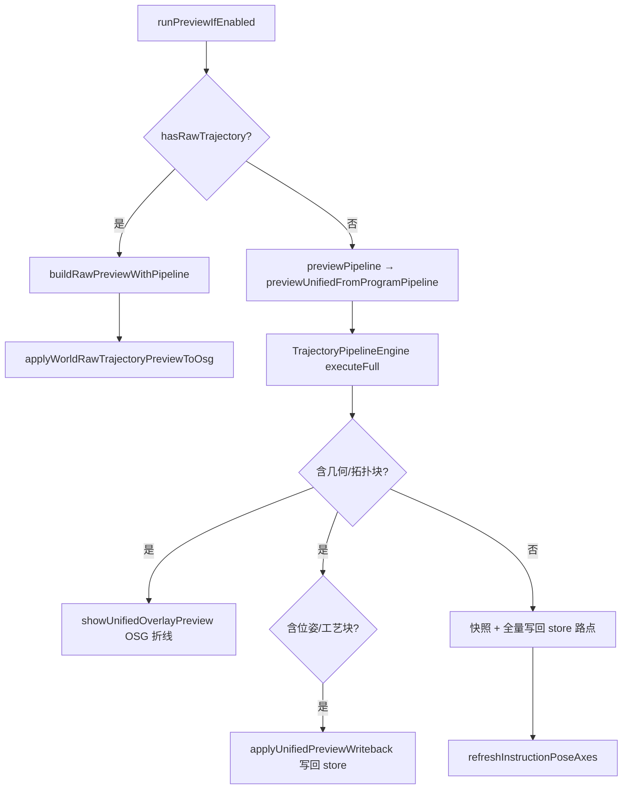

# RobotWidget Developer Guide

> **空间契约**：[`../../../docs/spatial_contract_world_pose.md`](../../../docs/spatial_contract_world_pose.md) — per-link FK、工具轴叠加、TCP 拖动示教均须遵守；实现见 `RobotSimulationMathExports.cpp`、`refreshRobotCoordinateFrameOverlays`。

Robot simulation and device UI live in this x64 DLL (`RobotWidget.dll`, `ROBOTWIDGET_LIB`). Widget keeps `DocumentPage`, `OsgWidget`, and TCP drag teach; orchestration uses host interfaces.

## Build (x64)

| Item | Value |
|------|--------|
| Output | `RobotWidget.dll` |
| Defines | `ROBOTWIDGET_LIB` |
| Links (import lib) | `Data`, `OsgWidgetCore`, `BackendVisual`, `GeometryEngine`, `RobotScene`, `RobotUrdf`, `RobotKinematics`, `RunLogger`, **`CloudSimUiAssets`** + OSG |

与 `Widget.dll` **共享**上述引擎 DLL 运行时实例，不在本 DLL 内重复静态嵌入。

## Layout

| Area | Location |
|------|----------|
| Simulation dock (Instructions / Axis / Frames / **Trajectory Generation** / **Trajectory Edit**) | `RobotSimulationDockWidget`, page widgets |
| Orchestration | `RobotSimulationController` |
| Host contracts | `IRobotMainWindowHost`, `IRobotDocumentHost`, `IRobotOsgViewHost` |
| STEP 坐标变换 | [`inc/FeaturePickTransform.h`](inc/FeaturePickTransform.h) + `source/FeaturePickTransform.cpp`：`stepModelPointToWorldMm` / `worldPointToStepModelMm`（导出，非 header inline） |
| FK / matrix helpers | `RobotSimulationMath` |
| Instruction planning context | `RobotInstructionPlanning` |
| URDF import entry | `RobotUrdfImport::registerUrdfRobot` → host |
| 程序 JSON（多程序 / 分组 / v4） | `RobotProgramStore` → `RobotProgramCatalog`；序列化见 `RobotProgramJsonIo` |
| 程序编辑撤销栈 | `ProgramEditService` + `ProgramEditStack`（`RobotScene`） |
| 轨迹编辑流水线 | `TrajectoryEditPageWidget` / `TrajectoryEditSession` / `TrajectoryPipelineEngine` |
| **CAD 轨迹生成** | `FeatureTrajectoryPageWidget`：`FeatureSpec` → 离散 → `RawTrajectory` 写入 `TrajectoryEditSession` |
| 指令属性面板 UI | `InstructionPropertyPanel` + `MainWindowInstructionPropertyUiHost`（Widget 桥接） |
| Property-panel feasible-axis query | `RobotInstructionPropertyEditor` / `RobotSimulationController::scheduleDeferredFeasibleAxisProbe` |

## Widget integration

- `MainWindowRobotHost` implements `IRobotDocumentHost` / `IRobotOsgViewHost` / `IRobotMainWindowHost`.
- `MainWindowUiSetup` creates `RobotSimulationController`, simulation dock, and attaches `m_robotSimTimer` via `attachPlaybackTimer`.
- `MainWindowRobotStubs.cpp` forwards slots (`onSimulationInstructionSelectionChanged`, `onRobotAxisJointAnglesChanged`, TCP teach, etc.) to the controller.
- `MainWindowPropertyPanel` owns the Qt property browser shell; simulation instruction rows are built by `InstructionPropertyPanel`.
- Feasible-axis enum refresh: show cached tokens first, then `scheduleDeferredFeasibleAxisProbe` (background IK via `JobSystem`).

### Host pitfalls (per-link URDF)

| 项 | 说明 |
|----|------|
| `IRobotDocumentHost::robotBackendManagerForKinematics()` | **必须**转发到 `DocumentPage::robotBackendManagerForKinematics()`。默认基类返回 `nullptr` 会导致 `applyJointAnglesViaLinkBackends` 失败，轴控制/拖动/预览均无场景更新。 |
| **M0 与 P 分离** | bind 表 **M0** 在导入时冻结；整机关节链平移/旋转只更新 **P**（`basePlacementWorld`）。勿在 gizmo 松手或 TCP 前把场景世界矩阵 **W** 直接写入 **M0**。进入 TCP 示教前调用 `reconcilePerLinkOuterBindFromScene` 校正 bind。 |
| `robotBaseWorldMatrixForInstance` | per-link 时返回 **P**，供 `tcpTeachSetTargetFromToolWorld` 做基座↔世界变换；**勿**用根连杆 OSG 世界矩阵冒充 URDF 基座。 |
| `IRobotOsgViewHost` 生命周期 | `osgView()` 在文档页变化时重建 `WidgetOsgViewHost`；实现委托 `IRenderView`，勿缓存裸 `OsgWidget*`。 |
| `IRobotOsgViewHost` 坐标 | `feature_pick_transform` 经 `resolvePickScopeBackendId` + `getBackendRootWorldMatrix` 做 STEP 文件坐标↔世界（**不**加减 `modelCenter`）；`backendSkipsInnerModelCenterRebase` 已恒 `false`（遗留 API）。 |
| `IRobotDocumentHost` 文档切换 | `document()` 在 `currentPage()` 变化时重建 `DocumentHost`（与 OSG 规则一致）。 |

## Build

- Platform: **x64** only (Debug/Release).
- Output: `bin/x64(d)/RobotWidget.dll`.
- Depends: `RobotScene`, `RobotUrdf`, `RobotKinematics`, `GeometryEngine`, `Data`, `RunLogger`, `OsgWidgetCore`, `BackendVisual`, OSG.

See also [`../Widget/DEVELOPER_GUIDE.md`](../Widget/DEVELOPER_GUIDE.md) §3.3 / §13–§16 and [`../ARCHITECTURE_SUMMARY.md`](../ARCHITECTURE_SUMMARY.md) §6.4.

### UI 图标（`CloudSimUiAssets`）

新按钮/菜单优先 `#include "UiIconDecorators.h"`，用 `UiIconDecorators::apply` 绑定 `UiIconId`；**勿**硬编码 `:/cloudsim/icons/...` 路径。文本与 tooltip 仍用现有 i18n（`setText` / `retranslateUi`）；图标 ID 不随语言变化。主题由 `ApplicationStyle::applyTheme`（Widget）统一刷新，RobotWidget 无需额外调用。

---

## `RobotSimulationController`

Central orchestration (formerly in `MainWindow.cpp`). Wired in `wireSimulationSignals()` after dock creation.

**重构进度**（详见 `ARCHITECTURE_SUMMARY.md` §迁移路线图）：
- 阶段 1.1-1.5 已完成：运动学（6 处 `applyJointAnglesForInstance`）、坐标系管理、TCP IK 已通过 `IRobotDocumentHost` 委托
- 阶段 1.6 待定：导出功能需 Controller 内部状态

| 职责 | 入口 | 委托方式 |
|------|------|----------|
| 轴控制 | `onRobotAxisJointAnglesChanged` | `doc->applyJointAnglesRad()` |
| 指令选中预览 | `onSimulationInstructionSelectionChanged` → `applyRobotPoseForInstructionPreview` | 仍经 Controller |
| 添加运动点 | `onSimulationAddInstructionRequested` | 仍经 Controller |
| 运行/停止 | `onSimulationRunRequested` / `onSimulationStopRequested` | 仍经 Controller |
| TCP 拖动示教 | `onSimulationTcpDragTeachModeChanged` / `onTcpDragTeachPoseChanged` | IK 经 `doc->solveTcpDragTeachIk()` |
| 程序起点 | `captureMotionPreviewProgramStartJoints` | 仍经 Controller |
| 坐标系捕获 | `onCaptureToolFrameFromTcp` / `onCaptureUserFrameFromTcp` | `doc->captureToolFrameFromTcp()` / `doc->captureUserFrameFromTcp()` |
| 坐标系重置 | `onResetToolFrame` | `doc->resetToolFrame()` |

### `wireSimulationSignals`

连接 `SimulationCommandWidget` / `RobotAxisControlWidget` / `RobotFrameSettingsWidget` / **`TrajectoryEditPageWidget`** / **`FeatureTrajectoryPageWidget`** 信号到 controller 槽。`ProgramEditService`、`TrajectoryEditSession` 在 dock 创建时实例化，文档就绪后 `bindStore`（`refreshSimulationProgramStore`）。

`FeatureTrajectoryPageWidget`：`bindHost` + `bindSession` + `setStepPathResolver`（`doc->meshBackendStepSourcePath`）；见 §CAD 轨迹生成。`TrajectoryEditPageWidget` 承接 session 内 RawTrajectory 的配方与生成程序。

`QTabWidget::currentChanged` 须在 dock 与 `attachPlaybackTimer` 之后连接（见 `MainWindowUiSetup`），避免构造期 `stopRobotSimulation` 空指针。

轨迹编辑：`opsChanged` → `syncSessionPipeline`（结构变更）；参数 SpinBox → `updatePipelineOps`（见 §轨迹编辑）。

---

## 示教关节与位姿真源

### `context.currentJointRadCsv`

添加 PTP/LINE 时写入当前实例关节角（rad，逗号分隔）。**Run** 与 **预览** 均先经 `shouldUseTaughtJointCsv` 判定，再校验位置/姿态残差（≤ 1 mm / ≤ 5°）。IK/规划成功后 `persistTaughtJointsAndToolContext` 回写 CSV 与冻结工具 context。

| API | 模块 |
|-----|------|
| `RobotInstructionPlanning::encodeJointAnglesRadCsv` | 写入 |
| `RobotInstructionPlanning::jointAnglesRadFromInstructionContext` | 读取 |
| `RobotInstructionPlanning::motionDurationSecFromInstruction` | 段时长（缺省 0.5s） |

### `prepareMotionInstructionForPlanning`

仅设置规划上下文，**禁止**用当前 `rollingQ` 的 FK 覆盖指令 `pose/euler`（`writeTargetTransformToInstruction` 已移除）。写入：

- `context.currentJointRadCsv`（链式种子）
- `context.urdfPath` / `context.tcpLinkName` / `context.flangeLinkName`（由工具系解析法兰 link）
- `context.toolFrameMat4`

### 程序起点 `m_motionPreviewProgramStartJointRad`

- Run 链式规划的**第一段起点**（与 `initialAngles` 同源）；预览链式种子 `buildChainSeedJointRadForInstruction` 亦从此处起步。
- **仅在**该机器人**第一条**运动指令加入程序时更新（`collectMotionInstructions` 条数 ≤ 1）；后续点不再覆盖，避免多点示教时起点被第二点关节顶替。
- 优先从 `m_aggregatedJointAnglesRad` 捕获，否则回退轴滑块。

### TCP 拖动 IK（`applyTcpDragTeachIkFromPose`）

**进入示教**（`onSimulationTcpDragTeachModeChanged(true)`）：per-link 时先 `doc->reconcilePerLinkOuterBindFromScene(instIdx, jointQ)` 从场景反解 **M0**；`resolveRobotBaseWorld` 经 `robotBaseWorldMatrixForInstance` 取 **P**（勿用根连杆 mesh 世界矩阵）。详见 Widget §13.1。

1. `ctx.T_base_target` 来自罗盘（`tcpDragTeachPoseChanged`），并缓存到 `m_lastTcpDragTargetInBase`。
2. `RobotTeachIk::solveTeachIk` → 关节角按 URDF 限位 **钳位**（`clampJointAnglesToInstanceLimits`）。
3. `setJointAnglesRad`（UI 钳位）后 `onRobotAxisJointAnglesChanged(jointAnglesRad())`，保证场景与滑块一致。
4. `updateTcpDragTeachFromTarget` 用钳位后 FK 对齐罗盘（IK 残差时可能略有偏差）。
5. **不**在拖动每帧更新程序起点（仅添加第一条运动指令或空程序结束拖动时可选捕获）。

### 添加指令（`onSimulationAddInstructionRequested`）

| 步骤 | 行为 |
|------|------|
| 位姿 | 若存在 `m_lastTcpDragTargetValid`，用罗盘 `T_base_target` 写 `pose/euler` 与 `writeTargetTransformToInstruction`；否则 `tryCaptureCurrentRobotTcpPose`（关节角优先 `m_aggregatedJointAnglesRad`） |
| 关节上下文 | `context.currentJointRadCsv` = `localJointAnglesForInstance` |
| 添加后 | `captureMotionPreviewProgramStartJoints`（仅首条运动）、`m_skipInstructionPreviewOnce` → 避免立即预览把机器人拉离示教姿态 |
| 选中 | `onSimulationInstructionSelectionChanged` 刷新属性与叠加轴 |

### 指令树点击预览 vs 仿真运行

预览与 Run **规划策略已分离**（2025 性能优化）：预览只对选中点做 **1× IK**，Run 对全程序链式规划并缓存；**二者 IK 种子语义一致**（程序起点 + 前序路点链式 `rollingQ`），不再使用屏幕当前关节角作种子。

| 维度 | 点击预览 | 仿真运行 |
|------|----------|----------|
| 种子关节 | **链式** `buildChainSeedJointRadForInstruction`（程序起点 → 前序路点 `rollingQ`；失败回退 `motionPreviewProgramStartJointsLocal`） | 程序起点 + 链式 `rollingQ` |
| 规划范围 | **仅选中** PTP/LINE（1× IK） | **全部** 运动指令（链式） |
| 缓存 | 不缓存 | `PlanResultCache`（key = instructionId + fingerprint） |
| 运行中树 | — | `currentInstruction()` + `QSignalBlocker` 跟随选中，不触发预览 |
| 后台预读 | — | `tickLookaheadPlanning` → `IRobotMainWindowHost::enqueueBackgroundJob` |

实现均在 `RobotSimulationController`；执行器为 `RobotProgramExecutor`（[`RobotScene/DEVELOPER_GUIDE.md`](../Robot/RobotScene/DEVELOPER_GUIDE.md)）。

#### 信号链

| 操作 | 调用链 |
|------|--------|
| 点击指令树 | `InstructionProgramTreeWidget::instructionSelected` → `SimulationCommandWidget::instructionSelectionChanged` → `onSimulationInstructionSelectionChanged` →（非 TCP 拖动）`applyRobotPoseForInstructionPreview` |
| 点 Run | `SimulationCommandWidget::runRequested` → `onSimulationRunRequested` → `onSimulationStartTriggered` → `m_programExecutor.tryStart` + `QTimer` → `onRobotSimulationTick` → `RobotProgramExecutor::tick` |

`emitSelection=false` 重建树时不发 `instructionSelected`，避免在工具扩展写入前触发预览/IK（见 `InstructionProgramTreeWidget`）。

#### 对比总览

| 维度 | 点击预览 | 仿真运行 |
|------|----------|----------|
| 触发 | 选中 **PTP/LINE**（及树刷新后的选中） | Run 按钮 |
| 规划时机 | 每次选中当场算，**不缓存** | 启动前链式规划；**命中** `PlanResultCache` 则跳过 IK |
| 机器人动作 | **一帧到位** | **定时器插值** |
| 写回指令 | `backup/restoreInstructionPose`，**不改** `motion.durationSec` | 可写 `motion.durationSec`；`PlanResult` 供播放 |
| 程序逻辑 | 不执行 WAIT / IF / WHILE / IO | `RobotProgramExecutor::advanceProgramStep` |
| 运行中 | `m_programExecutor.isRunning()` 时预览 **直接 return** | tick 内更新指令树选中 + 并行预读 |

直观理解：**预览 = 用与 Run 相同语义的链式种子，对选中点单次 IK（或示教 CSV）并瞬间摆过去**；**运行 = 全程序链式建 `PlanResult`（带缓存）再插值播放**。屏幕上的当前关节角**不参与**预览 IK 种子（`localJointAnglesForInstance` 仅用于添加指令、TCP 拖动等其它路径）。

#### `PlanResultCache` 与 fingerprint

- 类：`PlanResultCache`（`RobotWidget/inc/PlanResultCache.h`），仅 UI 线程读写。
- `computePlanFingerprint` 纳入：指令 id、pose、euler、speed、accel、axisConfig preset、`motion.tool.frameId`、`context.toolFrameMat4`、seed 关节、urdfPath、tcpLinkName。
- **失效**：`invalidateFeasibleAxisConfigurationCache`、`onRobotCoordinateFramesChanged`、`onSimulationRobotSelectionChanged`、`ProgramEditService::revisionChanged`。

#### 点击预览（`applyRobotPoseForInstructionPreview`）

**前置条件**：非 `m_skipInstructionPreviewOnce`、非 TCP 拖动示教、仿真未运行、选中类型为 PTP/LINE。

**步骤**：

1. `chainSeedQ = buildChainSeedJointRadForInstruction`（前序路点链式种子；前序 `plan` 失败则标记 `chainReliable=false` 并回退程序起点）；`seedQ = chainReliable ? chainSeedQ : programStartQ`。
2. **示教 CSV 快速路径**：`shouldUseTaughtJointCsv` 且位置/姿态残差合格 → `resultQ = taughtQ`。
3. 否则对**选中点**单次 `planMotionOnHost`；姿态门控 ≤ 5°；失败可回退 `programStartQ` 再试。
4. IK 成功后 `persistTaughtJointsAndToolContext` 回写示教关节。
5. 写入关节状态并 `refreshRobotCoordinateFrameOverlays(instruction, &resultQ)`。

**不**播放中间过程；**不**缓存 `PlanResult`。

#### 仿真运行（`onSimulationStartTriggered`）

1. `initialAngles`：优先 `m_motionPreviewProgramStartJointRad`，否则轴滑块当前角。
2. 对每条运动指令：先查 `PlanResultCache`；未命中则示教 CSV 或 `planMotionOnHost`；成功写入缓存。
3. 保存 `m_currentRunMotions` 供 `tickLookaheadPlanning`。
4. `tryStart` + `m_playbackTimer`；tick 内 `currentInstruction()` 高亮指令树（`QSignalBlocker` + id 去重）。

播放阶段 **不再** 调用 planner；后台 Job 仅预热后续段缓存。

#### 并行预读（`tickLookaheadPlanning`）

Run 期间每 tick 在 UI 线程调用；根据 `activeMotion()` 在 `m_currentRunMotions` 中定位当前段，向前最多 3 段：

1. `trySeedJointRadForMotionIndex` 沿链从 `PlanResultCache` 恢复种子关节；
2. 未命中且 `m_lookaheadPendingJobs < maxConcurrentJobs` → `IRobotMainWindowHost::enqueueBackgroundJob`；
3. 工作线程用 `PlanJobPayload` 快照构造独立 `PtpInstruction`/`LineInstruction` + `Controller::plan`（**禁止** clone `Base`）；
4. `onFinished`（UI 线程）写入 `PlanResultCache`。

`stopRobotSimulation` 清空 `m_currentRunMotions`、`m_lookaheadPendingJobs`、`m_lastHighlightedInstructionId`。

#### 可行轴 IK 后台探测（`scheduleDeferredFeasibleAxisProbe`）

属性面板 `refreshFeasibleAxisOptions=true` 或指令树首次选中 `AUTO` 未 seed 时触发。

1. UI 线程：`buildChainSeedJointRadForInstruction` + fingerprint；命中 `m_cachedFeasibleAxis*` 则直接刷新面板。
2. 快照 `PlanJobPayload` + `RobotCoordinateFrameSet` → `enqueueBackgroundJob`（标题 `Feasible axis IK`）。
3. 工作线程：独立 `RobotInstruction::Controller` + `prepareMotionInstructionForPlanning` + `queryFeasibleMotionAxisConfigurationOptions`（同 lookahead/reachability，**禁止**碰共享 `Base`）。
4. `onFinished`（UI 线程）：写缓存；若 `activeInstructionForProperty()` 仍匹配则 `applySuggestedAxisPresetFromSeedIfNeeded` + `refreshInstructionPropertyPanel(false)`。
5. `invalidateFeasibleAxisConfigurationCache` 递增 `m_feasibleAxisJobToken` 丢弃过期结果。

显式 API `IRobotService::queryFeasibleMotionAxisOptions` 仍可走 `feasibleMotionAxisConfigurationOptionsForInstruction` **同步**路径（插件/契约查询）。

#### 关键 API（本模块）

| 符号 | 文件 | 说明 |
|------|------|------|
| `PlanResultCache` | `inc/PlanResultCache.h` | Run 规划结果缓存 |
| `computePlanFingerprint` | `RobotSimulationController` | 缓存 key 的 fingerprint |
| `tickLookaheadPlanning` | 同上 | Run 中后台预读 |
| `buildChainSeedJointRadForInstruction` | 同上 | 预览/可行轴：程序起点 → 前序路点链式种子 |
| `applyRobotPoseForInstructionPreview` | 同上 | 选中预览（链式种子 + 单次 IK 或示教 CSV） |
| `scheduleDeferredFeasibleAxisProbe` | 同上 | 可行轴 IK 后台 Job + 缓存 |
| `scheduleAsyncMotionReachabilityRefresh` | 同上 | 全程序 reachability 后台 Job |
| `onSimulationStartTriggered` | 同上 | Run 启动 + 链式缓存 |
| `onRobotSimulationTick` | 同上 | 播放 + 树高亮 + 预读调度 |

Host 侧：`IRobotMainWindowHost::enqueueBackgroundJob` → `MainWindowRobotHost` → `MainWindow::jobSystem()`（见 [`../Widget/DEVELOPER_GUIDE.md`](../Widget/DEVELOPER_GUIDE.md) §12）。

Executor 侧：`RobotProgramExecutor::currentInstruction()`（见 [`../Robot/RobotScene/DEVELOPER_GUIDE.md`](../Robot/RobotScene/DEVELOPER_GUIDE.md) §7.2）。

#### 与添加指令的协作

- 首条运动指令加入时 `captureMotionPreviewProgramStartJoints` 冻结起点。
- 添加后设 `m_skipInstructionPreviewOnce`，避免树自动选中触发预览把机器人从刚示教姿态拉走。

#### 修改注意

- 预览与 Run **共享链式种子语义**；差异仅在规划范围（选中 1× vs 全程序）与 Run 缓存/预读。勿在预览中改回 `localJointAnglesForInstance` 作 IK 种子，除非产品需求变更。
- 改示教 CSV 判定、`prepareMotionInstructionForPlanning`（含 `flangeLinkName`）或姿态门控时，**须同时**核对预览与 Run 两处路径。
- 改 `computePlanFingerprint` 字段时同步检查缓存命中率与失效触发点。

---

## `RobotInstructionPlanning`

| 符号 | 说明 |
|------|------|
| `backupInstructionPose` / `restoreInstructionPose` | 规划前保存/恢复位姿与 extensions |
| `prepareMotionInstructionForPlanning` | 写规划上下文（见上） |
| `encodeJointAnglesRadCsv` / `jointAnglesRadFromInstructionContext` | 示教关节持久化 |
| `motionFollowsActiveToolFrame` / `syncInstructionToolContextFromFrames` / `persistTaughtJointsAndToolContext` | 工具系切换与 IK 后回写；**active 跟随路点 sync 始终用 `activeToolFrame(frames)`**，避免 stale `context.activeToolFrameId` |
| `motionDurationSecFromInstruction` | 段时长 |

---

## `RobotSimulationMath` / 捕获

`tryCaptureCurrentRobotTcpPose`（controller）：优先 `targetInBaseFromUrdfFlangeFk` + 工具系；关节角优先聚合向量再滑块。per-link 场景见 `captureTcpFromSceneFlangeBackend`。

---

## 页面控件（简要）

| 类 | 说明 |
|----|------|
| `SimulationCommandWidget` | 指令树、Run/Stop、TCP 拖动；**程序下拉 / 新建 / 重命名 / 删除**；**指令**分组（PTP/LINE/…）与 **功能**分组（末端拖动/删除/清空）；Ctrl 多选 + 右键创建分组；`setProgramStore`、`activeProgramChanged` / `groupsChanged` |
| `RobotAxisControlWidget` | 关节滑块；`setJointAngle` 内 `qBound` 限位 |
| `RobotFrameSettingsWidget` | 工具/用户系；`framesChanged` → `onRobotCoordinateFramesChanged`（见下） |

#### 工具坐标系页 `framesChanged` 分级刷新

`onRobotCoordinateFramesChanged` 对比变更前后 `RobotCoordinateFrameSet`：

| 变更类型 | 典型操作 | 行为 |
|----------|----------|------|
| **无变更** | 仅切换工具列表行（spin 未改） | 不 emit `framesChanged` |
| **DisplayOnly** | 全局「显示工具系/用户系」或**单项** `showInScene` 勾选 | 只刷 overlay；不 invalidate plan / 不 IK |
| **StructuralOnly** | 添加/复制/删除**未激活**工具系 | `refreshInstructionPoseAxes(false)`；**不** invalidate plan 缓存；**不** preview |
| **ActiveToolChanged** | 「设为当前」切换激活工具 | `applyToolFrameChangeToProgram` + 失效 plan/可达性缓存；**异步** reachability + 选中点 preview |
| **ToolGeometryChanged** | 编辑 `T_flange_tool` / flange link | 对使用该工具 id 的路点失效示教关节；异步 reachability + preview |

`motion.tool.frameId` 为 `"active"` 或空的路点**跟随全局激活工具**（切换 active 时 `syncInstructionToolContextFromFrames` 写当前 `activeToolFrameId` / `toolFrameMat4`，不用 frozen id 解析）。具体 id 的路点仅在该工具几何变更时失效。

辅助 API（`RobotInstructionPlanningHelpers`）：`motionFollowsActiveToolFrame`、`syncInstructionToolContextFromFrames`、`persistTaughtJointsAndToolContext`。

Add/Duplicate/Remove 工具系时用 `m_blockSignals` 避免 `setCurrentRow` 触发双重 `framesChanged`。工具列表切换行时仅 spin 实际变更才 emit。

#### `RobotFrameSettingsWidget` 列表与显示

| UI | 行为 |
|----|------|
| 工具/用户列表每行 | 名称 + `*`（当前激活）；**右侧勾选** → 该项 `showInScene`（默认 `true`） |
| 「三维显示」分组 | 全局 `showToolFrameInScene` / `showUserFramesInScene`；关闭时全部 overlay 不绘制 |
| 单项勾选 | 仅隐藏该条坐标系轴；属 **DisplayOnly**，经 `coordinateFrameSetPlanningEquals` 忽略后对比 |
| 持久化 | 工程 JSON 每帧可选字段 `showInScene`；缺省视为显示 |

3D 叠加由 `refreshRobotCoordinateFrameOverlays` → `OsgWidget::setRobotFrameOverlays`：全局开关开启且该项 `showInScene` 才入队。

| per-link 模式 | 工具系 mount | 工具系 local |
|---------------|--------------|--------------|
| `meshVerticesInLinkFrame=false`（世界烘焙，**默认**） | `urdfRootLinkBackendId` | `toolTcpInBaseFromFk(urdf, q, **该 tool**)` |
| `meshVerticesInLinkFrame=true` | 法兰 link backend | `T_flange_tool` |

用户系挂 **URDF 根连杆**，`local = T_base_user`。多工具时 **必须** per-tool 计算 TCP（禁止共用激活工具矩阵）。TCP 拖动后须 `updateTcpDragTeachFromTarget` + IK 后 `refreshRobotCoordinateFrameOverlays`。Run 期间工具系与预览一致显示。

| 类 | 说明 |
|----|------|
| `TrajectoryEditPageWidget` | 轨迹编辑 Dock 子页：**工艺模板**区 + 调色板 + Program Op 流水线 + 参数区 + 预览勾选/Apply/Reset/Undo |
| `InstructionProgramTreeWidget` | 层级指令树；`NodeKind::Group` 嵌套显示分组；Ctrl 多选根层级指令 → 右键创建分组；拖放维护 `memberInstructionIds`；`instructionSelected` → 预览 |
| `TrajectoryEditSession` | 预览三分支（raw 叠加 / overlay / 位姿写回）与 Apply（Command 落盘）；`reset` / `abandonPreview`；**并行持有** `m_rawTrajectory`（`setRawTrajectory` / `rawTrajectoryChanged`，与 Program 预览快照解耦）；见 §轨迹编辑 |
| `ProgramEditService` | `execute` / `undo` / `redo`；`revisionChanged` → 轨迹页 `syncUiAfterProgramRevision` + 指令树刷新 |
| `DevicePageWidget` | Property Dock「设备」Tab：类型/品牌 Combo + 自适应缩略图网格；`urdfImportRequested` |

### `DevicePageWidget` 布局（Property Dock）

宿主为 **Property Dock** 第二 Tab（默认宽约 340px），非 RobotSimulationDock。

| 区域 | 控件 | 行为 |
|------|------|------|
| 筛选栏 | 类型 / 品牌 `QComboBox`、刷新 | 驱动 `m_packagesByTypeBrand`；仅 1 个品牌时隐藏品牌 Combo |
| 型号网格 | `QScrollArea` + `QGridLayout` | 缩略图 96×88；列数随 viewport 宽度自适应；点击 → `urdfImportRequested` |
| 数据源 | `resource/models/{Type}/{Brand}/{Package}` | 扫描与 URDF 匹配逻辑不变 |

i18n：`setUseChinese` ← `MainWindow::applyLanguage`。

TCP 拖动 OSG 实现仍在 [`../Widget/DEVELOPER_GUIDE.md`](../Widget/DEVELOPER_GUIDE.md) §13.1。

### `SimulationCommandWidget` 布局（指令子页）

Dock **机器人** 页内指令编辑区自上而下：

| 区域 | 控件 |
|------|------|
| 提示 | 选择机器人、插入指令、Ctrl 多选 + 右键分组、拖放排序 |
| 机器人 / TCP | `m_robotCombo`、`m_tcpLinkCombo` |
| 程序 | 下拉 + 新建 / 重命名 / 删除 |
| **指令**（`m_instructionGroupBox`） | PTP、LINE、\|、WAIT、IF、WHILE、SET_DO、SET_AO |
| **功能**（`m_functionGroupBox`） | 末端拖动、删除、清空 |
| 指令树 | `InstructionProgramTreeWidget`（占剩余高度） |
| 运行 | Run / Stop / Export |

分组创建/解散/重命名在**树右键**完成，经 `ProgramEditService` 落盘并 `emit groupsChanged()` 供轨迹编辑页刷新顶栏分组下拉。程序切换：`onProgramComboChanged` → `rebuildCommandListWidget()` 绑定当前程序 `steps` + `groups`。

---

## 轨迹编辑（Trajectory Edit）

Dock **「轨迹编辑」**页（在「轨迹生成」之后）。Dock 主标签为 **机器人** / Robot（原「指令仿真」）。默认中文 UI；`MainWindow::applyLanguage` → `trajectoryEditPage()->setUseChinese` / `featureTrajectoryPage()->setUseChinese`；页签索引见 `RobotSimulationDockWidget::kTabIndexTrajectoryGeneration` / `kTabIndexTrajectoryEdit`。

### 管道引擎与 Observer（2026 升级）

| 组件 | 职责 |
|------|------|
| `TrajectoryPipelineEngine` | `UnifiedTrajectory` 为管道 IR；`pendingPreRaw → committed → draft` 顺序重放；`executeFrom` 局部重跑 |
| `TrajectoryEditSession::m_pipelineEngine` | Raw/Unified Apply 与 `buildRawPreviewWithPipeline` 委托引擎 |
| `TrajectoryEditObserver` | Page/AI 统一入口：`loadPipeline` / `updateNodeParams` / `moveNode*` |
| `ProcessFlowPresetLoader` | 工艺默认流水线 JSON：`bin/resource/trajectory/ProcessFlowPresets.json` |
| 原子块实现 | [`TrajectoryAlgorithmBuiltins`](../../Robot/TrajectoryAlgorithmBuiltins/DEVELOPER_GUIDE.md) |

预览收敛为 **单引擎执行 + 多 egress**（OSG raw 叠加 / 临时写回路点轴）。有 raw 时改参可 `runPipelineEngineFrom(nodeIndex)` 再刷新叠加层。

流水线列表支持 **列表内拖拽排序**（`TrajectoryPipelineListWidget::startDrag` + 内部 MIME 行号）。

### 工艺模板与原始轨迹（CAD 离散结果）

页顶 **「工艺模板」** 区用于将焊缝/涂胶/打磨一键填充到统一流水线；`RawTrajectory` 仍作为离散输入来源：

| 控件 | 行为 |
|------|------|
| 状态标签 | `TrajectoryEditSession::hasRawTrajectory()` → 点数；否则提示先在轨迹生成页离散 |
| 工艺下拉 | 焊缝 / 涂胶 / 打磨（`buildRecipePreset` → `ProcessFlowPresets.json` 原子 `pipeline`） |
| 填充工艺流水线 | `ProcessFlowPresetLoader` 展开 Resample/Offset/Approach/Retract 等 → `m_pipeline->setOps(...)` |
| 生成程序 | 保留 `emitRawTrajectoryToProgram` 入口用于 raw 直出；绑定 PathPlan 时仅替换该条 `PathPlanOutput`，不删除其它 PathPlan 的分组与路点；**Apply 成功后自动禁用**，避免覆盖已应用结果；发生新编辑或 Raw 更新后恢复可用 |

`rawTrajectoryChanged` 刷新状态；`reset()` / `abandonPreview` **不清** `m_rawTrajectory`。Apply 统一走 `TrajectoryPipelineEngine`；有 raw 时引擎 `setUsingRaw(true)`，无 raw 时从程序 Ingress。

### Session 几何历史（多次 Apply / 预览对齐）

`TrajectoryEditSession` 在流水线 **Apply 成功后** 会 `clearPipelineAfterCommit()` 清空 UI 流水线，但保留下列历史，用于下次从**同一 CAD raw 基线**重放全部几何变换（避免「第二次 Apply 覆盖第一次移动」）：

| 成员 | 何时写入 | 何时用于预览/Apply |
|------|----------|-------------------|
| `m_pendingPreRawGeometryOps` | 引擎 `pendingPreRaw` 槽位（Program Command 路径已移除，通常为空） | 有 raw 的 Apply/预览经 `setPendingPreRawOps` 传入；Apply 成功后 **清空** |
| `m_accumulatedGeometryOps` | 每次有 raw 的 Apply 成功后追加本批全部几何块 | 之后每次 Apply/预览作为引擎 `committed` 在 `draft` 之前重放 |
| `m_bakedWorldRaw` | 有 raw 的 Apply 成功后由 `unifiedTrajectoryToRaw` 烘焙 | 诊断/状态用；**不再**作为 Apply 起点（始终从 `m_rawTrajectory` 重建） |
| `m_rawTrajectory` | 轨迹生成页 `setRawTrajectory`；有 raw 的 Apply 可更新 `rawWorking` | 引擎 raw 路径的 **文件坐标** 输入；`rebuildUnifiedFromSourceRaw` 转世界系 |

用户点轨迹编辑 **Reset** 时：`clearTrajectoryGeometryHistory()` 清空上述历史 + `m_bakedWorldRaw`（`onResetClicked`）。`setRawTrajectory`（新离散）会清 `m_bakedWorldRaw`，**保留** accumulated（除非用户 Reset）。

**新离散**：`setRawTrajectory` 清几何历史；**已绑定** PathPlan 时只更新该条 raw；无绑定时在根级 PathPlan 序列末尾 `InsertPathPlanCommand` 并自动命名（featureId 去重）。重离散清 `appliedHistory`。`bindPathPlan(id)` 加载 `pipeline` / `appliedHistory` / raw。Apply（有 raw）用 `CompositeProgramEditCommand` 一次撤销。删除 PathPlan：`RemovePathPlanCommand`（指令树删除按钮）。

**指令树 · 路径规划区**：根级虚拟节点「路径规划」下展示全部 `Type::PathPlan`（可拖放排序）；子节点可显示对应 `PathPlanOutput` 分组（只读）。运动程序（分组/路点）在其下方。`program.steps` 约定为 **PathPlan 块在前、运动指令在后**（`syncToProgram` 写回）。离散/编辑绑定以树选中或轨迹编辑页下拉为准，不再默认 `plans.front()`。

### 组件与绑定（Program Op 流水线）

| 组件 | 职责 |
|------|------|
| `TrajectoryEditPageWidget` | UI：程序/路径规划/分组、调色板、流水线、`TrajectoryOpParamPanel`、预览勾选/Apply/Undo |
| `TrajectoryPipelineListWidget` | `m_ops` 真源；列表项由 `rebuildItems()` 从 `m_ops` 生成 |
| `TrajectoryEditSession` | 持有 `m_ops` + `TrajectoryPipelineEngine`；Preview 快照 / Apply Command；`reset` / `abandonPreview` |
| `ProgramEditService` | Apply 时优先 `executeBatch(cmds)`（单次 `renumberAndNotify` + `revisionChanged`）；Undo/Redo 恢复程序树 |
| `RobotProgramStore` | `activeCatalog()` / `activeProgram()`；与 Instructions 页共用 |

`RobotSimulationController::wireSimulationSignals` 创建并绑定 `ProgramEditService`、`TrajectoryEditSession`；文档就绪后 `bindStore`（见 controller 内 `refreshSimulationProgramStore`）。

### 流水线 ↔ Session 同步（必读）

| 操作 | UI 路径 | Session API |
|------|---------|-------------|
| 增删/排序/拖入/加载模板 | `opsChanged` → `syncSessionPipeline()` | 已绑定 PathPlan：**`updatePipelineOps`** + `syncPipelineToBoundPathPlan`；否则 **`setPipeline`**（`reset()`） |
| 仅改参数（Schema 面板） | `applyParamsToSelectedOp()` → `syncSessionParams()` | **`updatePipelineOps`**（不 reset）；勾选预览时 **`schedulePreviewRun`** 完整重算（勿依赖旧 `reapplyPreview` 单独路径） |
| 预览勾选 / Apply | `reconcilePipelineScopes()` + `flushPipelineToSession()`（预览勾选时自动或手动触发） | 有选中块 → `applyParamsToSelectedOp`；否则 `syncSessionParams` |
| 撤销 / 重做（任意 Command） | `ProgramEditService::revisionChanged` → `syncUiAfterProgramRevision()` | 刷新分组下拉、丢弃预览、协调流水线 scope（见下） |

**禁止**在参数变更路径调用 `setPipeline()`，否则预览位姿会被 `reset()` 立刻还原。

### 撤销 / 重做与作用域协调

程序树变更（含轨迹 **Apply**、分组创建/删除、指令增删等）均走 `ProgramEditService` 撤销栈。`revisionChanged` 时轨迹页 **`syncUiAfterProgramRevision()`**：

| 步骤 | 行为 |
|------|------|
| 刷新 UI | `refreshUndoButtons`、`refreshProgramAndGroupCombos`（保留顶栏/参数区/当前选中块的分组选中项） |
| 丢弃预览 | `TrajectoryEditSession::abandonPreview()` — **不**还原快照（程序已被 undo/redo 改写，旧快照会污染 store） |
| 协调 scope | `reconcilePipelineScopes()` — 分组块引用的 `groupId` 若已不存在或成员为空：先回退顶栏当前分组，否则改为 `EntireProgram` |
| 同步参数面板 | 若有选中块 → `loadSelectedOpToParams()` |

**典型场景**：预览/应用后撤销「创建分组」→ 流水线块仍带旧 `groupId` → 若不协调会报「作用域内无运动路点」；协调后自动回退为全程序作用域。

`applyParamsToSelectedOp` 在 UI 分组下拉无有效项时，**仅当** `storedGroupId` 仍存在于当前程序分组列表时才恢复，避免保留已失效 id。

### Session：`reset` vs `abandonPreview`

| API | 何时用 | 行为 |
|-----|--------|------|
| `reset()` | 用户点 **Reset**、切换程序、`setPipeline`（结构变更） | 若预览中：先 `restorePreviewSnapshots()` 还原 store，再清快照 |
| `abandonPreview()` | `syncUiAfterProgramRevision`（undo/redo 后） | 仅清快照与 `m_previewActive`，**不** `restorePreviewSnapshots`（程序已被 undo/redo 改写） |

### 按钮与交互一览

| 控件 | 行为 |
|------|------|
| **预览（勾选框，默认勾选）** | `runPreviewIfEnabled`（`reconcile` → `flush` → 见下 §预览三分支）；取消：`session->reset()` 恢复路点。流水线/参数变更且仍勾选时 `schedulePreviewRun` 防抖重跑 |
| **Apply** | `reconcilePipelineScopes` → `flush` → `apply`：统一引擎 + `ReplaceProgramContentCommand`；成功后清空流水线、**取消勾选**预览、**关闭 raw/overlay 叠加层**并 `refreshInstructionPoseAxes` |
| **Apply 后生成门控** | 页面状态 `m_pipelineAppliedSinceLastRawChange=true`，`m_rawEmitBtn` 禁用；`onRawEmitProgram` 也有硬门禁提示，防止绕过按钮状态覆盖结果 |
| **Reset** | `session->reset()` + `pipeline->setOps({})`（`opsChanged` → `setPipeline` 同步 Session） |
| **Undo / Redo** | `ProgramEditService::undo/redo` → `revisionChanged` → `syncUiAfterProgramRevision` |
| **流水线右键** | 移除块 / 上移 / 下移（`opsChanged` → `syncSessionPipeline` + 勾选时自动预览） |
| **加载模板** | `setOps` + `syncSessionPipeline` + 勾选时 `runPreviewIfEnabled` |

### 调色板拖放

调色板为内部类 `TrajectoryOpPaletteWidget`（`TrajectoryEditPageWidget.cpp`），`startDrag` 必须写入 `TrajectoryPipelineListWidget::kMimeType` + `TrajectoryOpKind` 整型。

| 方式 | 行为 |
|------|------|
| 双击调色板 | `appendOp(makeDefaultOp(kind))`（`opsChanged` 同步 Session 并可选自动预览） |
| 拖入流水线 | `dropEvent` 解析 MIME → `makeDefaultOp`（默认 scope）→ 写入 `m_ops` |
| ~~Qt 默认 QListWidget 拖放~~ | **已禁用**（`dropEvent` 对未知 MIME `ignore()`）— 仅会产生无数据的「幽灵项」 |

拖入/新建块的默认 scope：`defaultScopeForNewOp()` — **顶栏「分组」**非「（无）」→ `OpScope::Group`（写入 `groupId`），否则 `EntireProgram`。参数区作用域默认「分组」；顶栏分组变更会同步参数区分组下拉，**不**使用指令树选中项。

### 预览 vs 应用（2026-06 修订）

入口均为 `TrajectoryEditPageWidget::runPreviewIfEnabled`：先 `reconcilePipelineScopes` + `flushPipelineToSession`，再按是否已有 raw 分派。

#### 预览分支

| 分支 | 条件 | API | 3D 显示 |
|------|------|-----|---------|
| **A. Raw 叠加层** | `hasRawTrajectory()` | `buildRawPreviewWithPipeline` → `showRawTrajectoryPreview(traj, posesAlreadyWorldMm=true)` | `applyWorldRawTrajectoryPreviewToOsg`：位姿已是**世界 mm** |
| **B. 程序 + Overlay** | 无 raw，含 Resample/Approach/Retract/Delete/Duplicate/Offset/Smooth/Weave | `previewUnifiedFromProgramPipeline` → `showUnifiedOverlayPreview` | `unifiedTrajectoryToRaw` + OSG 叠加；**不改** store 路点形状；大轨迹自动抽稀 overlay |
| **B′. 混合预览** | B + AssignBlend/AssignSpeedZone 或 Translate/Rotate | 同上 + `applyUnifiedPreviewWriteback` | 形状仍走 overlay；**工艺/位姿**写回已有 `sourceInstructionId` 路点（属性面板与 reset 可逆） |
| **C. 程序 + 写回** | 无 raw，仅平移/旋转/工艺属性块 | `previewUnifiedFromProgramPipeline`（无拓扑变更） | 快照 → 引擎结果写回 scope 路点 + `refreshInstructionPoseAxes` |

**Raw 预览引擎顺序**（与 Apply 一致，`configurePipelineEngineForRaw` + `executeFull`）：

1. `ingressUnifiedFromRaw`（`m_rawTrajectory` 文件坐标 → 世界 Unified）
2. `pendingPreRaw`（`m_pendingPreRawGeometryOps`，通常为空）
3. `committed`（`m_accumulatedGeometryOps`）
4. `draft`（当前流水线 `m_ops`）
5. `unifiedTrajectoryToRaw` → 世界系 `outPreviewRaw` → 分支 A 画 OSG

**注意**：离散后、尚未「生成程序」时，预览只看 **raw 叠加层**（分支 A），不要与指令树路点轴混读。纯 overlay（B）时 `refreshPreviewVisuals` 跳过路点轴；**混合预览（B′）** 写回 store 但 3D 仍以 overlay 为准，选中路点可在属性面板看到 blend/speed。`m_rawTrajectoryPreviewActive` 时 `refreshInstructionPoseAxes` 直接返回。

#### Apply（统一引擎）

与 raw 预览相同引擎重放，最后 `unifiedTrajectoryToProgram` / `unifiedTrajectoryMergeIntoProgram` + `ReplaceProgramContentCommand`。成功后：

- `appendGeometryOpsHistory(m_accumulatedGeometryOps, geometryOps)` 记录本批几何；
- 有 raw 时更新 `m_rawTrajectory`（`rawWorking`）、写入 `m_bakedWorldRaw`；
- `syncRenderMatricesForInstructionIds(..., worldFrameTcp=true)`；
- 页面 `onApplyClicked`：`setRawTrajectoryPreviewActive(false)`、`clearRawTrajectoryOverlay*`、`refreshInstructionPoseAxes`。

无 raw 且程序无路点 → 报错「无原始轨迹且程序中无路点」。有 raw 的 Apply 经 `configurePipelineEngineForRaw` 配置 pending/committed/draft。

#### 坐标系

| 数据 | 坐标系 |
|------|--------|
| `m_rawTrajectory.points`（session 持久） | STEP **文件**坐标（轨迹生成页离散结果） |
| Unified 上 `ITrajectoryOp::processPath` | **世界** mm（`rebuildUnifiedFromSourceRaw` 之后） |
| `buildRawPreview` / Apply 写入程序 | 世界 targetTransform；渲染 `syncInstructionRenderMatricesFromWorldPose` |
| 轨迹生成页首次预览 | `applyRawTrajectoryPreviewToOsg`：file → world（[`FeaturePickTransform`](inc/FeaturePickTransform.h)） |
| 轨迹编辑页 raw 预览（分支 A） | `applyWorldRawTrajectoryPreviewToOsg`：**已是世界坐标**，避免往返变换抹掉平移 |

#### 其它 Session API

| API | 行为 |
|-----|------|
| `previewPipeline(ops)` | 设置 `m_ops` → `previewUnifiedFromProgramPipeline`；有 raw 时返回错误（用 `buildRawPreviewWithPipeline`） |
| `rebuildUnifiedFromSourceRaw` | file raw → world unified（引擎 raw 路径共用） |
| `reapplyPreview` | 无 raw → `previewUnifiedFromProgramPipeline`；**有 raw 时返回 false**（由页面 `schedulePreviewRun` 重算） |
| `clearOverlayPreview` | 清除拓扑预览 OSG 叠加层（`abandonPreview` / `reset` / Apply 后调用） |
| `updatePipelineOps` | 仅更新 `m_ops` + 失效 scope 缓存，**不**自动 reapply |
| `syncSessionParams`（页面） | `updatePipelineOps` + 勾选预览时 `schedulePreviewRun(80ms)` |

| 阶段 | 行为 |
|------|------|
| **Undo / Redo** | `syncUiAfterProgramRevision`：`abandonPreview` + `reconcilePipelineScopes` + 刷新分组 UI |
| **Reset** | `reset()` 恢复快照 + `clearTrajectoryGeometryHistory()`；UI 流水线 `setOps({})` |

预览错误提示（区分原因）：

| 条件 | 文案 |
|------|------|
| `m_ops.empty()` | 流水线为空，请先添加算法块 |
| 无可预览能力块 | 当前流水线无可预览块 |
| scope 解析无路点（分支 B/C） | 作用域内无运动路点，请先在程序中创建路点或完成轨迹离散 |
| 无 raw 且无路点 | 无原始轨迹且程序中无路点 |

### pose 与 targetTransform 一致性约束（2026-05 修订）

- `TrajectoryEditSession::restorePreviewSnapshots()` 在恢复 `pose/euler + extensions` 时，若快照中不存在 `context.targetTransformQuatCsv` / `context.targetTransformTransMmCsv`，必须先显式 `eraseExtensionProperty`。
- 原因：预览阶段会写入 `context.targetTransform*`；若恢复时仅覆盖 `pose/euler` 而不清理残留键，会出现 `pose` 与 `readTargetTransformFromInstruction` 的真值不一致，Apply 会以错误基线再次增量，表现为“位置像被作用多次”。
- 验证口径：Apply 三阶段（restore 前/后、execute 后）应满足 `pose == targetTransform`，且 `after_execute = baseline + 本次 op`。

### 参数面板（Schema 驱动）

| 组件 | 职责 |
|------|------|
| `TrajectoryOpParamPanel` | 根据 `ITrajectoryOp::paramFields()` 动态建控件；读写经 [`TrajectoryOpBridge.h`](../../Robot/RobotScene/inc/TrajectoryOpBridge.h) |
| `TrajectoryParamWidgetFactory` | Double / Int / Enum / Vec3 / Message 等控件工厂 |
| 顶栏分组 Combo | 页级持有；`scope.groupId` 行复用同一控件，面板 `clearRows` 时不销毁 |
| 几何 Backend Combo | `project.targetBackendId`：列出点云 / mesh / BREP；「从选中填充」读 `IRobotMainWindowHost::selectedBackendId()` |
| `TrajectoryGeometryResolverHost` | 预览/Apply 前 `bindTrajectoryGeometryResolver(document, osg)`，将 backend 烘焙到世界 mm |

构造时 `RobotInstruction::ensureTrajectoryOpBuiltinsRegistered()`。调色板种类来自 `trajectoryOpPaletteKinds()`；默认块 `makeDefaultDescriptor(defaultScopeForNewOp())`。

流水线摘要 `formatOpSummary`：委托 Registry 中对应 `ITrajectoryOp::formatSummary`（含坐标系、Δ、角度等）。

模板：`QSettings` 键 `pipelineJson`，`trajectoryPipelineToJson` / `trajectoryPipelineFromJson`（见 [`TrajectoryAlgorithm/DEVELOPER_GUIDE.md`](../../Robot/TrajectoryAlgorithm/DEVELOPER_GUIDE.md) §8）。

### 已知限制（Phase 2b）

- Mirror 已实现为“轴反向”（选轴后姿态反向，位置不变）
- Reorder 已实现为“固定姿态”（以作用域首点姿态为基准对齐全部点）
- Delete 预览高亮、ghost 轨迹、`previewMotionWithAccess` FK 链未做
- 预览直接改指令 `pose`，非 Run 级 FK 链（MVP 足够显示路点轴偏移）

业务类型、算法块与 scope 解析见 [`../RobotScene/DEVELOPER_GUIDE.md`](../RobotScene/DEVELOPER_GUIDE.md) §12–§14、[`../TrajectoryAlgorithm/DEVELOPER_GUIDE.md`](../TrajectoryAlgorithm/DEVELOPER_GUIDE.md)。

---

## CAD 轨迹生成（Trajectory Generation）

Dock 页签 **「轨迹生成」**（`FeatureTrajectoryPageWidget`，`kTabIndexTrajectoryGeneration`）。与 §轨迹编辑 区分：本页仅 **特征离散 → 原始 `RawTrajectory` 预览**；配方流水线与 `emitRawTrajectoryToProgram` 在轨迹编辑页完成。

| 步骤 | UI / API |
|------|----------|
| 选 STEP 工件 | `m_backendCombo`：仅**顶层** `Model`/`BrepModel`（`BackendDataManager::parentsOf` 为空，不含装配子零件）；`Model` 需 `meshBackendStepSourcePath` 为 `.step`/`.stp`；`BrepModel` 需内存 shape；同一路径去重时优先 `BrepModel` |
| **3D 拾取边/面** | 复用 `MeshEdgeFacePickOperation` → `OsgWidget::meshPickCommitted` → `buildFeatureSpecFromModelPick`（世界坐标经 `feature_pick_transform::worldPointToStepModelMm` 反变换后 `resolveStepFace/EdgeIndex`） |
| 面离散类型 | 拾取前下拉：`FaceBoundary` / `FaceUVGrid` |
| 枚举特征目录 | `geometry_backend_ops::enumerateFeatureCatalog`（Catalog JSON ≠ FeatureSpec，须组装或 3D 拾取） |
| 离散参数 UI | `m_discretizeGroup`：`applyDiscretizeUiToSpecJson` / `syncDiscretizeUiFromSpecJson` ↔ `FeatureSpec` JSON |
| 离散预览 | `discretizeFeature` → `importRawPathToTrajectory` → `TrajectoryEditSession::setRawTrajectory` → `applyRawTrajectoryPreviewToOsg` |

**离散参数 UI ↔ JSON**（V1 不增 schema 字段）：

| 模式 | UI 控件 | JSON 路径 | 默认 |
|------|---------|-----------|------|
| 线/轮廓（`EdgeChain` / `FaceBoundary`） | 步距、曲线精度 | `discretize.stepMm`、`discretize.linearDeflectionMm` | 2.0 mm、0.01 mm |
| 面网格（`FaceUVGrid`） | U/V 点数、网格旋转 | `refs.uvCountU/V`、`refs.gridAngleDeg` | 16×16、0° |

拾取写 Spec 时 UI 当前值覆盖 `buildFeatureSpecFromModelPick` 默认；离散完成后状态栏显示实际点数（如「步距 2 mm → 共 N 点」或「UV 16×16 → 共 N 点」）。

**3D 拾取数据流**：轨迹页「拾取边/面」→ `IRobotOsgViewHost::setMesh*PickMode` + `setMeshPickScopeBackendId`（当前 combo backend）→ 视口左键 → `MainWindowRobotHost::notifyMeshPickCommitted` → 自动填 `FeatureSpec` 并离散。

**坐标系约定**：`RawTrajectory.points` 与 OCCT 离散结果同在 **STEP 文件坐标**。预览与 `emitRawTrajectoryToProgram` 前经 `feature_pick_transform::stepModelPointToWorldMm` / `transformRawTrajectoryToWorld`：`resolvePickScopeBackendId` 后乘 `getBackendRootWorldMatrix`（统一世界坐标契约，**不**加减 `modelCenter`）。AI 特征编号 overlay 走同一路径。

**预览叠加层**：原始轨迹用 `setRawTrajectoryOverlay`（折线 + 点）+ 可选 `setRawTrajectoryOverlayFrames`（稀疏 TCP 轴，默认 15 mm，X/Y/Z 红/绿/蓝）。

| API | 用途 |
|-----|------|
| `applyRawTrajectoryPreviewToOsg` | **文件坐标** raw（轨迹生成页离散后首次预览） |
| `applyWorldRawTrajectoryPreviewToOsg` | **世界坐标** raw（轨迹编辑页 `buildRawPreviewWithPipeline` 输出） |

`m_rawTrajectoryPreviewActive` 时 `refreshInstructionPoseAxes` 直接返回，避免 raw 叠加层与指令路点轴叠成「双轨」。轨迹编辑 Apply 成功后会主动清除 raw 叠加并刷新指令轴。选中指令树节点会清除 raw 预览并恢复指令路点轴。

**生成程序后显示**：`TrajectoryEditPageWidget::onRawEmitProgram` 在 `refreshInstructionList()` 后调用 `refreshInstructionPoseAxes(false)` 并 `clearRawTrajectoryOverlay` / `clearRawTrajectoryOverlayFrames`，3D 立即显示指令 TCP 轴，无需再点树。`emitRawTrajectoryToProgram` 写入 LINE 后**默认创建分组**（组名 = `sourceFeature.featureId`，成员 = 全部可达 LINE id）。多 PathPlan 时每次生成/Apply 只更新当前绑定项的输出组，先前规划的分组与路点保留。

**当前特征锁定**：3D 拾取或离散成功后缓存 `FeatureSpec`；调整离散参数时自动对**上次特征**重新离散（400 ms 防抖），无需再次拾取；编辑器仍为 catalog JSON 时不影响参数调参。

**性能**：指令树选中时 `buildChainSeedJointRadForInstruction` **只算一次**，预览与可行轴探测共用 `PrecomputedChainSeed`；可行轴完整枚举经 **后台 Job**（非 UI 线程 IK）；`refreshInstructionPoseAxes(false)`（不算可达性）；链式种子 / 可达性 / Run 复用 `PlanResultCache`。切换激活工具或工具几何时 reachability 经 `enqueueBackgroundJob` 异步计算。树选择 50 ms debounce；程序步数 &gt; 100 时 `rebuildFromProgram` 不 `expandAll`。

**V1 限制**：单次拾取一条边或一个面；层级 STEP 子件共享整件 STEP 索引；索引解析容差默认 2 mm；已 emit 的 LINE 为发射时刻世界坐标，工件再移动不会自动更新程序。

数据流：`FeatureTrajectoryPage` 离散 → `TrajectoryEditSession::m_rawTrajectory` → `TrajectoryEditPage` 应用配方 / 生成程序。

| 依赖 | 说明 |
|------|------|
| `geometry_backend_ops` | [`Data/inc/GeometryRef.h`](../../Data/Data/inc/GeometryRef.h) |
| `RawTrajectory` | [`RobotScene/inc/RawTrajectory.h`](../../Robot/RobotScene/inc/RawTrajectory.h) |
| STEP 路径 | `IRobotDocumentHost::meshBackendStepSourcePath`（`DocumentHost::backendSourcePath`） |
| 预览 | `applyRawTrajectoryPreviewToOsg` / `applyWorldRawTrajectoryPreviewToOsg`；`clearRawTrajectoryOverlay*`；指令路点 `setInstructionPoseAxes` |
| `FeaturePickTransform` | `transformRawTrajectoryToWorld` / `transformRawTrajectoryWorldToFile` / `stepModelPointToWorldMm` / `applyWorldRawTrajectoryPreviewToOsg`（实现于 `FeaturePickTransform.cpp`） |

AI 入口：领域 `trajectory.feature`（`TrajectoryFeatureDomainHandler` 校验 `features[]`；确认离散经 `commitFeaturePlanFromAi`）。**完整 AI 流程、3D 编号叠加、编号选择高亮过滤**见 [`docs/trajectory_feature_ai.md`](../../docs/trajectory_feature_ai.md)。

| API（`FeatureTrajectoryPageWidget`） | 说明 |
|--------------------------------------|------|
| `ensureFeatureCatalogEnumerated` | 对当前 combo 工件调用 `enumerateFeatureCatalog`（AI 解析前自动触发） |
| `buildAndShowCandidatePreview` | catalog 切片 → `buildPreviewOverlayJson` → `setFeatureCatalogOverlay` |
| `clearCandidatePreview` | 清除 3D 特征叠加 |
| `commitFeaturePlanFromAi` | 计划 JSON → 多特征离散 + 写入 `TrajectoryEditSession` + 默认 pipeline |

3D 叠加经 `IRobotOsgViewHost::setFeatureCatalogOverlay`（红边、黑色编号、leader 线）；锚点 `geometry_backend_ops::computeFeatureAnchor`（STEP 文件坐标）→ `buildPreviewOverlayJson` 内 `feature_pick_transform::stepModelPointToWorldMm`（见上「坐标系约定」）。

| `FeaturePickTransform` API | 说明 |
|----------------------------|------|
| `stepModelPointToWorldMm` / `worldPointToStepModelMm` | 文件↔世界；经 `IRobotOsgViewHost` 解析 pick alias + skip-rebase |
| `transformRawTrajectoryToWorld` / `transformRawTrajectoryWorldToFile` | 整条 raw 点列变换 |
| `applyRawTrajectoryPreviewToOsg` / `applyWorldRawTrajectoryPreviewToOsg` | 轨迹预览叠加 |

---

## Project I/O（与 Host / Widget）

保存/加载编排主体在 [`../Widget/DEVELOPER_GUIDE.md`](../Widget/DEVELOPER_GUIDE.md) §11；本模块提供 **机器人 JSON 语义** 与 **文档宿主数据**。

| 阶段 | 模块 | 说明 |
|------|------|------|
| 保存 · 采集关节角 | `MainWindowProjectIo` + `RobotSimulationController::aggregatedJointAnglesRad`（或轴控制页回退） | Widget 收集 `QVector<double>*`，不写入 JSON 本身 |
| 保存 · 写 kinematics | Host [`ProjectPackageIo::mergeRobotKinematicsIntoProjectRoot`](../../Host/CloudSimHost/inc/ProjectPackageIo.h) | 内部 `RobotProjectIo::writeRobotKinematics(root, IRobotDocumentHost*, angles)` |
| 保存 · programs | Host `mergeRobotProgramsIntoProjectRoot` | `RobotProgramStore` → `robotPrograms[]` |
| 加载 · kinematics | Host `restoreRobotKinematicsFromProjectJson` | perLink 实例恢复；Widget 再 `applyJointAngles` / 刷新仿真 UI |
| 加载 · programs | Host `loadRobotProgramsFromProjectJson` | 填入 `RobotProgramStore` |

**约定**：`IRobotDocumentHost` 由 `MainWindowRobotHost` 包装 `DocumentPage`；Host API 使用全局 `::IRobotDocumentHost*`（勿在 `cloudsim::host` 内前向声明同名类型）。

---

## 扩展指南

1. 仿真 UI/编排：改本 DLL；Widget 扩展 host 与 OSG/TCP。
2. 新增运动点字段：扩展 `RobotInstruction` extensions，并在**预览与 Run** 两条路径一致使用（勿只改其一）。
3. 若新增 `IRobotSimulationDocument` 虚函数，**DocumentHost 必须转发** `DocumentPage` 对应实现。
4. DLL 导出：页面类 `ROBOTWIDGET_EXPORT`（`robotwidget_global.h`）。
5. **轨迹编辑**：结构变更走 `setPipeline`；参数变更走 `updatePipelineOps`；Preview/Apply 前必须 `reconcilePipelineScopes` + `flushPipelineToSession`；undo/redo 后走 `syncUiAfterProgramRevision`（`abandonPreview`，勿在修订路径用 `reset()` 还原快照）；调色板拖放须用 `kMimeType`，勿依赖 Qt 默认列表拖放。

---

## 相关文档

- 总架构：[`../../ARCHITECTURE_SUMMARY.md`](../../ARCHITECTURE_SUMMARY.md)
- 模块索引：[`../../docs/MODULE_DEVELOPER_GUIDES.md`](../../docs/MODULE_DEVELOPER_GUIDES.md)
- Host 工程包 / kinematics：[`../Host/CloudSimHost/DEVELOPER_GUIDE.md`](../Host/CloudSimHost/DEVELOPER_GUIDE.md) §4.2c
- Widget 宿主 / TCP / 保存流程：[`../Widget/DEVELOPER_GUIDE.md`](../Widget/DEVELOPER_GUIDE.md)
- 指令/执行器：[`../RobotScene/DEVELOPER_GUIDE.md`](../RobotScene/DEVELOPER_GUIDE.md)
- 刚体/工具链：[`../GeometryEngine/DEVELOPER_GUIDE.md`](../GeometryEngine/DEVELOPER_GUIDE.md)
