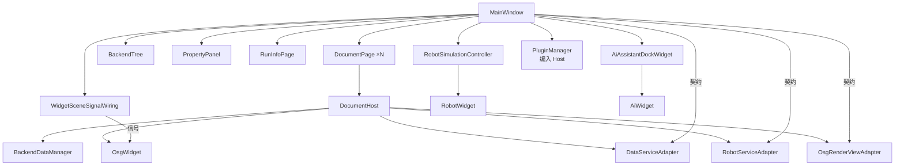

# Widget 模块开发文档

> **空间契约**：[`../../../docs/spatial_contract_world_pose.md`](../../../docs/spatial_contract_world_pose.md) §1.1 — `pose`=模型原点世界坐标；Widget 侧属性编辑经 `doc->data().applyPropertyChange`，由 Host `BackendVisualSync` 同步 OSG。

## 1. 模块定位

`Widget` 是 **UI 编排层 DLL**：承载 `MainWindow`、文档页、属性面板、后端树、仿真协调与插件宿主。对应架构中的「UI 层」；不直接持有 OSG 场景核心（在 `OsgWidgetCore`），不直接持有后端数据模型（在 `Data`）。

| 属性 | 说明 |
|------|------|
| 路径 | `src/UI/Widget/` |
| x64 产物 | `bin/x64(d)/Widget.dll`、`Widget.lib` |
| 预处理器 | `WIDGET_LIB`（本 DLL **export**）；消费方无此宏则为 **import** |
| 契约 | [`CloudSimCore/DEVELOPER_GUIDE.md`](../../Contracts/CloudSimCore/DEVELOPER_GUIDE.md) |
| 宿主 | [`CloudSimHost/DEVELOPER_GUIDE.md`](../../Host/CloudSimHost/DEVELOPER_GUIDE.md) |

**与 `CloudSimHost` 的分工**

| 层 | 模块 | 职责 |
|----|------|------|
| UI 编排 | **`Widget.dll`** | `MainWindow`、树/属性/仿真 Dock、工程 I/O、`DocumentPage` 机器人元数据 |
| 文档宿主 | `CloudSimHost.dll` | 每页 `BackendDataManager` + `OsgWidget`、Core 适配器、`EventHub` 注入 |
| 契约 | `CloudSimCore.dll` | `IDataService` / `IRenderView` / `IRobotService` / `EventHub` |

`DocumentPage` **继承** `cloudsim::host::DocumentHost` 并实现 `IRobotSimulationDocument`；新功能优先经 `data()` / `render()` / `events()`，避免 Widget 再直接扩散 OSG/Data 头文件。

---

## 2. 目录与编译单元

```text
Widget/
├── inc/
│   ├── widget_global.h                    # WIDGET_EXPORT / OSG_WIDGET_API
│   ├── MainWindow.h                       # 主窗口（QMainWindow）
│   ├── MainWindow_p.h                     # 主窗口私有类型（ItemDataRole 等）
│   ├── DocumentPage.h                     # 单文档页（DocumentHost + IRobotSimulationDocument）
│   ├── ApplicationStyle.h                 # 浅色/深色主题
│   ├── RunInfoPage.h                      # 运行日志面板（中央 splitter）
│   ├── DevicePageWidget.h                 # 设备页
│   ├── MainWindowSelectionState.h         # 选择状态
│   ├── MainWindowSelectionService.h       # 选择服务（静态）
│   ├── MainWindowObjectRepository.h       # 对象仓库（静态）
│   ├── MainWindowImportCaptureRenderController.h  # 导入/捕获/渲染控制器
│   ├── MainWindowSceneInteractionCoordinator.h    # 场景交互协调
│   ├── MainWindowInstructionPropertyUiHost.h      # 指令属性 UI
│   ├── MainWindowRobotHost.h              # 机器人宿主（IRobotDocumentHost 实现）
│   ├── WidgetRenderAccess.h               # 渲染访问辅助
│   ├── WidgetDocumentAccess.h             # 文档访问辅助（插件存量）
│   ├── WidgetOsgViewHost.h                # IRobotOsgViewHost 实现
│   └── WidgetSceneSignalWiring.h          # OsgWidget 信号边界
└── source/
    ├── MainWindow.cpp                     # 核心逻辑、语言切换、选择处理
    ├── MainWindowUiSetup.cpp              # 构造函数、菜单栏、Dock 布局
    ├── MainWindowProjectIo.cpp            # 工程保存/加载
    ├── MainWindowFileImport.cpp           # 模型/点云导入
    ├── MainWindowBackendTree.cpp          # 后端树管理
    ├── MainWindowPlugins.cpp              # 插件加载
    ├── MainWindowRobotHost.cpp            # 机器人宿主集成
    ├── MainWindowSelectionService.cpp     # 选择管理
    ├── MainWindowPropertyPanel.cpp        # 属性面板
    ├── MainWindowAiAssistant.cpp          # AI 助手集成
    ├── MainWindowImportCaptureRenderController.cpp  # 导入/捕获控制器
    ├── MainWindowSceneInteractionCoordinator.cpp    # 场景交互
    ├── MainWindowObjectRepository.cpp     # 对象仓库
    ├── MainWindowInstructionPropertyUiHost.cpp      # 指令属性
    ├── MainWindowRobotStubs.cpp           # 机器人桩函数
    ├── DocumentPage.cpp                   # 文档页实现
    ├── WidgetSceneSignalWiring.cpp        # OsgWidget → MainWindow 信号接线
    ├── WidgetOsgViewHost.cpp              # IRobotOsgViewHost 实现
    ├── ApplicationStyle.cpp               # 主题加载/应用
    ├── RunInfoPage.cpp                    # 运行日志
    └── DevicePageWidget.cpp               # 设备页
```

**编入 `CloudSimHost.vcxproj` 的源码**（路径仍为 `src/UI/Widget/`，勿在 Widget 下维护第二份副本）：

- `OsgWidget.cpp` 及 `OsgWidget*Controller.cpp`、`ObjectTransformOperation.cpp`、`QWidgetViewer.cpp` 等
- `BackendSceneDocumentFacade.cpp`、`BackendFollowReverseIndex.cpp`、`OsgWidgetSceneBridge.cpp`

---

## 3. 架构（本模块内）



---

## 4. 核心类型

### 4.1 `MainWindow`

`MainWindow` 是应用主窗口，继承 `QMainWindow` 和 `IPluginMainWindowHost`。源码拆分为 15+ 文件实现关注点分离。

| 维度 | 说明 |
|------|------|
| 职责边界 | 菜单栏、Dock 布局、文档标签页、属性面板、后端树、仿真协调、插件加载 |
| 生命周期 | `main.cpp` 构造，`showMaximized()`，进程内单例；关窗/`~MainWindow` 调用 `shutdownRuntimeWorkers`（停仿真定时器 + `JobSystem::shutdown`：清排队、限时 wait，超时弃池以免卡死）再 `pluginManager->shutdownAll` |
| 对外契约 | 通过 `currentPage()` 获取当前 `DocumentPage*`，再经 `data()` / `robot()` / `render()` 访问契约 |
| 事件协作 | 订阅 `EventHub` 事件刷新树/属性面板；`WidgetSceneSignalWiring` 桥接 OsgWidget 信号 |

**源码拆分职责**：

| 文件 | 职责 |
|------|------|
| `MainWindowUiSetup.cpp` | 构造函数、菜单栏、Dock 布局、语言切换初始化 |
| `MainWindow.cpp` | 核心逻辑、`applyLanguage()`、选择处理、`closeDocumentTab()` |
| `MainWindowProjectIo.cpp` | 工程保存/加载（`.pcp` / `.json`） |
| `MainWindowFileImport.cpp` | 模型/点云导入；「插入 → 坐标系」创建 `FrameBackendData` |
| `MainWindowBackendTree.cpp` | 后端树 `QTreeWidget` 管理、右键菜单 |
| `MainWindowPlugins.cpp` | `loadPlugins()` 扫描 `plugins/*/plugin.json` |
| `MainWindowRobotHost.cpp` | `MainWindowRobotHost`（`IRobotDocumentHost` 实现） |
| `MainWindowSelectionService.cpp` | 选择状态管理、gizmo 联动 |
| `MainWindowPropertyPanel.cpp` | 属性面板 `QtTreePropertyBrowser`、防抖提交 |
| `MainWindowAiAssistant.cpp` | AI 助手 Dock 集成 |
| `MainWindowImportCaptureRenderController.cpp` | 导入/捕获/渲染控制器 |
| `MainWindowSceneInteractionCoordinator.cpp` | 场景交互模式切换 |
| `MainWindowObjectRepository.cpp` | 对象仓库管理 |
| `MainWindowInstructionPropertyUiHost.cpp` | 仿真指令属性 UI |
| `MainWindowRobotStubs.cpp` | 机器人桩函数 |

### 4.2 `DocumentPage`

`DocumentPage` 是单文档页，继承 `DocumentHost` 并实现多个接口：

| 接口 | 来源 | 说明 |
|------|------|------|
| `DocumentHost` | `CloudSimHost` | 文档宿主（Data + OSG + Core 适配器） |
| `IRobotSimulationDocument` | `RobotWidget` | 机器人仿真元数据（URDF、关节、FK 绑定） |
| `IRobotUrdfImportContext` | `CloudSimHost` | URDF 导入上下文（场景挂载、后端注册） |
| `IPerLinkKinematicsHost` | `CloudSimHost` | per-link FK 计算委托 |
| `IPerLinkRobotStateAccessor` | `CloudSimHost` | 状态快照提取与结果应用 |

**多实例机器人**：`HierarchicalRobotInstance` 结构体支持多个机器人实例，每个实例独立维护：

- URDF 路径、关节名/限位
- per-link 后端映射（`linkNameToBackendId`）
- FK 绑定矩阵（`fkMeshWorldT0`、`outerWorldAtBind`）
- 坐标系（`RobotCoordinateFrameSet`）

### 4.3 `WidgetSceneSignalWiring`

OsgWidget 信号的**唯一边界**。所有 OsgWidget 的 Qt 信号（拾取、gizmo、拖拽等）在此接线到 MainWindow 槽函数。

| 维度 | 说明 |
|------|------|
| 位置 | `WidgetSceneSignalWiring.cpp` |
| 职责 | 将 OsgWidget 信号转发到 MainWindow 对应处理函数 |
| 设计约束 | MainWindow 不直接 connect OsgWidget 信号；所有接线集中在此文件 |
| 典型信号 | `objectPicked` → `onOsgBackendObjectPicked`；`pointPickFeedback` → `onPointPickFeedback` |

### 4.4 `MainWindowRobotHost`

包含内部类 `DocumentHost`，实现 `IRobotDocumentHost`，将机器人操作委托给 `DocumentPage`。

| API | 委托目标 |
|-----|----------|
| `applyJointAnglesRad` | `DocumentPage::robot().applyJointAnglesRad` |
| `captureToolFrameFromTcp` | `DocumentPage` 坐标系操作 |
| `captureUserFrameFromTcp` | `DocumentPage` 坐标系操作 |
| `resetToolFrame` | `DocumentPage` 坐标系操作 |
| `solveTcpDragTeachIk` | `RobotKinematics::ikPositionDampedLeastSquares` |
| `planForExport` | `RobotPlanInstruction::planMotionInstruction` |

### 4.5 `MainWindowSelectionService`

静态服务，管理选择状态与 gizmo 联动。

| API | 说明 |
|-----|------|
| `selectBackend(MainWindow&, backendId)` | 选中对象、刷新属性面板、设置 gizmo |
| `clearSelection(MainWindow&, keepGizmo)` | 清除选择 |
| `syncSelectionFromOsg(MainWindow&, backendId)` | OSG 拾取 → 选择同步 |

### 4.6 `ApplicationStyle`

浅色/深色主题管理。

| API | 说明 |
|-----|------|
| `applyTheme(QApplication*, Theme)` | 加载 QSS 并应用 |
| `loadSavedTheme()` | 从 `QSettings` 读取 |
| `saveTheme(Theme)` | 写入 `QSettings` |
| `usesDarkTheme()` | 当前是否深色 |

**按钮角色（QSS 属性）**：`QPushButton` 设置 `btnRole` 为 `primary` / `secondary` / `danger`，主题切换后仍生效。主操作（如应用）用 `primary`，次要用 `secondary`，清空类用 `danger`。

**运行日志布局**：`RunInfoPage` 挂在中央区竖向 `QSplitter`（文档页上方、日志下方），**不再**使用 `BottomDockWidget`。左右 Dock 通高，日志只占 3D 列，避免与右侧工作区/AI 助手叠层遮挡。

**QComboBox**：全局 QSS 闭合高度约 24–26px；弹层 `item` 设 `min-height` 并允许滚动。

**圆角策略**：仅小控件（按钮/单行输入/Combo/Spin/滚动条把手等）保留 `border-radius`。`QTabWidget::pane`、树/列表、多行文本、`QGroupBox`、菜单弹层等大面积区域强制直角，避免 Qt 无法裁切视口导致「圆角描边 + 直角内容漏角」。

---

## 5. 数据流

### 5.1 属性编辑防抖

属性面板使用防抖避免每次 spin 值变化都触发完整重建：

```
用户编辑属性 → onVariantPropertyValueChanged()
  → schedulePropertyPanelCommitRefresh(backendId)
    → m_propertyPanelCommitTimer.start(150ms)
      → onPropertyPanelCommitTimer()
        → flushPropertyPanelVisualCommit(contextId)
          → doc->data().applyPropertyChange(id, key, value)
            → BackendVisualSync::afterDataServicePropertyChange()
```

### 5.2 指令属性刷新

仿真指令属性同样使用防抖：

```
用户选择指令 → onSimulationInstructionSelectionChanged()
  → scheduleInstructionPropertyRefreshDebounced(instruction, refreshFeasibleAxis)
    → m_instructionPropertyRefreshTimer.start(100ms)
      → onInstructionPropertyRefreshTimer()
        → updateInstructionPropertyPanel(instruction, refreshFeasibleAxis)
```

### 5.3 后端树批量刷新抑制

层级导入时抑制逐片树刷新：

```cpp
{
    ScopedBackendTreeRefreshSuppress guard(*this);
    // 批量导入...不触发 refreshBackendTree()
}
// guard 析构 → 一次 refreshBackendTree()
```

---

## 6. 工程 I/O

### 6.1 保存流程

```
onSaveProject()
  → QFileDialog::getSaveFileName()
  → buildProjectSaveRoot(*doc, languageCode, workRoot)
    → 生成 objects[] / edges[] / annotations / camera
  → mergeRobotKinematicsIntoProjectRoot()
  → mergeRobotProgramsIntoProjectRoot()
  → QJsonDocument → file.write()
  → [可选] project_package_zip::zipDirectoryTree() → .pcp
```

### 6.2 加载流程

```
onOpenProjectFile()
  → QFileDialog::getOpenFileName()
  → [可选] project_package_zip::extractZipArchive()
  → QJsonDocument::fromJson()
  → page->data().clear()
  → loadProjectObjectsFromJson(objects[])
       → loadFromJson 恢复 visible 等公共字段
       → 建 OSG 视觉后 setBackendObjectVisible(id, data.isVisible())
  → finalizeProjectHierarchyAfterObjects(edges[])
  → restoreRobotKinematicsFromProjectJson()
  → loadRobotProgramsFromProjectJson()
  → finalizeProjectLoadFollowAndViewport()
  → refreshBackendTree()  // 勾选态读 BackendObjectDto.visible
```

**显示/隐藏**：树勾选 / 右键 → `DocumentPage::setBackendVisible` → `IDataService::setVisible`（Data 真源）+ OSG NodeMask。保存时经 `saveToJson` 写出 `objects[].visible`。
---

## 7. 插件集成

### 7.1 插件加载

```cpp
void MainWindow::loadPlugins()
{
    // 扫描 plugins/*/plugin.json
    // QPluginLoader 加载 DLL
    // qobject_cast<ICloudSimPlugin*>(instance)
    // plugin->initialize(hostContext)
    // 插件可注册：side panel tab、dock widget、menu action
}
```

### 7.2 `IPluginMainWindowHost`

Widget 实现此接口，供插件宿主（编入 Host）访问 UI 能力：

| API | 说明 |
|-----|------|
| `currentDocumentHost()` | 当前文档宿主 |
| `documentHostAt(tabIndex)` | 按索引获取文档 |
| `documentTabs()` | 文档标签页控件 |
| `appendRunInfo(message)` | 追加运行日志 |
| `addPluginSidePanelTab(title, widget)` | 添加侧栏标签 |
| `addPluginDockWidget(title, widget, area)` | 添加 Dock |
| `useChinese()` | 当前语言 |
| `menuBar()` / `statusBar()` | 菜单栏/状态栏 |
| `enqueueBackgroundJob(...)` | 后台任务 |
| `mainWindowWidget()` | 主窗口 QWidget* |

**菜单栏结构**（`setupMenuBar`）：File / View / **Insert** / Settings。

| 菜单 | 要点 |
|------|------|
| Insert（插入） | `Coordinate Frame…` → `onCreateCoordinateFrame`：对话框填名称+位姿，注册 `FrameBackendData`（`catalogTypeName=CoordinateFrame`）并加载轴可视化 |

---

## 8. 机器人仿真协调

### 8.1 `RobotSimulationController`

仿真控制器（`RobotWidget` 编译），由 MainWindow 持有：

| 能力 | API |
|------|-----|
| 初始化 | `initializePlanners()` |
| 关节角 | `aggregatedJointAnglesRad()` |
| 播放 | `runSimulation()` / `stopSimulation()` |
| 指令 | `addInstruction(type)` / `removeInstruction(id)` |
| 导出 | `exportProgram()` |

### 8.2 `MainWindowRobotHost`

桥接 `MainWindow` ↔ `DocumentPage` 的机器人操作：

```
RobotSimulationController
  → IRobotMainWindowHost (MainWindow 实现)
    → MainWindowRobotHost::DocumentHost (IRobotDocumentHost)
      → DocumentPage::robot() / render()
```

---

## 9. 工程与构建

### 9.1 链接依赖（`Widget.vcxproj`）

`CloudSimUiAssets`（静态）、`CloudSimHost`、`CloudSimCore`、`OsgWidgetCore`、`Data`、`RobotKinematics`、`RobotUrdf`、`RobotScene`、`GeometryEngine`、`RunLogger`、`RobotWidget`、`AiWidget`、`CloudSimAiSDK`、`CloudSimPluginSDK`。

### 9.2 输出与链接路径

[`Directory.Build.props`](../../../Directory.Build.props) 定义：

- Debug：`$(CloudSimBinDir)` → `CGAL5.5.2/bin/x64d/`
- Release：`bin/x64/`

### 9.3 推荐生成顺序

`CloudSimCore` → `Data`（及依赖引擎）→ `CloudSimHost` → **`Widget`** → `CloudSim`。

若仅生成 Widget 报 **LNK1181 找不到 Host.lib**，先单独生成 `CloudSimHost`。

### 9.4 Qt MOC 注意

- `DocumentPage.h`：仅 `<QtMoc Include="inc\DocumentPage.h" />`
- 禁止同一头文件同时出现在 `ClInclude` 与 `QtMoc`

### 9.5 预处理器

| 宏 | 作用 |
|----|------|
| `WIDGET_LIB` | 本 DLL 导出 `WIDGET_EXPORT` |
| `CLOUDSIM_OSG_IN_HOST` | 区分 OSG 符号 import/export（与 Host 工程约定） |

---

## 10. 消费方集成

### 10.1 `CloudSim.exe`

```cpp
#include "CloudSimBootstrap.h"
#include "MainWindow.h"

cloudsimSetApplicationContext(cloudsimCreateApplicationContext());
MainWindow w(cloudsimApplicationContext()->events());
w.showMaximized();
```

### 10.2 插件

插件通过 `IPluginMainWindowHost` 接口访问 Widget 能力，不直接 include Widget 头文件。

### 10.3 新代码应遵守

1. **跨模块数据**：经 `CoreTypes` DTO 与 `IDataService` / `IRenderView`，禁止 `void*` 或 JSON 穿透。
2. **OSG 修改**：改 `Widget/source/OsgWidget*.cpp`（由 Host 编译）；核心场景改 `OsgWidgetCore`。
3. **事件**：向 `EventHub` 发布/订阅（`CoreEvents.h`）；选择/姿态刷新优先走 `SelectionChanged` / `PoseCommitted`。
4. **信号接线**：OsgWidget 信号统一在 `WidgetSceneSignalWiring` 接线，禁止 MainWindow 直接 connect OsgWidget。
5. **属性编辑**：使用防抖定时器（`m_propertyPanelCommitTimer`），避免每次 spin 触发完整重建。
6. **树刷新**：批量操作使用 `ScopedBackendTreeRefreshSuppress` RAII 守卫。

---

## 11. 与相关文档

| 文档 | 内容 |
|------|------|
| [`ARCHITECTURE_SUMMARY.md`](../../../ARCHITECTURE_SUMMARY.md) | 全局架构与依赖图 |
| [`CloudSimHost/DEVELOPER_GUIDE.md`](../../Host/CloudSimHost/DEVELOPER_GUIDE.md) | 文档宿主、Core 适配器、组合根 |
| [`CloudSimCore/DEVELOPER_GUIDE.md`](../../Contracts/CloudSimCore/DEVELOPER_GUIDE.md) | 契约接口与 DTO |
| [`RobotWidget/DEVELOPER_GUIDE.md`](../RobotWidget/DEVELOPER_GUIDE.md) | 仿真 UI、轨迹编辑 |
| [`CloudSimPluginHost/DEVELOPER_GUIDE.md`](../CloudSimPluginHost/DEVELOPER_GUIDE.md) | 插件宿主（编入 Widget） |
| [`OsgWidgetCore/DEVELOPER_GUIDE.md`](../OsgWidgetCore/DEVELOPER_GUIDE.md) | 场景核心、gizmo、拾取 |

---

## 12. 演进路线

**已完成**

1. ~~**属性 `IDataService`**~~：`MainWindowPropertyPanel` 普通行走 `doc->data()`。
2. ~~**EventHub 选择/姿态**~~：`publishSelectionChanged` / `publishPoseCommitted`；`MainWindowUiSetup` 订阅刷新属性面板。
3. ~~**工程 I/O 收口**~~：`buildProjectSaveRoot` / `loadProjectObjectsFromJson` 经 Host 集中。
4. ~~**PluginHost 迁入 Host**~~：`CloudSimPluginHost` 源码编入 `CloudSimHost.vcxproj`。
5. ~~**Robot 收口**~~：`IRobotDocumentHost` 委托 Host 实现；per-link 通过 `IPerLinkKinematicsHost` 收口。

**仍待 / 长期**

1. **OSG 头文件解耦**：`DocumentPage` 等仍保留 Robot* 头用于访问器实现（未来可通过 Pimpl 隔离）。
2. **`IRenderView` 全面替代**：Widget 主路径走 `render()`；阶段 3.3-3.4（`ObjectTransformOperation` 等）待定。
3. **`RobotSimulationController` 核心逻辑迁入 Host**：仿真编排逻辑下沉（长期规划）。
