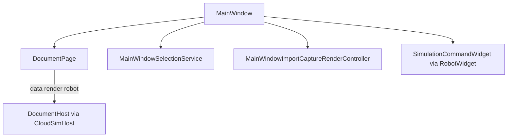

# Widget 模块开发文档

## 1. 模块定位

`Widget` 是 **Qt 桌面前端与流程协调中心**：主窗口、多文档标签、后端树/属性面板、OSG 视图桥接、项目 I/O、机器人仿真 UI、异步任务与进度。对应架构中的「前端 UI 层」；本地引擎在 `Data` / `OsgWidgetCore` / `RobotScene` 等子工程。

| 属性 | 说明 |
|------|------|
| x64 构建 | **DLL** `Widget.dll`（`WIDGET_LIB` / `WIDGET_EXPORT`） |
| x64 链接（编译期） | **必链**：`CloudSimCore.lib`、`CloudSimHost.lib`、`RunLogger.lib`、`RobotWidget.lib`、`AiWidget.lib`、OSG/Qt 系统库。**过渡链**（待机器人/属性面板迁入 RobotWidget 后移除）：`Data.lib`、`OsgWidgetCore.lib`、`RobotScene.lib`、`RobotUrdf.lib`、`RobotKinematics.lib`、`GeometryEngine.lib`。**禁止**（CI `check_widget_deps.ps1`）：`BackendVisual.lib`、`GeometryAlgorithm.lib` |
| 运行时 | 引擎 DLL 主由 **`CloudSimHost.dll`** 加载；Widget 经 `doc->data()` / `doc->render()` / `doc->robot()` 访问 |
| 头文件 | `Widget/inc/`（约 40 个）；**禁止** Widget `source/*.cpp` 直接 `#include` Data/引擎头（门禁脚本） |
| 实现拆分 | `MainWindow*.cpp`、`*Controller`、`*Operation`（**`OsgWidget*.cpp` 已迁入 Host 编译**） |
| 插件宿主 | `CloudSimPluginHost` **编入 `CloudSimHost.dll`**；`MainWindow` 实现 **`IPluginMainWindowHost`**，构造 **`PluginManager`**（符号来自 Host）→ [`CloudSimPluginHost/DEVELOPER_GUIDE.md`](../CloudSimPluginHost/DEVELOPER_GUIDE.md) |

---

## 2. 架构分层（本模块内）



---

## 3. 应用壳与主窗口

### 3.1 `MainWindow`

**职责**：菜单、Dock、文档标签、设备页、运行信息、仿真 Dock、主题/语言、机器人回放定时器、跟随求解调度、项目保存/加载。

| 公共 API | 说明 |
|----------|------|
| `MainWindow(parent)` | 构造；内部调用 `MainWindowUiSetup` 等拆分单元 |
| `static shutdownApplicationLogging()` | 退出时 `RunLogger::shutdown` |

**友元 / 协作类**（逻辑在对应 `.cpp`，非全部 public）：

| 类 | 职责 |
|----|------|
| `MainWindowUiSetup` | 菜单、Dock、初始布局；订阅 `EventHub`（`BackendObjectRegistered/Removed`、`SelectionChanged`、`PoseCommitted`） |
| `MainWindowBackendTree` | 后端树与场景树 |
| `MainWindowPropertyPanel` | 属性浏览器壳层；仿真指令行委托 `RobotWidget/InstructionPropertyPanel` |
| `MainWindowFileImport` | 模型/点云导入 |
| `MainWindowProjectIo` | `project.json` **v4**、`.pcp`；对象经 `BackendProjectObjectIo` / Host 注册 |
| `MainWindowImportCaptureRenderController` | 注册 backend、URDF |
| `MainWindowSelectionService` | 选择与可见性闭环 |
| `MainWindowObjectRepository` | `findSnapshot` / `listSnapshots`（`BackendObjectDto`） |

**`IPluginMainWindowHost`**：`MainWindow` 公开实现（`MainWindow.h`），供 Host 内 `PluginHostContext` / `PluginManager` 回调 UI，**不**反向 `#include` Host 具体文档类型以外的 Widget 实现细节。

| 方法 | 说明 |
|------|------|
| `currentDocumentHost()` / `documentHostAt(i)` | 返回 `cloudsim::host::DocumentHost*`（`DocumentPage` 基类指针） |
| `enqueueBackgroundJob` | 转发 `JobSystem`（插件/AI 大任务） |
| `focusBackendInTreeAfterImport` | 导入后树选中 + 与 Host 导入聚焦配合 |
| `appendRunInfo` | 运行信息面板 |
| `addPluginDockWidget` / `addPluginSidePanelTab` | 插件 UI 注册 |
| `pluginManager()` | 访问 Host 导出的 `PluginManager*`（`MainWindowPlugins.cpp` 构造） |

### 3.2 `mainwindow_detail`（`MainWindow_p.h`）

Qt 树角色：`kRoleItemType`, `kRoleBackendId`, `kRoleAnnotationId`；项类型 `kItemTypeBackend`, `kItemTypeAnnotation`。

### 3.3 `ApplicationStyle`

| API | 说明 |
|-----|------|
| `Theme::Light` / `Dark` | |
| `applyTheme`, `loadSavedTheme`, `saveTheme` | 全局 QSS/调色 |

---

## 4. 文档页与场景门面

### 4.1 `DocumentPage`

**一标签页 = 一套独立世界**（Data/OSG 在 Host 内）：经 **`data()` / `robot()` / `render()`** 访问；勿在新代码中使用 **`backend()`** / **`activeBackend()`**（Host 内部存量，Widget 侧已移除公开 API）。

| 方法 | 说明 |
|------|------|
| `data()` / `robot()` / `render()` | Core 契约入口（`IDataService` / `IRobotService` / `IRenderView`） |
| `render()` / `hierarchyModel()` | `IRenderView` 与层级模型（优先于裸 `OsgWidget*`） |
| `osgWidget()` | 继承自 `DocumentHost`（Host 内部/URDF 边界；Widget 新代码勿直接依赖） |
| `sceneFacade()` | `BackendSceneDocumentFacade`；`poseSink()` 供 FK/示教写回 |
| `robotProgramStore()` | 每机器人指令表 |
| `invalidateFollowReverseIndex()` | 跟随反向索引失效 |
| `markFollowAttachmentDirtyFromBackendMove` / `followDirtyBackendIds` | 跟随脏集 |
| `requestFollowSolveForced` / `takeFollowSolveForced` | 强制整图跟随求解 |
| `removeBackendSubtree(rootId)` | 删子树（委托 Host；优先 `data().unregisterSubtree`） |
| 导入/注册 | 经 `DocumentImportFacade` 或 `MainWindow::registerBackendObject`；勿再调用已移除的 `DocumentHost::registerAdopted*` |
| `setProjectFilePath` / `projectFilePath()` | 工程路径 |
| `appendHierarchicalRobotSimulationContext(...)` | **追加**机器人实例 |
| `clearRobotSimulationContext` / `clearRobotSimulationIfContains` | 清除仿真 |
| `robotKinematicInstanceCount` / `robotPerLinkKinematicsForInstance` | 多机 per-link 元数据 |
| `setRobotPerLinkKinematicsBinding` | 绑定 URDF 切片 |
| `notifyRobotKinematicsAppliedToScene()` | FK 后跟随脏 |

实现 **`IRobotSimulationDocument`**（供 `RobotScene` 使用）。

### 4.1a OSG 边界（架构演进后）

| 组件 | 说明 |
|------|------|
| `WidgetOsgViewHost` | `IRobotOsgViewHost`：渲染/拾取/TCP/叠加委托 `IRenderView`；`poseSink()` → `sceneFacade().poseSink()` |
| `WidgetOsgViewHost`（坐标查询） | `resolvePickScopeBackendId` / `backendSkipsInnerModelCenterRebase`：const 路径经私有 `osgWidget()`（`renderView()->widget()`），**不**调非 const `poseSink()`；供 `feature_pick_transform` 与 AI 特征 overlay 对齐 BREP 拾取 |
| `WidgetSceneSignalWiring.cpp` | **唯一** OsgWidget Qt 信号 → `MainWindow` 槽边界（`wireMainWindowDocumentSceneSignals`） |
| `DocumentHost::loadUrdfLinkMeshIntoScene` 等 | Host 侧 URDF/场景加载；`UrdfRobotImport` 经 `IRobotUrdfImportContext` 契约调用 |

`tools/check_widget_deps.ps1`：禁止 Widget 新源文件 `#include OsgWidget.h`；过渡白名单见脚本内 `$transitionalIncludeAllow`（**新文件不得加入**）。

### 4.1b `WidgetDocumentAccess.h`（存量/插件）

```cpp
OsgWidget* osg = widgetOsgFromPage(page);  // qobject_cast 自 page->render().widget()
```

| 说明 | |
|------|------|
| 调用方 | `CloudSimPluginHost`、部分存量路径 |
| Widget 新代码 | 优先 `page->render()` / `page->sceneFacade()` / `page->osgWidget()`（继承）；勿新增 `#include "OsgWidget.h"` |
| 已移除 | `MainWindow` / `DocumentPage` / `MainWindowRobotHost` 对 `OsgWidget.h` 的直接依赖 |
| 例外 | `WidgetOsgViewHost.cpp` 仅 `#include "OsgWidget.h"` 以 const 查询 pick alias / skip-rebase（实现文件内，头文件仍前向声明） |

### 4.2 `IBackendSceneBridge`

OSG 操作抽象；矩阵为 **列主序 16 double**。

| 虚方法 | 说明 |
|--------|------|
| `set/getBackendRootWorldMatrixColumnMajor` | 世界矩阵 |
| `setBackendObjectVisible` | 显隐 |
| `removeBackendObjectVisual` | 移除分支 |
| `hasBackendObjectBranch` | 是否存在 |
| `tryGetBackendModelCenterMm` | 模型中心 mm |
| `syncOuterPatFromBackend` | 从 backend pose 写 outer |
| `setBackendParent` | 场景父链（reparent OSG + 写 `m_backendParentIds`） |
| `setBackendLogicalParent` | 仅写逻辑父 id（DXF 分件等） |

### 4.3 `OsgWidgetSceneBridge`

`IBackendSceneBridge` → 委托 `OsgWidget`。

### 4.4 `BackendSceneEntity` / `BackendSceneDocumentFacade`

| 类型 | 作用 |
|------|------|
| `BackendSceneEntity` | 单 `backendId`：显隐、矩阵、子 id、follower id |
| `BackendSceneDocumentFacade` | `entity(id)`、`setBackendsVisible`、`ensureSelectionVisualForBackend`、`poseSink()` → `IRobotBackendPoseSink*` |
| `BackendFollowReverseIndex` | target id → follower ids 缓存 |

**推荐调用链**：树显隐经 `sceneFacade().entity(...).setVisible`；树/OSG 选中加载几何经 `ensureSelectionVisualForBackend`；属性改 pose 经 `doc->data().applyPropertyChange`（Host 内 OSG 同步）。减少散落裸 `OsgWidget` 调用。

---

## 5. 选择与对象查询

### 5.1 `MainWindowSelectionState`

| 方法 | 说明 |
|------|------|
| `selectedBackendId()` / `setSelectedBackendId` / `clearBackendSelection` | 选择真源 id |

### 5.2 `MainWindowSelectionService`

| 方法 | 说明 |
|------|------|
| `SelectionSnapshot` | `backendId`, `data`, `kind`（PointCloud/Mesh/Other） |
| `handleBackendTreeSelectionChanged` | 树 → `sceneFacade` 显隐/选中视觉；末尾 `publishSelectionChanged`（属性面板由 EventHub 订阅刷新） |
| `handleOsgBackendObjectPicked` | 拾取 → `selectBackendById`（树变更触发上者） |
| `handleBackendTreeItemChanged` | 勾选 → **子树**显隐（`subtreeIds` 语义） |
| `clearSelection` / `selectBackendById` | 程序化选择 |

### 5.3 `MainWindowObjectRepository`

| 静态方法 | 说明 |
|----------|------|
| `findSnapshot(mw, id)` | 活动文档 `BackendObjectDto`（`doc->data().objectSnapshot`） |
| `listSnapshots(mw)` | 全表快照（`doc->data().listObjectSnapshots`） |

---

## 6. `OsgWidget` — 3D 视图

**继承/实现**：`QWidget` + `OsgScene` 能力委托 + **`IRobotBackendPoseSink`**。

### 6.1 导入与捕获

| 方法 | 说明 |
|------|------|
| `importModelFile` / `importPointCloudFile` | 文件 → staging |
| `captureImportedPointCloudBackend` / `captureImportedMeshBackend` / `captureImportedMeshBackendHierarchy` | → `BackendDataManager` |
| `loadPointCloudFromBackendData` / `loadMeshFromBackendData` / `loadBackendFromBackendData` | 注册后建 OSG 分支；后者用于 `BrepModel` |
| `setPickVisualAlias` | 装配子零件拾取 scope → 共享 visual backendId |
| `clearImportedContent` / `clearStagingGeometry` | 清空 |

**网格/BREP 文件路由**（`MainWindowImportCaptureRenderController`）：`.step`/`.stp` 优先 `BrepBackendData`（多零件 B-rep 装配，见 Host §4.4.1b）；obj/stl/ply/off 走 `MeshBackendData::loadFromFile`；`.obj` 含 `vn` 时 Data 保留文件法线（见 Data §4.2.1）；`.dae`/`.fbx` 等仍可为 OSG fallback。

### 6.2 交互模式

| 方法 | 说明 |
|------|------|
| `setSelectionActive` / `setObjectSelectionMode` | 对象选择 + gizmo |
| `setPointPickMode` / `setMeshLinePickMode` / `setMeshFacePickMode` | 拾取模式 |
| `setTransformGizmoFrame` | World / Local 罗盘 |

### 6.3 选中对象变换（与 `ObjectGizmoFrame` 统一）

| 方法 | 说明 |
|------|------|
| `selectedPosition` / `setSelectedPosition` | 经 `readActiveObjectGizmoFrame` |
| `selectedRotationEulerDeg` / `setSelectedRotationEulerDeg` | 同上 |
| `setSelectedColor` | 颜色 |
| `syncOuterPatFromBackend` | 嵌套：**世界矩阵**写回，非 root-local 误用 |
| `syncSelectionFromBackend` / `syncSelectionForBackendId` | 选中同步 |
| `get/setBackendRootWorldMatrixFromWorld` | FK / 属性 |

### 6.3.1 对象选择罗盘（`ObjectTransformOperation`）

与 TCP 示教（§13.1）共用 **`TransformGizmoFrame`（World / Local）**，位姿真源为 **`ObjectGizmoFrame` + `m_activeBackendOuterPat`**，无 IK。

**拖动链路**：

```text
LMB → beginGizmoScreenDrag → gizmoScreenDragDs × gain → translateAlongWorldDirection(m_gizmoScreenDragAxisWorld)
    → applyToOuter → syncActiveBackendRootFromObjectFrame(..., true) → selectedObjectPoseChanged

RMB → cacheRotatePivotInParentSpace → beginGizmoScreenRotate → gizmoScreenRotateDeltaRad × gain
    → dragAxisDirectionOuterParent → adjustCenterPlusPoseForRotationDelta → applyToOuter
    → syncCompassGizmoOrientation（不写 selectedObjectPoseChanged）
```

**平移不用平面求交**：物体与 outer 一体运动，移动枢轴时射线-平面求交会发散（与 TCP 相同）。按下时冻结 `gizmoCompassUnitAxisWorld` 方向的屏幕轴与 `mmPerPixel`。

**旋转保枢轴**：`adjustCenterPlusPoseForRotationDelta` 固定文件原点 `(inner+trans)*R`；`fromOuter` 用 `(fileInOuterParent - inner*R)*inv(R)` 恢复 `trans`（见 `OsgWidgetCore` §3）。

**旋转轴坐标系**：屏幕转角用法向的**场景世界**方向；四元数写入用 **outer 父节点**方向（`dragAxisDirectionOuterParent`）。层级父节点非单位阵时，World 模式须 `worldDirectionToOuterParent`，不可直接把场景 `(1,0,0)` 当作 `Quat` 轴而不经父链变换。

| 文件 | 职责 |
|------|------|
| `ObjectTransformOperation.cpp` | 鼠标、平移/旋转应用 |
| `OsgSceneGizmo.cpp` | 罗盘、`beginGizmoScreen*`、`gizmoCompassUnitAxisWorld` |
| `ObjectGizmoFrame.cpp` | 位姿数学、轴方向、保枢轴 |

### 6.4 机器人与指令预览

| 方法 | 说明 |
|------|------|
| `addHierarchicalRobotScene` / `removeHierarchicalRobotScene` | 层级 URDF |
| `setInstructionPoseAxes` / `clearInstructionPoseAxes` | PTP/LINE 世界系 XYZ 轴 |
| `setCameraFollowBackendId` | 轨道相机跟踪 backend 原点 |
| `beginTcpDragTeach` / `endTcpDragTeach` | TCP 示教罗盘；见 §13.1 |
| `isTcpDragTeachActive` / `isTcpDragGizmoDragging` | 示教模式 / 拖动中 |
| `updateTcpDragTeachFromTarget` | IK→FK 后对齐罗盘与 `m_tcpTeachTargetInBase` |
| `beginTcpTeachScreenDrag` / `tcpTeachScreenDragDsMm` | 平移拖动：冻结屏幕轴 + mm/px 标定 |
| `tcpTeachCompassUnitAxisWorld` | 罗盘箭头在世界系的单位方向（与拾取一致） |
| `applyTcpTeachTranslationWorld` | 沿世界方向增量更新 tool 位姿并写回基座目标 |

### 6.5 信号（与 MainWindow 协作）

| 信号 | 说明 |
|------|------|
| `backendObjectPicked(backendId)` | OSG 拾取 |
| `transformGizmoCommitted` | 罗盘释放 → 刷新属性面板 |
| `tcpDragTeachPoseChanged` / `tcpDragTeachEnded` | TCP 示教拖动 / ESC 退出 |
| `selectedObjectPoseChanged` / `Rotation` / `Color` | 平移拖动中写后端；**旋转拖动中不写**（松手 `transformGizmoCommitted`） |
| `annotationCreated` / `Removed` / `visibilityChanged` | 注释 |

### 6.6 帧钩子

| 方法 | 说明 |
|------|------|
| `setPerFrameHook` | 每帧：跟随求解、注释缩放等 |
| `isTransformGizmoDragging` | 跟随求解跳过正在拖拽的 follower |

---

## 7. OsgWidget 控制器（静态，无状态）

| 类 | 主要 API |
|----|----------|
| `OsgWidgetImportController` | `importModelFile`, `importPointCloudFile` |
| `OsgWidgetBackendLoadController` | `loadPointCloudFromBackendData`, `loadMeshFromBackendData` |
| `OsgWidgetCaptureController` | `captureImported*Backend*`；`MeshCapturedPart` |
| `OsgWidgetPickAnnotationController` | 点标记、文字注释、快照恢复 |
| `OsgWidgetGizmoController` | 罗盘创建、`pickAxisAtScreenPos`、高亮、缩放 |
| `OsgWidgetTransformHierarchyController` | `setBackendParent`, `setBackendLogicalParent`, `syncSelectionForBackendId`, `finalizeSelectionSync` |
| `OsgWidgetCameraFocusController` | `focusCameraOnBackend` |
| `OsgWidgetColorController` | staging/backend 上色 |

---

## 8. 交互 Operation（`eventFilter`）

| 类 | 基类 | 行为 |
|----|------|------|
| `SelectionOperation` | — | 分发鼠标/滚轮虚函数 |
| `ObjectTransformOperation` | SelectionOperation | LMB **屏幕轴**平移 / RMB **屏幕角**旋转；见 §6.3.1 |
| `RobotTcpDragTeachOperation` | SelectionOperation | TCP 示教罗盘：LMB **屏幕空间**平移 / RMB 旋转；见 §13.1 |
| `PointPickOperation` | SelectionOperation | 点云拾取 + 注释 |
| `MeshEdgeFacePickOperation` | SelectionOperation | 网格边/面拾取高亮 |

---

## 9. Qt/OSG 窗口桥

| 类 | 说明 |
|----|------|
| `QWidgetViewer` | `QGLWidget`；转发输入到 `GraphicsWindowQt1` |
| `GraphicsWindowQt1` | `osgViewer::GraphicsWindow` 实现 |
| `QtKeyboardMap` | Qt 键 → `osgGA` 键码 |
| `LitMeshMaterial::applyPlastic` | URDF 塑料材质 |

---

## 10. 导入与 URDF

### 推荐入口（新代码）

| 场景 | API |
|------|-----|
| obj/stl/ply/off（同步） | `currentPage()->data().importFromFile` 或 `DocumentImportFacade::importFileIntoDocument` |
| 点云（`IDataService`） | `importFromFile` + `ImportOptionsDto::isPointCloud = true` |
| 已构造 mesh/点云 | Host `DocumentImportFacade::registerAdoptedMesh` / `registerAdoptedPointCloud` |
| URDF | `page->robot().registerUrdfRobot` 或 `MainWindowImportCaptureRenderController::registerUrdfRobot` |
| AI 基本体 | `AiCreateMeshRunner` → `registerAdoptedMesh` + `focusBackendInTreeAfterImport` |

### `MainWindowImportCaptureRenderController`（复杂格式仍经此路径）

| 方法 | 说明 |
|------|------|
| `registerBackendObject(mw, path, typeName, isPointCloud, quietUi)` | 见下表分格式；Host `importMeshFileExtended` / `importPointCloudFile` |
| `registerUrdfRobot(mw, urdfPath, quietUi)` | **每连杆**路径：robot root + 各 link `MeshBackendData`、拓扑 `setBackendParent`、FK bind、`appendHierarchicalRobotSimulationContext` |

`MainWindow::registerBackendObject` 仅为上述控制器的薄封装（菜单「打开模型/点云」、工程 las/laz 兜底、插件点云）。

**`registerBackendObject` 内部分流**

| 格式 | 路径 |
|------|------|
| obj/stl/ply/off（同步） | `DocumentImportFacade::importFileIntoDocument` 或 `page->data().importFromFile` |
| step/stp/brep（Job 可用） | Widget `JobSystem`：`ModelBackgroundLoadState::executeLoad`（Worker）→ UI `finishIntoDocument` |
| step/stp/brep/mesh（无 Job） | 同步 `importFileIntoDocument` |
| ply 大文件点云 | Widget `JobSystem` 异步：`PointCloudBackgroundLoadState::executeLoad`（Host）→ UI 线程 `adoptIntoDocument`（**仅纯顶点** ply；含面时拒绝） |
| ply 含 `element face` | **不入点云 Job**；`plyFileHasTriangleFaces(nativePath)` 为真时改 `ImportFileKind::Mesh`（catalog `Model`） |
| dxf 层级 mesh | facade 内 `importMeshFileExtended`（mesh 分件），**不**做 Follow |
| step 多零件装配 | BREP 路径：`importBrepHierarchyParts`；单 visual + pick alias；**不**做 Follow |

**路径编码（PLY 及 Data 读盘）**：`nativePath = QFile::encodeName(filePath)` → `std::string`；与 [`Data/Data/DEVELOPER_GUIDE.md`](../Data/Data/DEVELOPER_GUIDE.md) §4.0 一致。**勿**对磁盘路径使用 `toUtf8()`。

**PLY 点云菜单 + mesh**：`OsgWidgetImportController::importPointCloudFile` 对含面 PLY 同样用 `encodeName` + `plyFileHasTriangleFaces`，走 `MeshBackendData::loadFromFile` + `loadMeshFromBackendData`（staging）；菜单注册路径与上表 mesh 改道一致。纯顶点 PLY 仍 `readPointCloudFromPlyFile`。

**导入完成 `finish()`**：`focusBackendInTreeAfterImport` 后调用 `doc->sceneFacade().ensureSelectionVisualForBackend`（实现文件需 `#include "BackendSceneDocumentFacade.h"`），避免树已选中但 OSG 无分支。mesh 导入若 OSG 失败，Host `importMeshFile` 会回滚 `registerData`（见 Host §4.4.1），用户应看到错误而非空场景对象。

**DXF/STEP 层级（与工程加载区别）**

- **DXF mesh 分件**：顶点为世界坐标 → 导入时**不**调用 `applyHierarchyFollowBinding`（避免 `pose ≈ -质心`）。
- **STEP B-rep 装配**：多零件时仅 `importParent` 有 OSG visual；子零件经 `setPickVisualAlias` 拾取；`skipInnerModelCenterRebase=true`。
- Data 树：`attachChild` + `setBackendLogicalParent`；mesh 分件 OSG 各片仍在 flat 组；BREP 装配共享单一 Geode。
- 工程打开后 `edges[]` 仍由 `MainWindowProjectIo` 批量 `applyHierarchyFollowBinding` + 一次 `runBackendFollowSolveAndSync`。

**已删除（2025 Host 接线 + 无用代码清理，勿再引用）**

| 符号 | 替代 |
|------|------|
| `MainWindow::registerExistingBackendObject` | `DocumentImportFacade::registerAdopted*` / `registerBackendObject` |
| `MainWindow::syncOsgViewerFrom*Backend` | Host `BackendVisualSync` + `doc->data().applyPropertyChange` |
| `MainWindow::backendPropertyCommitted` 信号 | `EventHub`：`PoseCommittedEvent` / `SelectionChangedEvent` |
| `DocumentHost::registerAdopted*` 公开成员 | `BackendFileImport::registerAdopted*` 或 `DocumentImportFacade` |
| Widget 侧渲染 | `render()` / `sceneFacade()`（Host 内部 `osgWidget()`；插件存量 `widgetOsgFromPage`） |
| `RobotProjectIo::writeRobotKinematicsAndPrograms` | 保存 kinematics：`mergeRobotKinematicsIntoProjectRoot`；programs：`mergeRobotProgramsIntoProjectRoot` |

要点见 [`../ARCHITECTURE_SUMMARY.md`](../ARCHITECTURE_SUMMARY.md) §6.1、[`../Host/CloudSimHost/DEVELOPER_GUIDE.md`](../Host/CloudSimHost/DEVELOPER_GUIDE.md) §4.4.1a、§4.4.3。

---

## 11. 项目 I/O

### `project_package_zip`

| 函数 | 说明 |
|------|------|
| `isZipArchiveFile` | 是否 zip |
| `zipDirectoryTree` | STORE 无压缩打包 `.pcp` |
| `extractZipArchive` | 解包 |

### `MainWindowProjectIo`（`MainWindowProjectIo.cpp`）

**格式**：`version: 4`（非 v4 拒绝打开）。输出 `.pcproj.json` 或 `.pcp`（`project_package_zip` STORE 打包）。

**保存流程**：

1. Host `buildProjectSaveRoot`：`objects`、`edges`、`annotations`（`AnnotationProjectIo`）、`cameraFollowBackendId`、`language`（点云无坐标则中止）。
2. Host `mergeRobotKinematicsIntoProjectRoot`（关节角由 Widget 采集）；Host `mergeRobotProgramsIntoProjectRoot`；打包 `.pcp` 仍在 Widget。

**加载流程**（编排已迁入 `BackendProjectObjectIo`，见 Host §4.4）：

1. 清空后端/机器人上下文。
2. `loadProjectObjectsFromJson` + `finalizeProjectHierarchyAfterObjects`（Host）；点云文件回退统一 `importPointCloudFile`（含 las/laz）。
3. `restorePerLinkRobotKinematicsFromProjectJson`；`applyRestoredJointAnglesToScene`（Host，Widget 不链 RobotScene）；`setRobotProgramsJson`。
4. Host `restoreRobotKinematicsFromProjectJson`、`loadRobotProgramsFromProjectJson`；Widget 同步关节角与仿真 UI；`finalizeProjectLoadFollowAndViewport`；`publishProjectLoaded`。

**不再由本文件维护**：对象级 `pose/color` 拼装、点云 PLY sidecar、`followAttachment` 手工读写（已下沉 `Data` 的 `components` + 兼容 `loadFromJson`）。

详见 [`../../docs/backend_persistence/`](../../docs/backend_persistence/)、[`../../ARCHITECTURE_SUMMARY.md`](../../ARCHITECTURE_SUMMARY.md) §6.5。

---

## 12. 异步任务

### `JobSystem` + `ProgressManager`

| 类 | 说明 |
|----|------|
| `JobSystem::enqueue(title, work, onFinished)` | `QThreadPool` 执行 `work`；`onFinished` 在 UI 线程 |
| `ProgressManager` | `jobStarted` / `jobProgress` / `jobFinished`（`QMetaObject::invokeMethod`） |
| `IRobotMainWindowHost::enqueueBackgroundJob` | RobotWidget 专用包装：`work` 无 progress sink，委托 `MainWindow::jobSystem()->enqueue` |

**已接入 Job**：点云 CGAL 解码（非 LAS）；Run **lookahead** 规划；全程序 **reachability**；**可行轴 IK**（`Feasible axis IK`）。

**边界**：后台用 `PlanJobPayload` / `FeasibleAxisJobPayload` 等快照；注册 OSG、刷树、写 `PlanResultCache` / 可行轴缓存在 **UI 线程** `onFinished`。

---

## 12a. 属性面板与 EventHub

| 路径 | 说明 |
|------|------|
| 普通属性行 | 须有 `currentPage()`：`doc->data().applyPropertyChange` → Host `BackendVisualSync`（OSG + `PoseCommitted`） |
| 无文档页 | 非 pose/rotation 属性直接 `return`（已移除 `data->applyPropertyChange` 回退） |
| pose/rotation 分量 | `doc->data().worldPoseMm` / `applyWorldPoseMm` + `syncVisualAfterPropertyChangeById` + `publishPoseCommittedFromBackendId`（Host） |
| 颜色 | `doc->data().applyColor` + `syncVisualAfterPropertyChangeById` |
| `follow.*` | `afterBackendFollowPropertyEdited` + Follow 求解（Widget） |
| 仿真指令属性 | `InstructionPropertyPanel`（`RobotWidget`）+ `MainWindowInstructionPropertyUiHost`；写回经 `doc->robot().applyInstructionPropertyChange` |
| 选择刷新 | `SelectionChanged` / `PoseCommitted` 订阅 → `updatePropertyPanel`（`MainWindowUiSetup`） |
| 当前渲染视口 | `currentPage()->render()`；插件截图 `doc->render().captureViewportPng` |

---

## 13. 仿真 UI

仿真页面控件与编排已迁入 **`RobotWidget`**（x64 DLL）。Dock 主标签为 **机器人** / Robot（`MainWindow::applyLanguage` 设置 `m_unitDockTabs` 第二页）。`Widget` 通过 `MainWindowRobotHost`（实现 `IRobotMainWindowHost`）提供文档/OSG/属性面板访问；`RobotSimulationController` 承接原 `MainWindow` 的仿真/示教/指令槽。详见 [`../RobotWidget/DEVELOPER_GUIDE.md`](../RobotWidget/DEVELOPER_GUIDE.md)。

**仍留在 `Widget`**：`DocumentPage`、`OsgWidget`、`OsgWidgetTcpTeach.cpp`、`RobotTcpDragTeachOperation.cpp`（依赖 `OsgWidget*`）。

### `RobotProgramStore`

`QHash<sceneBackendId, vector<RobotInstruction::Base>>`；`activeRobotBackendId()`。

### `SimulationCommandWidget`

| 方法 / 信号 | 说明 |
|-------------|------|
| `setProgramStore` | 绑定 |
| `setRobotInstances(labels, backendIds)` | 多机 |
| `instructions(robotBackendId)` | 指令向量 |
| `appendInstructionFromCurrentPose` | 捕获当前 TCP |
| `instructionSelected` → `RobotSimulationController` | 预览：链式种子 + 选中点单次 plan（或示教 CSV）；Run 中由 tick 高亮跟随 |
| `runRequested` / `stopRequested` | 执行器 |
| `groupsChanged` | 树内分组变更 → 轨迹编辑页刷新分组下拉 |
| `tcpDragTeachModeChanged(bool)` | **功能**分组内「末端拖动」开/关（不落盘指令） |
| `setTcpDragTeachMode` / `tcpDragTeachMode` | 与 3D ESC / 仿真 Run 同步按钮状态 |

**布局**：**指令**分组框（PTP/LINE/…）与 **功能**分组框（末端拖动/删除/清空）分两行；详见 [`RobotWidget/DEVELOPER_GUIDE.md`](../RobotWidget/DEVELOPER_GUIDE.md) §SimulationCommandWidget 布局。

### `InstructionProgramTreeWidget`

| 方法 / 信号 | 说明 |
|------|------|
| `setProgram` / `rebuildFromProgram` / `syncToProgram` | 树 ↔ 模型 |
| `NodeKind` | Instruction / ThenBranch / ElseBranch / **Group** |
| `createGroupRequested` / `dissolveGroupRequested` / `renameGroupRequested` | 右键菜单 → `SimulationCommandWidget` → `ProgramEditService` |
| `groupMembershipChanged` | 拖放进出分组后更新 `memberInstructionIds` |
| DnD | 调整顺序、嵌套 IF/WHILE、根层级指令拖入/拖出 Group |

### `SimulationLogIoSink`

实现 `IRobotIoSink`，IO 写入打 `RunLogger`。

### `RobotAxisControlWidget`

关节滑块 ↔ 场景由 `RobotSimulationController::onRobotAxisJointAnglesChanged` 经 `applyJointAnglesForInstance` 驱动（per-link 不依赖 `MatrixTransform` 节点）。`setJointAngle` 内 `qBound` 与 URDF 限位一致；拖动示教 IK 结果在 controller 侧先钳位再写滑块与场景。

### 13.1 末端拖动示教（TCP 罗盘）

**入口**：`SimulationCommandWidget` **功能**分组内可切换「末端拖动」按钮 → `tcpDragTeachModeChanged` → `RobotSimulationController::onSimulationTcpDragTeachModeChanged`（经 `MainWindow` 槽转发）。

**行为约束**：

- 仅更新关节滑块与场景姿态，**不写** PTP/LINE 指令；落盘用「点到点/直线」：优先 `m_lastTcpDragTargetInBase`（罗盘位姿）+ `currentJointRadCsv`，否则 `tryCaptureCurrentRobotTcpPose`。
- 仿真运行中禁止进入；与对象选择 gizmo 互斥（进入时 `clearBackendObjectSelection`、关闭 `objectSelectionMode`）。
- 支持视图菜单 **Transform: World / Local**（`setTransformGizmoFrame`），与对象罗盘共用同一开关。

**挂载（per-link URDF 常见）**：

1. 优先 `robotSceneBackendId`；若无分支则 **法兰连杆 mesh** `linkMeshBackendIdForInstance`；再回退 `robotFrameWorldReferenceBackendId`。
2. `resolveRobotBaseWorld`：挂载在法兰时提供 `robotBaseWorldMatrixForInstance`，供 `tcpTeachSetTargetFromToolWorld` 做基座↔世界变换。
3. `toolLocalOnFlange`：罗盘 PAT 的 `localMatrix = T_flange_tool`（与 `updateRobotFrameOverlays` per-link 一致）；`updateTcpDragTeachFromTarget` 在法兰模式下只刷新该固定局部矩阵，位置随 FK 关节更新。

**拖动链路**：

```
LMB/RMB (RobotTcpDragTeachOperation)
  → 平移：tcpTeachScreenDragDsMm × gain → applyTcpTeachTranslationWorld（沿 m_tcpTeachDragAxisWorld）
  → emit tcpDragTeachPoseChanged
  → `RobotSimulationController` / `MainWindow` 转发 → `applyTcpDragTeachIkFromPose`（RobotTeachIk → 关节钳位 → 滑块与场景同步 → applyJointAngles）
  → updateTcpDragTeachFromTarget(fkTarget)；`m_lastTcpDragTargetInBase` 供「添加指令」落盘罗盘位姿
```

**平移为何不用平面求交**：对象 gizmo 与 TCP 示教均在拖动时移动枢轴/末端，平面求交会导致 `ds` 暴增或反向。对象侧见 §6.3.1；TCP 按下时 `beginTcpTeachScreenDrag()`：

- 用 `tcpTeachCompassUnitAxisWorld` 与拾取相同的 `toWorld` 逻辑冻结**屏幕单位向量**；
- `mmPerPixel = (120mm × 罗盘缩放) / 轴在屏幕上的像素长度`；
- 每帧 `ds = dot(Δmouse·dpr, screenAxis) × mmPerPixel`。

旋转仍用枢轴平面求交，冻结 `m_tcpTeachRotatePivotWorld`（对象 gizmo 已改为屏幕角 + `gizmoScreenRotateDeltaRad`，见 §6.3.1）。

**实现文件**：

| 文件 | 职责 |
|------|------|
| `OsgWidgetTcpTeach.cpp` | 罗盘几何、挂载、`beginTcpTeachScreenDrag`、位姿应用 |
| `RobotTcpDragTeachOperation.cpp` | 鼠标事件、拾取轴、平移/旋转 |
| `RobotSimulationController.cpp` | 模式进出、IK、指令预览/回放编排 |
| `MainWindowRobotHost.cpp` | 宿主：`DocumentHost` 须转发 `robotBackendManagerForKinematics()`；`osgView()` 随当前页 OSG 重建 |

详见 [`../RobotScene/DEVELOPER_GUIDE.md`](../RobotScene/DEVELOPER_GUIDE.md)（`RobotTeachIk`）。

### `RobotFrameSettingsWidget`（坐标系 Dock）

| 项 | 说明 |
|----|------|
| 工具系 `T_flange_tool` | `positionMm` / `eulerDeg`；平移在 **法兰连杆轴**（UI：`X/Y/Z (mm, flange)`） |
| `flangeLink` | 空则用 `RobotCoordinateFrameSet::flangeLinkName`（如 `link_6`） |
| 列表行尾勾选 | `RobotToolFrame::showInScene` / `RobotUserFrame::showInScene`；与全局「显示工具/用户坐标系」AND 后决定是否绘制 |
| 捕获 / 重置 | `Capture from TCP`、`Reset to flange` → `RobotSimulationController`（经 `MainWindow` 转发） |

### `OsgWidget::setRobotFrameOverlays`

| 项 | 说明 |
|----|------|
| 工具系 | per-link：`mountBackendId` = 法兰 link；`localMatrix` = `T_flange_tool` |
| 用户系 | per-link：挂 URDF **根连杆** backend（robot root 无 OSG 节点）；`localMatrix` = `T_base_user` |
| 非 per-link | 空 `mountBackendId` + asmRoot / outer 回退；矩阵为 FK 基系下 TCP |
| 可见性 | 工具/用户轴 `alwaysVisible`：`GL_DEPTH_TEST OFF` + 高 render bin；指令路点轴仍测深 |
| `mountOnParent` | 指定 backend 失败时，尝试 robot root 首子 `Group`；否则挂 root `outer` |

### 示教与 FK 路径（`RobotWidget` + `MainWindow` 转发）

| 函数 | 说明 |
|------|------|
| `tryCaptureCurrentRobotTcpPose` | 优先 `UrdfFlangeFk+Tool`：`targetInBaseFromUrdfFlangeFk` → `engine::toolOriginFromFlange` |
| `targetRigidTransformFromUrdfFlangeFk` | 示教落盘 `context.targetTransform*` 真值 |
| `osgTcpInBaseFromFlangeLinkWorld` | 委托 `toolOriginFromFlange`（禁止裸 `linkWorld * toolMat`） |
| `osgMatrixFromRobotRigidFrame` | `osgMatrixFromRigidTransform(rigidTransformFromFrame(...))` |
| `updateRobotFrameOverlays` | per-link 时优先 URDF FK 放置工具轴；否则 `localMatrix` 挂在法兰 backend |

详见 [`../GeometryEngine/DEVELOPER_GUIDE.md`](../GeometryEngine/DEVELOPER_GUIDE.md)、[`../RobotScene/DEVELOPER_GUIDE.md`](../RobotScene/DEVELOPER_GUIDE.md) §8.3。

---

## 14. 其它页面

| 类 | 说明 |
|----|------|
| `RunInfoPage` | `appendInfo/Warning/Error`；接 `RunLogger` UiSink |
| `DevicePageWidget` | 扫描 `resource/models`；`urdfImportRequested` |

---

## 15. 关键业务流程索引

| 流程 | 入口 | 文档章节 |
|------|------|----------|
| 导入显示 | `registerBackendObject` | ARCH §6.1 |
| 属性编辑 | `doc->data().applyPropertyChange` → Host `BackendVisualSync` | Host §4.2b、ARCH §6.2 |
| Gizmo | `ObjectTransformOperation` | ARCH §6.2.0 |
| 跟随 | `runBackendFollowSolveAndSync` | ARCH §6.2.1 |
| 选择闭环 | `MainWindowSelectionService` | ARCH §6.3 |
| 仿真预览/运行 | `applyRobotPoseForInstructionPreview`（链式种子 + 1× IK）/ `onSimulationStartTriggered`（全程序链式 + 缓存；示教 CSV 优先） | ARCH §6.4、`RobotWidget` 指南 |
| 末端拖动示教 | `onSimulationTcpDragTeachModeChanged` → 屏幕空间平移 → `RobotTeachIk` | §13.1 |
| 工具/示教 FK | `targetRigidTransformFromUrdfFlangeFk` | §13、`GeometryEngine` |

---

## 16. 扩展指南

1. **机器人仿真 UI/编排**：改 `RobotWidget`；`Widget` 仅扩展 `IRobotMainWindowHost` 与 OSG/TCP 底层。
2. **新菜单/工作流**：优先新 `MainWindowXxx.cpp` 单元，避免膨胀 `MainWindow.cpp`。
3. **新 OSG 行为**：逻辑放 `OsgWidgetCore`；Qt 事件放 `OsgWidget` 或 `*Controller`。
4. **新后端类型**：`Data` 注册 + `BackendVisual` + `load*FromBackendData` 分支。
5. **DLL 导出**：`Widget` 用 `WIDGET_EXPORT`；仿真页面类用 `ROBOTWIDGET_EXPORT`；引擎模块（`RunLogger`、`OsgWidgetCore` 等）用各自 `*_global.h` 宏，x64 **勿**在消费者侧定义 `*_STATIC`。

---

## 17. 常见问题

| 现象 | 处理 |
|------|------|
| `IRenderView` 未定义（`WidgetDocumentAccess.h`） | 确保 `#include "IRenderView.h"`（已由 `WidgetDocumentAccess.h` 包含） |
| C2662 `render()` 与 `const DocumentPage*` | 新代码用 `page->render()`（非常量 `DocumentPage*`）；插件存量 `widgetOsgFromPage` |
| 属性提交无效果且无文档页 | 检查 `currentPage()` 非空；见 §12a |

---

## 18. 相关文档

- 总架构：[`../ARCHITECTURE_SUMMARY.md`](../ARCHITECTURE_SUMMARY.md)
- 模块索引：[`../docs/MODULE_DEVELOPER_GUIDES.md`](../docs/MODULE_DEVELOPER_GUIDES.md)
- 刚体/工具链：[`../GeometryEngine/DEVELOPER_GUIDE.md`](../GeometryEngine/DEVELOPER_GUIDE.md)
- 数据层：[`../Data/DEVELOPER_GUIDE.md`](../Data/DEVELOPER_GUIDE.md)
- OSG 核心：[`../OsgWidgetCore/DEVELOPER_GUIDE.md`](../OsgWidgetCore/DEVELOPER_GUIDE.md)
- 仿真 UI：`../RobotWidget/DEVELOPER_GUIDE.md`
