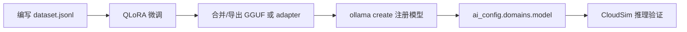

# CloudSim AI 分域训练工具链

**训练在仓库外完成**（本机 Python + LLaMA-Factory 等）；CloudSim 运行时只读取 `ai_config.json` 中的 `domains[].model` 做推理。

---

## 1. 目录结构

```text
tools/ai-training/
  CONFIGURATION.md          # ai_config.json 字段说明
  requirements-train.txt    # Python 训练依赖（可选）
  catalog/
    full_api_catalog.json   # 全量 API 清单（按 domain 切片供 prompt）
  domains/
    mesh.create/
      README.md
      dataset.jsonl         # 该域训练样本
    mesh.compose/
      README.md
      dataset.jsonl         # 布尔多步 ActionPlan v2
    geometry.recognize/
      README.md
      dataset.jsonl
  scripts/
    export_catalog_slices.py
    build_dataset.py
```

---

## 2. 训练总流程



| 步骤 | 产出 |
|------|------|
| 1. 数据 | `domains/<domain_id>/dataset.jsonl` |
| 2. 训练 | LoRA 适配器或完整权重 |
| 3. 部署 | Ollama 中可 `ollama run <name>` 的模型 |
| 4. 配置 | `ai_config.json` → `domains[].model` |
| 5. 验证 | AI 助手或 `curl` 调 `/v1/chat/completions` |

### 2.1 训练完成后要删除 dataset.jsonl 吗？

**不要删除。** `domains/<id>/dataset.jsonl` 是仓库内的**版本化训练资产**，应长期保留，原因：

| 原因 | 说明 |
|------|------|
| 复现与迭代 | 增删样本、改默认尺寸策略后需重新 SFT |
| 与运行时对齐 | 金标尺寸须与 `mesh_create_defaults` / `AiMeshDefaults` 一致 |
| 校验 | `python scripts/build_dataset.py mesh.create` 可在 CI 或提交前回归 |
| 协作 | 其它开发者依赖同一份 jsonl 复现 `cloudsim-mesh:3b` |

可删除的仅是**训练过程临时目录**（如 LLaMA-Factory 的 `saves/`、合并中间 GGUF），勿提交到 git；**不要**删 `tools/ai-training/domains/**/dataset.jsonl`。

---

## 3. 环境准备

### 3.1 训练机（建议）

- GPU：≥12GB 显存（3B QLoRA 可尝试 8GB，`batch_size=1`）
- Python 3.10+
- CUDA 与 PyTorch（按 LLaMA-Factory 文档安装）

```bash
cd tools/ai-training
pip install -r requirements-train.txt
# 或按 https://github.com/hiyouga/LLaMA-Factory 安装完整环境
```

### 3.2 推理机（CloudSim 用户机）

- 安装 [Ollama](https://ollama.com)（推荐路径 `D:\Project\VSprogram\Ollama`）
- 拉取基座或出厂模型：

```powershell
ollama pull qwen2.5:3b
ollama pull qwen2.5vl:3b
```

---

## 4. 数据集格式（dataset.jsonl）

每行一条 JSON（Alpaca 风格），**`output` 必须是运行时能执行的 schema**。

### 4.1 mesh.create（创建基本体）

`output` 对齐 `AiCommandSchema` v1 `create_mesh`。**`output` 必须包含完整 `dimensions_mm`**（运行时 `AiMeshDefaults::applyMissingDimensions` 会兜底，但训练标签应写全）。

**运行时默认尺寸**（与 [`ai_config.defaults.json`](../../src/App/CloudSim/ai_config.defaults.json) 中 `mesh_create_defaults` 一致，可覆盖）：

| primitive | 默认 dimensions_mm |
|-----------|-------------------|
| box | length=100, width=100, height=100 |
| cylinder | radius=50, height=100 |
| cone | radius=50, height=100 |
| sphere | radius=50 |

**必训样本类型**（见 `domains/mesh.create/dataset.jsonl`，当前约 80 条）：

| 类型 | 说明 | instruction 示例 |
|------|------|------------------|
| 无尺寸 | 用户未给数字 | `生成长方体` → 默认 100³ |
| 部分尺寸 | 只给长/宽/高等 | `长方体长200` → 200×100×100 |
| 完整尺寸 | 数字齐全 | `长宽高 100,100,200` |
| 口语修饰 | 大/小/扁/厚 | `大一点的圆柱` → 约 1.5× 默认 |

```json
{
  "instruction": "生成长方体",
  "input": "",
  "output": "{\"version\":1,\"action\":\"create_mesh\",\"primitive\":\"box\",\"dimensions_mm\":{\"length\":100,\"width\":100,\"height\":100}}"
}
```

| primitive | dimensions_mm 主要字段 |
|-----------|------------------------|
| box | length, width, height |
| cylinder | radius, height |
| cone | radius, height, radius_top（可选） |
| sphere | radius 或 diameter |

校验数据集（含 schema 字段检查）：

```bash
python scripts/build_dataset.py mesh.create
```

### 4.2 mesh.compose（布尔多步编排）

`output` 为 **ActionPlan v2**（`version:2` + `steps[]`），支持三种布尔 op：

| op | 典型步骤 |
|----|----------|
| `difference` | box + cylinder（`hole_tool`）→ 挖孔 |
| `union` | 两实体 + 常需 `pose_mm` 错位 → 合并 |
| `intersection` | 两实体部分重叠 → 保留交集 |

生成/校验（含 op 统计与重复 instruction 警告）：

```bash
python scripts/gen_mesh_compose_dataset.py
python scripts/build_dataset.py mesh.compose
```

首版数据量建议（~50 条）：difference / union / intersection 约 **36% / 36% / 24%**，另 2 条无布尔单步 create。

详见 [`domains/mesh.compose/README.md`](domains/mesh.compose/README.md)（含 union/intersection 金标与 CloudSim 验收清单）。

### 4.3 geometry.recognize（几何识别）

`output` 为识别 JSON（非 ActionPlan），由 `GeometryRecognizeDomainHandler` 校验（`primitive` ∈ box/cylinder/cone/sphere/unknown，按类型校验 `dimensions_mm`；`unknown` 不可 execute）：

```json
{
  "instruction": "识别图中的基本体",
  "input": "images/box_000.png",
  "output": "{\"primitive\":\"box\",\"label\":\"长方体\",\"dimensions_mm\":{\"length\":100,\"width\":50,\"height\":30},\"confidence\":0.9}"
}
```

**生成合成训练集（冷启动 / 联调）：**

```bash
pip install pillow
python tools/ai-training/scripts/gen_geometry_recognize_dataset.py --per-type 15
python tools/ai-training/scripts/build_dataset.py geometry.recognize
```

输出：`domains/geometry.recognize/images/*.png` + 更新后的 `dataset.jsonl`（当前默认 60 条，四类基本体各 15）。CloudSim 运行时将活动视口 PNG 经 `captureActiveViewportPng` 送入 vision API；识别结果默认仅展示，用户确认后再创建 mesh。

### 4.4 数据量建议

| 场景 | 建议条数 |
|------|----------|
| 规则可覆盖的简单句 | 可不训练，靠 `rules` 解析 |
| 专模提升口语化/复杂句 | 200～2000+ |
| 新 domain 冷启动 | 50+ 金标准 + 迭代 |

---

## 5. 使用 LLaMA-Factory 微调（示例）

以下以 **mesh.create**、基座 **Qwen2.5-3B-Instruct** 为例；路径与超参请按本机调整。

### 5.1 准备数据

将 `dataset.jsonl` 转为 LLaMA-Factory 所需格式（如 sharegpt/alpaca），或在 `data/dataset_info.json` 中注册：

```json
{
  "cloudsim_mesh_create": {
    "file_name": "path/to/mesh.create/dataset.jsonl",
    "formatting": "alpaca",
    "columns": {
      "prompt": "instruction",
      "query": "input",
      "response": "output"
    }
  }
}
```

导出该域 ApiCatalog 切片（写入 system prompt 参考）：

```bash
python scripts/export_catalog_slices.py mesh.create > mesh_create_catalog.json
```

### 5.2 QLoRA 训练（示意）

在 LLaMA-Factory 目录执行（具体参数见官方文档）：

```bash
llamafactory-cli train \
  --stage sft \
  --model_name_or_path Qwen/Qwen2.5-3B-Instruct \
  --dataset cloudsim_mesh_create \
  --template qwen \
  --finetuning_type lora \
  --output_dir saves/cloudsim-mesh-create-lora \
  --per_device_train_batch_size 1 \
  --gradient_accumulation_steps 8 \
  --learning_rate 1e-4 \
  --num_train_epochs 3 \
  --fp16
```

**geometry.recognize** 需选用 **VL 基座**（如 Qwen2.5-VL-3B），并开启多模态数据加载。

### 5.3 合并与导出

- 合并 LoRA：`llamafactory-cli export` 或 `merge_lora`
- 转为 GGUF：按 LLaMA-Factory / llama.cpp 文档
- 或保留 adapter 供 Ollama Modelfile 引用

---

## 6. 注册到 Ollama

### 6.1 方式 A：基于基座 + adapter（Modelfile）

在 `D:\Project\VSprogram\Ollama` 或任意目录创建 `Modelfile`：

```dockerfile
FROM qwen2.5:3b
ADAPTER /path/to/cloudsim-mesh-create-lora
PARAMETER temperature 0.1
```

```bash
ollama create cloudsim-mesh-create -f Modelfile
ollama run cloudsim-mesh-create
```

### 6.2 方式 B：完整导出模型

若已合并为独立 GGUF/目录，按 Ollama 导入文档 `ollama create` 即可。

### 6.3 验证

```bash
ollama list
curl http://127.0.0.1:11434/v1/chat/completions -d "{
  \"model\": \"cloudsim-mesh-create\",
  \"messages\": [{\"role\":\"user\",\"content\":\"生成长方体 100 100 200\"}],
  \"temperature\": 0.1
}"
```

响应 `content` 应为**纯 JSON**（无 markdown 包裹），否则需在训练数据中加强约束或后处理。

---

## 7. 写回 CloudSim 配置

编辑 exe 旁 `ai_config.json`：

```json
{
  "domains": [
    {
      "id": "mesh.create",
      "model": "cloudsim-mesh-create",
      "base_url": "http://127.0.0.1:11434/v1",
      "parser_priority": ["rules", "local"]
    }
  ]
}
```

- 简单句式仍可先走 **rules**（快、无 GPU）
- 复杂句式由 **local** 调用你的专模

重启 CloudSim，在 AI 助手 **创建网格** 领域测试。

---

## 8. 新增 Domain 训练清单

1. 定义 `domain_id`（如 `robot.command`）
2. 在 `catalog/full_api_catalog.json` 为相关 API 添加 `"domains": ["robot.command"]`
3. 新建 `domains/robot.command/dataset.jsonl`
4. 实现并注册 `IAiDomainHandler`（见 CloudSimAiSDK 开发指南）
5. 训练 → `ollama create` → `ai_config.domains[]`
6. 在 AiWidget 领域下拉中暴露（宿主注册 descriptor）

---

## 9. 脚本说明

| 脚本 | 用法 |
|------|------|
| `scripts/build_dataset.py` | `python build_dataset.py mesh.create` 校验 jsonl + mesh.create 的 `create_mesh` schema |
| `scripts/export_catalog_slices.py` | `python export_catalog_slices.py mesh.create` 输出 catalog 子集 |

---

## 10. 相关文档

- 配置字段详解：[`CONFIGURATION.md`](CONFIGURATION.md)
- SDK / 接模 / 架构：[`../../src/Plugins/CloudSimAiSDK/DEVELOPER_GUIDE.md`](../../src/Plugins/CloudSimAiSDK/DEVELOPER_GUIDE.md)
- 本地 Ollama：`D:\Project\VSprogram\Ollama\README.md`
